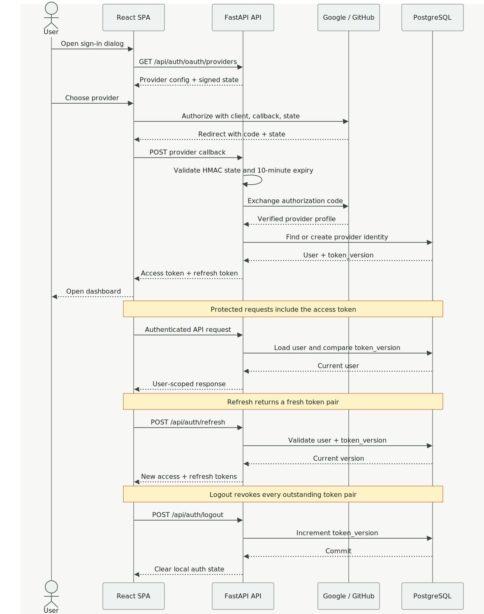

# Ledger Sync

**Your personal finance command center** - Transform messy Excel exports into a beautiful, insightful financial dashboard.

Ledger Sync is a self-hosted personal finance application that syncs your transaction data from Excel files (exported from Money Manager Pro or similar apps) and provides comprehensive analytics for your financial life.


**Live:** [sagargupta.online/ledger-sync](https://sagargupta.online/ledger-sync/) | **Demo:** [Try it now](https://sagargupta.online/ledger-sync/demo) | **API:** [ledger-sync.onrender.com](https://ledger-sync.onrender.com/docs)

## Features

### Demo Mode

- **Try before you sign up** - Click "Try Demo" on the landing page or visit `/demo` directly
- Explore the full dashboard with ~500 realistic sample transactions (Indian household model)
- All 23 pages render with pre-computed analytics data, zero backend calls
- Floating banner with quick sign-up and exit options
- Mutations (upload, settings, budgets, goals) are gracefully blocked with toast notifications

### Smart Upload & Sync

- Drag-and-drop Excel uploads with beautiful hero UI
- Intelligent duplicate detection using SHA-256 hashing
- Idempotent syncing - re-upload anytime without duplicates
- Real-time toast notifications for upload status

### Spending Analysis

- **50/30/20 Budget Rule** - Track Needs (50%), Wants (30%), and Savings (20%)
- Category and subcategory breakdown with treemaps
- Year-over-year spending comparisons
- Recurring transaction detection

### Investment Portfolio

- **4 Investment Categories**: FD/Bonds, Mutual Funds, PPF/EPF, Stocks
- Track both inflows (investments) and outflows (redemptions)
- Net investment calculations per category
- Asset allocation visualization

### Cash Flow Visualization

- Interactive Sankey diagrams showing money flow
- Income to Expenses/Savings breakdown
- Monthly and yearly views

### Analytics & Insights

- Financial Health Score with 8 metrics across 4 pillars (Spend, Save, Borrow, Plan)
- Income vs Expense trends and forecasting
- Tax planning for India FY (April-March)
- Net Worth tracking across all accounts
- Anomaly detection and review
- Budget tracking and goals

### Smart Defaults

- **Account classification** - Automatically categorizes accounts by keyword (EPF/PPF/MF/FD/Stocks to Investments, HDFC/SBI/ICICI to Bank Accounts, etc.)
- **Income classification** - Auto-assigns Salary/Freelance to Taxable, Dividends/Interest to Investment Returns, Cashbacks to Non-taxable
- **Investment mapping** - Auto-maps investment accounts to types (Groww MF to Mutual Funds, PPF Account to PPF/EPF, etc.)

## Tech Stack

| Layer            | Technology                                                                   |
| ---------------- | ---------------------------------------------------------------------------- |
| **Frontend**     | React 19, TypeScript 5.9, Vite 7, Tailwind CSS 4, Recharts 3, Framer Motion 12 |
| **Auth**         | OAuth 2.0 (Google, GitHub), JWT tokens (PyJWT)                              |
| **Backend**      | Python 3.11+, FastAPI, SQLAlchemy 2, Alembic                                |
| **Database**     | SQLite (dev), Neon PostgreSQL 17 (prod)                                      |
| **State**        | TanStack Query 5, Zustand 5                                                 |
| **Deployment**   | GitHub Pages (frontend), Render (backend), Neon (database)                   |
| **CI/CD**        | GitHub Actions (lint, type-check, build, deploy)                             |
| **Package Mgmt** | pnpm 10 (frontend), uv (backend)                                            |

## Architecture

### System Overview

<p align="center">
  
</p>

### Upload & Sync Pipeline

<p align="center">
  
</p>

### Authentication Flow

<p align="center">
  
</p>

### Backend Layer Architecture

<p align="center">
  
</p>

<details>
<summary>View Mermaid source (for editing)</summary>

Diagrams generated from `.mmd` files in `docs/images/` using:

```bash
npx -y @mermaid-js/mermaid-cli -i docs/images/<name>.mmd -o docs/images/<name>.svg -b transparent
```

</details>

For detailed architecture docs, see [docs/architecture.md](docs/architecture.md).

## Quick Start

```bash
# Clone the repository
git clone https://github.com/Sagargupta16/ledger-sync.git
cd ledger-sync

# Install root dependencies
pnpm install

# Setup backend + frontend in parallel
pnpm run setup

# Start both servers
pnpm run dev
```

**Access the app:**

- Frontend: http://localhost:5173
- Backend API: http://localhost:8000
- API Docs: http://localhost:8000/docs

## Project Structure

```
ledger-sync/
├── backend/                # Python FastAPI backend
│   ├── src/ledger_sync/    # Main application
│   │   ├── api/            # REST endpoints
│   │   ├── core/           # Business logic (reconciler, sync, analytics)
│   │   ├── db/             # Database models & session
│   │   ├── ingest/         # Excel processing pipeline
│   │   └── schemas/        # Pydantic request/response models
│   └── tests/              # pytest tests
├── frontend/               # React + TypeScript frontend
│   └── src/
│       ├── pages/          # 23 page components (split into subdirectories)
│       │   ├── settings/       # Settings sections (20 files)
│       │   ├── goals/          # Goals sub-components (13 files)
│       │   ├── comparison/     # Comparison sub-components (13 files)
│       │   └── subscription-tracker/  # Subscription sub-components (13 files)
│       ├── components/     # UI & analytics components (60+)
│       ├── hooks/          # React Query hooks & custom hooks
│       ├── constants/      # Colors, chart tokens, animations
│       ├── store/          # Zustand global stores
│       ├── services/       # API client (Axios)
│       ├── lib/            # Utility functions
│       │   └── demo/          # Demo mode (data generators, cache seeder)
│       └── types/          # Shared TypeScript types
├── .github/workflows/      # CI pipeline
└── CHANGELOG.md            # Version history
```

## Pages

| Page                       | Description                                         |
| -------------------------- | --------------------------------------------------- |
| **Home**                   | Landing page                                        |
| **Dashboard**              | Overview with KPIs, sparklines, and quick insights  |
| **Upload & Sync**          | Drag-and-drop upload with sample format preview     |
| **Transactions**           | Full transaction list with filters and search       |
| **Spending Analysis**      | 50/30/20 rule, treemap, top merchants, subcategories|
| **Income Analysis**        | Income sources, growth tracking, breakdown          |
| **Comparison**             | Period-over-period financial comparison              |
| **Trends & Forecasts**     | Trend lines, rolling averages, cash flow forecast   |
| **Cash Flow**              | Sankey diagram of money flow                        |
| **Investment Analytics**   | Portfolio across 4 categories                       |
| **Mutual Fund Projection** | SIP calculator and projections                      |
| **Returns Analysis**       | Investment returns tracking                         |
| **Tax Planning**           | India FY-based tax insights and slab breakdown      |
| **Net Worth**              | Assets, liabilities, and credit card health         |
| **Budget**                 | Budget tracking and monitoring                      |
| **Goals**                  | Financial goal setting and progress                 |
| **Insights**               | Advanced analytics (velocity, stability, milestones)|
| **Anomaly Review**         | Flag and review unusual transactions                |
| **Year in Review**         | Annual financial summary                            |
| **Subscription Tracker**   | Recurring expense detection, confirm/add manually   |
| **Bill Calendar**          | Monthly calendar view of upcoming bills             |
| **Settings**               | Preferences, account mappings, categories           |

## Deployment

The app is deployed for free using three services:

| Service | Platform | Details |
|---------|----------|---------|
| Frontend | GitHub Pages | Auto-deploys on push via GitHub Actions |
| Backend | Render (free tier) | FastAPI on Python 3.12, ~30s cold start after idle |
| Database | Neon PostgreSQL | Free tier, 0.5 GB, Singapore region |

See [Deployment Guide](docs/DEPLOYMENT.md) for full setup instructions.

## Authentication

Ledger Sync uses **OAuth 2.0** for authentication - no passwords to manage.

- **Google Sign-In** and **GitHub Sign-In** buttons on the login page
- Backend exchanges OAuth codes for user info, then issues JWT tokens
- OAuth providers are configurable via environment variables
- Buttons only appear for providers that are configured

### Setting Up OAuth (Local Dev)

1. Create OAuth apps at [Google Cloud Console](https://console.cloud.google.com/apis/credentials) and/or [GitHub Developer Settings](https://github.com/settings/developers)
2. Set redirect URIs to `http://localhost:5173/auth/callback/google` and `http://localhost:5173/auth/callback/github`
3. Add credentials to `backend/.env`:

```env
LEDGER_SYNC_GOOGLE_CLIENT_ID=your-google-client-id
LEDGER_SYNC_GOOGLE_CLIENT_SECRET=your-google-secret
LEDGER_SYNC_GITHUB_CLIENT_ID=your-github-client-id
LEDGER_SYNC_GITHUB_CLIENT_SECRET=your-github-secret
LEDGER_SYNC_FRONTEND_URL=http://localhost:5173
```

## Configuration

### Backend Environment (`backend/.env`)

```env
LEDGER_SYNC_DATABASE_URL=sqlite:///./ledger_sync.db    # Local dev (SQLite)
LEDGER_SYNC_ENVIRONMENT=development                     # development | production
LEDGER_SYNC_GOOGLE_CLIENT_ID=...                        # OAuth (optional)
LEDGER_SYNC_GOOGLE_CLIENT_SECRET=...
LEDGER_SYNC_GITHUB_CLIENT_ID=...
LEDGER_SYNC_GITHUB_CLIENT_SECRET=...
LEDGER_SYNC_FRONTEND_URL=http://localhost:5173          # OAuth redirect base URL
```

### Frontend Environment

```env
VITE_API_BASE_URL=http://localhost:8000                # Set in GitHub Actions variable for production
```

## Documentation

- [Changelog](CHANGELOG.md) - Version history and release notes
- [Architecture](docs/architecture.md) - System design and data flow
- [API Reference](docs/API.md) - REST endpoint documentation
- [Database Schema](docs/DATABASE.md) - Models and migrations
- [Development Guide](docs/DEVELOPMENT.md) - Setup and workflow
- [Testing Guide](docs/TESTING.md) - Test strategies
- [Deployment Guide](docs/DEPLOYMENT.md) - Production deployment

## Contributing

Contributions are welcome! Please read the [Development Guide](docs/DEVELOPMENT.md) first.

## License

MIT License - see [LICENSE](LICENSE) for details.
