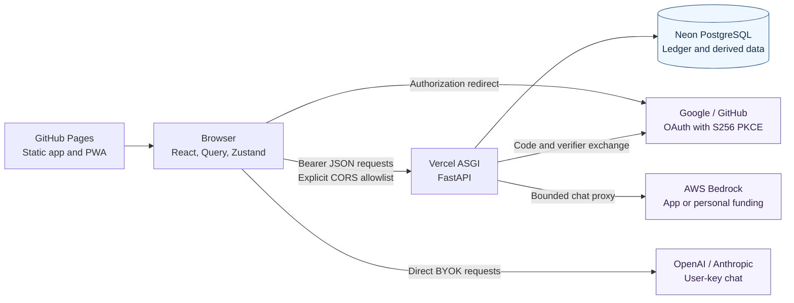
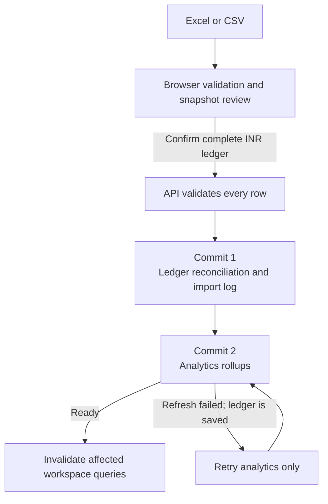

# Ledger Sync

Self-hosted personal finance workspace for importing bank statements, reconciling a ledger, exploring analytics, and asking an AI assistant questions about your own data.

[](CHANGELOG.md)
[](https://github.com/Sagargupta16/ledger-sync/actions/workflows/ci.yml)
[](https://sonarcloud.io/dashboard?id=Sagargupta16_ledger-sync)
[](LICENSE)

[](https://github.com/Sagargupta16/ledger-sync)

## Why

Ledger Sync is built for people who want useful personal finance analysis without handing over direct bank access or paying a recurring subscription. It supports Indian fiscal years and tax planning, multi-currency display, transaction organization, investments, goals, recurring commitments, and FIRE planning.

- [Open the hosted app](https://sagargupta.online/ledger-sync/)
- [Explore demo data](https://sagargupta.online/ledger-sync/demo)
- [Read the deployment guide](docs/DEPLOYMENT.md)

## Highlights

### Import and reconciliation

- Accepts `.xlsx`, `.xls`, and `.csv` statements.
- Parses files in the browser with SheetJS.
- Sends validated JSON rows to the API instead of uploading the source file.
- Reviews the date range, accounts, and row counts before replacing the complete ledger snapshot.
- Uses deterministic SHA-256 transaction IDs plus occurrence counters so repeated imports remain idempotent without collapsing legitimate duplicate rows.
- Commits reconciliation and import history together, then refreshes analytics separately. A failed refresh can be retried without importing again.

### Financial workspace

- Dashboard and fixed Overview for quick financial status.
- Server-paginated transaction ledger with search, filters, tags, saved views, sorting, and CSV export.
- Expense, income, cash flow, period comparison, year review, forecasting, and net worth analysis.
- Investment contributions and realised cash flows, book-value holdings, SIP projections, and instrument calculators.
- 50/30/20 budget analysis, goals, recurring commitments, bill calendar, and anomaly review.
- Account-backed goals with explicit review before recovering older browser-only edits.
- Merchant intelligence derived from transaction notes, with spend concentration and recurring detection.
- Data health reporting: ledger coverage, last-import row counts, and whether analytics rollups are current.
- Indian income tax, RSU vesting, projected TDS, GST estimation, and FIRE planning.

### AI assistant

- Fifteen read-only, user-scoped financial tools.
- App-provided Bedrock mode with a shared-funding daily limit and database-backed usage reservations.
- BYOK configuration for supported providers. Bedrock token budgets are enforced by the proxy; browser-direct OpenAI/Anthropic limits are informational.
- AES-256-GCM encrypted key storage. Current v3 envelopes use HKDF-SHA256 with `LEDGER_SYNC_ENCRYPTION_KEY`; authenticated legacy ciphertexts remain readable and can be rewrapped.
- Financial data is fetched through tools when needed instead of being copied into a large prompt.

### Responsive UI

- Compact desktop workspace with grouped navigation, search, notifications, theme control, and AI access.
- Phone bottom navigation plus a complete More page.
- Light and dark themes. New users start on the operating system preference.
- Persisted Full and Reduced motion modes available from the sidebar and Settings.
- Mobile card layouts for wide data tables and 44px touch targets for primary controls.
- Distinct loading, empty, and retryable error states across protected financial pages.
- Installable PWA that never caches API responses.

## Application Map

The router contains 3 public routes and 26 protected workspace pages.

| Area | Pages |
| --- | --- |
| Public | Home, demo entry, OAuth callback |
| Top level | Dashboard, Overview, Transactions |
| Analytics | Expense Analysis, Merchant Intelligence, Income Analysis, Cash Flow, Comparison, Year in Review |
| Wealth | Net Worth, Trends and Forecasts, Investment Analytics, Projections, Returns Analysis |
| Commitments | Recurring, Bill Calendar |
| Planning | Budget Rule, Financial Goals, FIRE Calculator, Anomaly Review, Data Health |
| Tax | Income Tax, Indirect Tax (GST) |
| Utility bar | Upload and Sync, Settings |
| Mobile | More |

See [docs/PAGES.md](docs/PAGES.md) for the route and data-source catalog and [docs/HANDBOOK.md](docs/HANDBOOK.md) for the user workflow guide.

## Quick Start

### Prerequisites

- Node.js 22+
- pnpm 11
- Python 3.13+
- [uv](https://docs.astral.sh/uv/getting-started/installation/)

### Install and run

```bash
git clone https://github.com/Sagargupta16/ledger-sync.git
cd ledger-sync
pnpm install
pnpm run setup
pnpm run dev
```

Local services:

- Frontend: `http://localhost:5173`
- Backend: `http://localhost:8000`
- Swagger UI: `http://localhost:8000/docs`
- ReDoc: `http://localhost:8000/redoc`

### Configuration

Copy the required `LEDGER_SYNC_*` entries from [.env.example](.env.example) into `backend/.env`.

```env
LEDGER_SYNC_ENVIRONMENT=development
LEDGER_SYNC_DATABASE_URL=sqlite:///./ledger_sync.db
LEDGER_SYNC_FRONTEND_URL=http://localhost:5173
LEDGER_SYNC_JWT_SECRET_KEY=replace-with-at-least-32-random-characters
LEDGER_SYNC_ENCRYPTION_KEY=replace-with-a-separate-random-key

# Configure at least one provider for real sign-in.
LEDGER_SYNC_GOOGLE_CLIENT_ID=...
LEDGER_SYNC_GOOGLE_CLIENT_SECRET=...
LEDGER_SYNC_GITHUB_CLIENT_ID=...
LEDGER_SYNC_GITHUB_CLIENT_SECRET=...
```

Local frontend development uses Vite's same-origin `/api` proxy. Set `VITE_API_BASE_URL` only when the built frontend and API are hosted on different origins.

## Common Commands

```bash
pnpm run dev       # Start backend and frontend
pnpm run check     # Lint, type-check, and test both stacks
pnpm run build     # Production frontend build
pnpm run format    # Format both stacks
```

Backend migrations:

```bash
cd backend
uv run alembic upgrade head
```

## Tech Stack

| Layer | Technology |
| --- | --- |
| Frontend | React 19, TypeScript 6, Vite 8, Tailwind CSS 4, Recharts 3, Motion 13 |
| Backend | Python 3.13+, FastAPI, SQLAlchemy 2, Alembic, Pydantic 2 |
| Database | SQLite for development, Neon PostgreSQL 17 for production |
| State | TanStack Query 5, Zustand 5 |
| Deployment | GitHub Pages, Vercel, Neon |
| Tooling | pnpm 11, uv, Vitest, pytest, Ruff, mypy, ESLint |

## Architecture


```mermaid
flowchart LR
  pages["GitHub Pages<br/>Static app and PWA"]
  browser["Browser<br/>React, Query, Zustand"]
  api["Vercel ASGI<br/>FastAPI"]
  db[("Neon PostgreSQL<br/>Ledger and derived data")]
  oauth["Google / GitHub<br/>OAuth with S256 PKCE"]
  direct["OpenAI / Anthropic<br/>User-key chat"]
  bedrock["AWS Bedrock<br/>App or personal funding"]
  pages --> browser
  browser -->|"Bearer JSON requests<br/>Explicit CORS allowlist"| api
  api --> db
  browser -->|"Authorization redirect"| oauth
  api -->|"Code and verifier exchange"| oauth
  browser --->|"Direct BYOK requests"| direct
  api -->|"Bounded chat proxy"| bedrock
  classDef store fill:#eef6ff,stroke:#35618f,color:#142d47
  classDef external fill:#f5f3ff,stroke:#7563a5,color:#30204c
  class db store
  class oauth,direct,bedrock external
```

OAuth uses a secret held in the initiating browser tab and a one-use database
record. It works across the GitHub Pages frontend and Vercel API without
third-party cookies. Changing accounts or leaving a session aborts outstanding
requests and clears user-scoped caches and stores.

Older sign-in clients receive a versioned restart path that loads the frontend
and begins a fresh PKCE attempt. An already-open legacy callback gets an
explicit refresh/sign-in message; its old state is not accepted.

The web import path makes the two persistence boundaries explicit:


```mermaid
flowchart TB
  file["Excel or CSV"] --> review["Browser validation and snapshot review"]
  review -->|"Confirm complete INR ledger"| validate["API validates every row"]
  validate --> ledger["Commit 1<br/>Ledger reconciliation and import log"]
  ledger --> analytics["Commit 2<br/>Analytics rollups"]
  analytics -->|"Ready"| cache["Invalidate affected workspace queries"]
  analytics -->|"Refresh failed; ledger is saved"| retry["Retry analytics only"]
  retry --> analytics
```

The snapshot covers the user's entire ledger: rows missing from the confirmed
snapshot are soft-deleted, including rows from other dates or accounts. Invalid
rows reject the batch before reconciliation. Local development uses SQLite
and Vite's API proxy; PostgreSQL migration verification uses a native PostgreSQL
instance.

The [static overview image](docs/images/system-overview.svg) remains available
as a companion illustration.

See [docs/architecture.md](docs/architecture.md) for component and data-flow details.

## Deployment

The hosted installation uses:

| Service | Platform |
| --- | --- |
| Frontend | GitHub Pages |
| Backend | Vercel serverless, ASGI |
| Database | Neon PostgreSQL 17 with PgBouncer |

On `main`, CI checks gate database migrations, which gate the GitHub Pages
deployment. PostgreSQL migration checks use a native instance. Vercel's Git
deployment is a separate platform path, so schema-compatible backend releases
still need coordination. See [docs/DEPLOYMENT.md](docs/DEPLOYMENT.md) before
changing production configuration.

## Documentation

- [Complete Handbook](docs/HANDBOOK.md)
- [Page and Route Catalog](docs/PAGES.md)
- [API Reference](docs/API.md)
- [Architecture](docs/architecture.md)
- [Calculations](docs/CALCULATIONS.md)
- [Database](docs/DATABASE.md)
- [Development](docs/DEVELOPMENT.md)
- [Testing](docs/TESTING.md)
- [Deployment](docs/DEPLOYMENT.md)
- [Changelog](CHANGELOG.md)
- [Contributing](CONTRIBUTING.md)

`docs/AUDIT.md` and `docs/plans/` are dated historical records. Their status headers identify the snapshot or implementation state.

## License

MIT. See [LICENSE](LICENSE).
