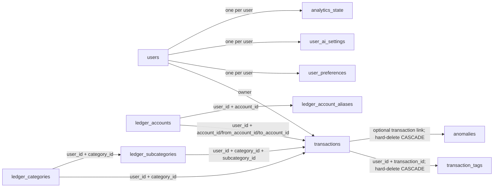
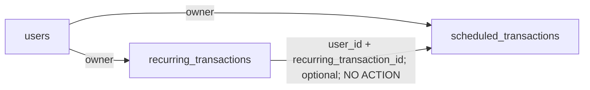
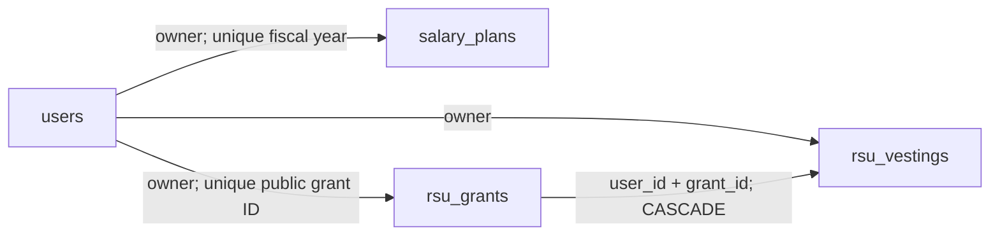

# Ledger Sync complete database schema reference

Prepared 2026-09-18. This reference covers **all 34 application tables, all 463 columns, all 43 declared foreign keys, all 78 explicit indexes, and every model unique/check constraint and enum**. It also documents Alembic's version table and the reported import-log archive separately.

## Navigation

- [Database and evidence](#database-and-evidence)
- [Table directory](#table-directory)
- [How the tables connect](#how-the-tables-connect)
- [Upload, fetch, edit and delete flow](#upload-fetch-edit-and-delete-flow)
- [Types, defaults and enum values](#types-defaults-and-enum-values)
- [Full table dictionary](#full-table-dictionary)
- [All foreign keys](#all-foreign-keys)
- [Nested JSON contracts](#nested-json-contracts)
- [Operational tables](#operational-tables)
- [Migration and model differences](#migration-and-model-differences)
- [Scope and verification](#scope-and-verification)

Companion files: [structured JSON](DATABASE_SCHEMA_REFERENCE.json), [model-derived PostgreSQL DDL](DATABASE_MODEL_SCHEMA.sql), [existing database guide](DATABASE.md).

In the JSON, `source_files_sha256` is a **list of `{path, sha256}` objects**, not a
path-keyed map. Keep it that way when regenerating. As a map, any digest whose path
contained `auth` or `token` (for example `services/auth_service.py` or
`20260704_1000_add_token_version_to_users.py`) paired a credential-looking key with a
high-entropy value, so SonarCloud's `json:S6418` reported seven BLOCKER hard-coded-secret
findings and dropped the security rating to E. The values are file-content digests, never
secrets; putting the path in a value and the digest under `sha256` keeps the provenance
record without tripping the rule.

## Database and evidence

| Item | Value |
| --- | --- |
| Neon project | [neon-cinereous-compass](https://console.neon.tech/app/projects/gentle-sunset-94386320) |
| Project ID | `gentle-sunset-94386320` |
| Production branch | `main` (`br-soft-moon-a1omep39`) |
| Database / role | `neondb` / `neondb_owner` |
| Application namespace | `public` |
| Engine | PostgreSQL model target; SQLite storage differences documented below. Prior reference reported PostgreSQL 17.11. |
| Source snapshot | Current working tree, including uncommitted changes; links resolve relative to this checkout. |
| Base checkout commit | `0467bc2c18789877b6d65147f9d9e77a4b852e71`; does not identify the uncommitted model definitions. |
| Matching source migration head | `domain_storage_cutover_2026` |
| Infrastructure context | Project/branch/role identifiers above are retained from the prior reference and were not refreshed. |

**Evidence boundary:** this refresh uses only current local model metadata, API schemas and migration source. No live database, remote service, financial rows, credentials or connection strings were read. The prior 2026-09-17 reference reported a successful Neon export, but full processing was blocked by automatic approval review with “encrypted summary was created for a different account or model.” That historical note is retained as provenance, not fresh verification. This is an **application-model dictionary**; live objects/defaults are not confirmed. The JSON companion records source-file SHA-256 hashes so the working-tree evidence can be checked independently.

A PostgreSQL **database** contains **schemas** (namespaces), which contain **tables**. For example: `neondb` → `public` → `transactions`. The source models do not create separate schemas for accounts, users or analytics. PostgreSQL also has system namespaces such as `pg_catalog` and `information_schema`; additional Neon-managed or extension namespaces are not inventoried here.

## Table directory

### Identity, settings and diagnostics

| Table | What it stores | One row represents | Columns |
| --- | --- | --- | ---: |
| [`users`](#users) | Login identity, profile and token revocation. | One application user. | 12 |
| [`user_preferences`](#user_preferences) | Display, category classification, budget, tax and growth preferences. | At most one preferences row per user. | 45 |
| [`user_ai_settings`](#user_ai_settings) | AI funding mode, provider/model selection, encrypted credentials and token limits. | At most one AI settings row per user. | 9 |
| [`audit_logs`](#audit_logs) | Operation and change records. | One recorded operation/change. | 12 |
| [`ai_usage_log`](#ai_usage_log) | Provider/model usage, token reservations and estimated cost. | One recorded provider call or reservation. | 12 |
| [`column_mapping_logs`](#column_mapping_logs) | Original spreadsheet headers, mapped headers and validation diagnostics. | One intended parser-mapping diagnostic event. | 10 |

### Ledger, imports and organization

| Table | What it stores | One row represents | Columns |
| --- | --- | --- | ---: |
| [`transactions`](#transactions) | Income, expense and transfer ledger, including soft-deleted history. | One logical financial transaction. | 24 |
| [`import_logs`](#import_logs) | Import idempotency and reconciliation results. | One current record per user and file hash. | 10 |
| [`ledger_accounts`](#ledger_accounts) | Stable account identities, classifications, closure state and credit limits. | One lowercased account key per user. | 10 |
| [`ledger_account_aliases`](#ledger_account_aliases) | Source account labels mapped to stable account identities. | One lowercased source label per user. | 5 |
| [`ledger_categories`](#ledger_categories) | Stable category identities. | One lowercased category key per user. | 4 |
| [`ledger_subcategories`](#ledger_subcategories) | Stable subcategory identities within a category. | One lowercased subcategory key per user and parent category. | 5 |
| [`categorization_rules`](#categorization_rules) | Ordered rules that assign category and subcategory. | One rule per user; multiple rules are allowed. | 10 |
| [`transaction_tags`](#transaction_tags) | Free-string annotations attached to transactions. | One exact tag per user and transaction. | 5 |
| [`saved_filter_views`](#saved_filter_views) | Saved Transactions-page filter configurations. | One named view per user. | 6 |

### Compensation

| Table | What it stores | One row represents | Columns |
| --- | --- | --- | ---: |
| [`salary_plans`](#salary_plans) | Exact salary components for each fiscal year. | One user and fiscal year. | 11 |
| [`rsu_grants`](#rsu_grants) | Stable public grant identities, stock-price assumptions and grant metadata. | One public grant ID per user. | 8 |
| [`rsu_vestings`](#rsu_vestings) | Individually identified RSU vesting events and received-share actuals. | One vesting event, including legitimate identical repeats. | 8 |

### Planning and review

| Table | What it stores | One row represents | Columns |
| --- | --- | --- | ---: |
| [`recurring_transactions`](#recurring_transactions) | Detected or manually maintained recurring patterns. | One recurring pattern, not one occurrence. | 21 |
| [`scheduled_transactions`](#scheduled_transactions) | Expected future cash flows. | One planned schedule. | 17 |
| [`anomalies`](#anomalies) | Detected outliers, metrics and review state. | One detected anomaly; a transaction link is optional. | 15 |
| [`budgets`](#budgets) | Category/subcategory limits and computed progress. | One budget scope per user, category and optional subcategory. | 15 |
| [`financial_goals`](#financial_goals) | Savings, investment, debt-payoff or custom goals. | One user-defined goal. | 15 |
| [`tax_records`](#tax_records) | Fiscal-year income, tax payments and deduction records. | One stored tax record; multiple rows per user/year are allowed by this schema. | 23 |

### Calculated analytics

| Table | What it stores | One row represents | Columns |
| --- | --- | --- | ---: |
| [`analytics_state`](#analytics_state) | Durable input versions, published versions and invalidation state. | At most one state row per user. | 10 |
| [`daily_summaries`](#daily_summaries) | Daily totals and counts for charts/heatmaps. | One user and YYYY-MM-DD day. | 12 |
| [`monthly_summaries`](#monthly_summaries) | Monthly income, consumption, transfers, savings and comparisons. | One user and YYYY-MM month. | 26 |
| [`category_trends`](#category_trends) | Monthly category/subcategory metrics by transaction type. | One user/month/category/optional-subcategory/type cell. | 15 |
| [`cohort_spending`](#cohort_spending) | Average spending by weekday, day of month or month of year. | One user/dimension/bucket cell. | 8 |
| [`transfer_flows`](#transfer_flows) | All-time transfers between account-label pairs. | One user/from-account/to-account pair. | 12 |
| [`merchant_intelligence`](#merchant_intelligence) | Merchant or description-level spending and recurrence statistics. | One user/merchant_name/label_kind cell. | 16 |
| [`fy_summaries`](#fy_summaries) | Fiscal-year income, spending, tax, investment and savings totals. | One user/fiscal_year cell. | 21 |
| [`net_worth_snapshots`](#net_worth_snapshots) | Asset, liability and net-worth totals at a point in time. | One user and exact snapshot timestamp; writer convention makes these daily snapshots. | 20 |
| [`investment_holdings`](#investment_holdings) | Ledger-derived invested principal and current account value. | Writer currently produces one holding per detected investment account. | 11 |

## How the tables connect

`users.id` is the ownership root. There are 32 declared owner FKs from application child tables. `column_mapping_logs` has no owner column; `audit_logs.user_id` is optional. `user_preferences.user_id` is unique; `analytics_state.user_id` and `user_ai_settings.user_id` are primary keys, giving at most one row of each per user. Salary plans are unique per user/fiscal year, RSU grants per user/public ID, and vestings have independent event IDs.

The diagrams summarize selected actual foreign keys. The complete 43-link register follows the dictionary.

**Logical links are different from foreign keys.** Account and category labels in budgets, rules, recurring plans and summaries are plain strings; account classification/closure/limit settings now belong to the stable ledger account record. Analytics rows are derived from transactions through application calculations, but generally have no transaction-level FK. `source_file` does not link to `import_logs.id`; audit `entity_id` has no generic FK. There is no separate merchant master table, transaction-to-goal allocation table, uploaded-file binary table, or AI conversation table in these models.

## Upload, fetch, edit and delete flow

1. **Upload:** the browser parses a spreadsheet and sends validated JSON rows to the authenticated upload API. The request is a complete user ledger snapshot, not an append-only batch: entries absent from the snapshot can be soft-deleted. The API allows at most 100,000 rows and INR accounting amounts.
2. **Identify:** the import records the file hash, locks the user, fingerprints source rows before categorization, and accounts for repeated identical source rows. Legacy public IDs are preserved when an exact, unambiguous match can adopt a v2 fingerprint.
3. **Store:** rules assign categories, dimension identities are resolved in batches, and transactions are inserted/updated/restored or marked deleted. The import log and analytics invalidation versions are committed with the ledger changes.
4. **Calculate:** application analytics refresh daily/monthly cells for affected dates where supported, and rebuild other affected domains. `analytics_state` records which versions were published. These are ordinary tables maintained by Python, not PostgreSQL materialized views or generated columns.
5. **Fetch:** transaction reads filter by authenticated user and `is_deleted IS false`. Date/ID cursor pagination is used for sequential pages; offset remains available for arbitrary jumps. Summary APIs read aggregates where appropriate; some reports still calculate directly from the ledger.
6. **Edit/delete:** writes must locate rows using owner plus identifier and invalidate affected analytics. Soft deletion keeps transaction identity and annotations. Hard deletion invokes transaction-child cascades. Deleting a recurring source requires unlinking dependent schedules first; deleting the user invokes owner cascades.
7. **Domain settings:** preferences responses aggregate remaining `user_preferences`, account limits from `ledger_accounts`, configuration from `user_ai_settings`, and salary/RSU records. Caller-owned transactions and user locks coordinate writes. Compensation services compare/upsert existing records, preserve unchanged IDs and list order, and resolve bulk reads without one lookup per grant. The AI preferences summary reads normalized salary components by fiscal year.

Relevant implementation: [upload contract](../backend/src/ledger_sync/schemas/upload.py), [sync engine](../backend/src/ledger_sync/core/sync_engine.py), [fingerprints](../backend/src/ledger_sync/ingest/hash_id.py), [dimension resolution](../backend/src/ledger_sync/services/ledger_dimensions.py), [refresh/version logic](../backend/src/ledger_sync/core/analytics/refresh.py), [transaction endpoints](../backend/src/ledger_sync/api/transactions.py), [pagination](../backend/src/ledger_sync/api/transaction_pagination.py).

## Types, defaults and enum values

- **PK** uniquely identifies a row. **FK** constrains a reference. A composite FK includes several columns and enforces ownership along with identity.
- **NULL allowed** means the database permits a missing value. It is separate from whether an API field is required. Plain strings do not acquire database validation just because code comments describe allowed values.
- **App default** is supplied by SQLAlchemy/Python. **DB default (model)** is explicitly declared in the model. A dash means no default declared there, not zero. Auto integer primary keys use PostgreSQL sequence/serial behavior in the generated DDL. Exact deployed sequence names need live catalog inspection.
- **Date/time:** model `DateTime` compiles to `TIMESTAMP WITHOUT TIME ZONE`. Audit defaults call `datetime.now(UTC)`, but the column itself does not store timezone information. Ledger calendar dates must follow the app's date convention. Daily and monthly aggregate keys are VARCHAR strings.
- **Money:** ledger and most planning/aggregate amounts use exact `NUMERIC(15,2)`. Ratios/confidence use FLOAT. `ledger_accounts.credit_limit` is `NUMERIC(15,2)`; its service rejects excess precision instead of silently rounding. `user_preferences.monthly_investment_target` remains FLOAT. SQLite's NUMERIC affinity is not equivalent to PostgreSQL's exact NUMERIC storage.
- **CompensationDecimal:** salary components, grant prices, vest prices and net shares use **unscaled PostgreSQL NUMERIC** and **SQLite TEXT**, returning Python Decimal. TEXT prevents SQLite from converting precise decimal strings to binary floats. No two-decimal share/price assumption or currency conversion is applied. JSON API decimal values are strings. Three price/share CHECKs are PostgreSQL-only; service/schema validation applies in both dialects. NULL actuals stay unknown and zero net shares records full withholding.
- **Vesting IDs:** `rsu_vestings.id` is TEXT with an application `lambda: str(uuid4())` default. It is neither an auto-incrementing integer nor a datetime default. Callable defaults below are extracted from their source expressions without executing them.
- **JSON:** flexible objects/arrays use TEXT here, not native JSONB. JSON shape and meaning are enforced by application readers/validators, not PostgreSQL JSON types or GIN indexes.
- **Enums:** SQLAlchemy Enum stores Python member **names** by default. The model and transaction CHECK use uppercase database labels, while API serialization uses the mapped values below. The introductory comment in enums.py saying values are stored directly should not override the actual column definition.
- **Indexes:** the 78 count includes explicit model indexes, including unique indexes. It excludes indexes automatically backing PK and UNIQUE constraints. Default index method is B-tree. More indexes add write cost; their presence is not a measured guarantee of production latency.

| PostgreSQL enum type | Python enum | Database label → API value |
| --- | --- | --- |
| `accounttype` | `AccountType` | `CASH` → `Cash`; `BANK_ACCOUNTS` → `Bank Accounts`; `CREDIT_CARDS` → `Credit Cards`; `INVESTMENTS` → `Investments`; `LOANS` → `Loans/Lended`; `OTHER_WALLETS` → `Other Wallets` |
| `anomalytype` | `AnomalyType` | `HIGH_EXPENSE` → `high_expense`; `UNUSUAL_CATEGORY` → `unusual_category`; `LARGE_TRANSFER` → `large_transfer`; `DUPLICATE_SUSPECTED` → `duplicate_suspected`; `MISSING_RECURRING` → `missing_recurring`; `BUDGET_EXCEEDED` → `budget_exceeded`; `CLOSED_ACCOUNT_ACTIVITY` → `closed_account_activity` |
| `goalstatus` | `GoalStatus` | `ACTIVE` → `active`; `COMPLETED` → `completed`; `PAUSED` → `paused`; `CANCELLED` → `cancelled` |
| `recurrencefrequency` | `RecurrenceFrequency` | `DAILY` → `daily`; `WEEKLY` → `weekly`; `BIWEEKLY` → `biweekly`; `MONTHLY` → `monthly`; `BIMONTHLY` → `bimonthly`; `QUARTERLY` → `quarterly`; `SEMIANNUAL` → `semiannual`; `YEARLY` → `yearly` |
| `transactiontype` | `TransactionType` | `EXPENSE` → `Expense`; `INCOME` → `Income`; `TRANSFER` → `Transfer` |

## Full table dictionary

### `users`

**Purpose:** Login identity, profile and token revocation. **Grain:** One application user. **Kind:** Authoritative identity.

**Model:** [`User`](../backend/src/ledger_sync/db/_models/user.py#L37). **Primary key:** `id`.

Email is unique. OAuth provider plus provider ID is unique when populated. No separate database table for each login session: token_version participates in JWT revocation.

| Column | PostgreSQL type | SQLite type | NULL allowed | App default | DB default (model) | Meaning |
| --- | --- | --- | --- | --- | --- | --- |
| [`id`](../backend/src/ledger_sync/db/_models/user.py#L56) PK | `INTEGER` | `INTEGER` | No | Auto integer PK | - | Internal integer row identifier. |
| [`email`](../backend/src/ledger_sync/db/_models/user.py#L57) | `VARCHAR(255)` | `VARCHAR(255)` | No | - | - | Unique account email. |
| [`hashed_password`](../backend/src/ledger_sync/db/_models/user.py#L58) | `VARCHAR(255)` | `VARCHAR(255)` | No | '' | - | Password hash, never a plaintext password; may be empty for OAuth users. |
| [`full_name`](../backend/src/ledger_sync/db/_models/user.py#L59) | `VARCHAR(255)` | `VARCHAR(255)` | Yes | - | - | Optional profile name. |
| [`is_active`](../backend/src/ledger_sync/db/_models/user.py#L60) | `BOOLEAN` | `BOOLEAN` | No | True | - | Whether this record is currently active. |
| [`is_verified`](../backend/src/ledger_sync/db/_models/user.py#L61) | `BOOLEAN` | `BOOLEAN` | No | False | - | Account/email verification state. |
| [`auth_provider`](../backend/src/ledger_sync/db/_models/user.py#L64) | `VARCHAR(20)` | `VARCHAR(20)` | Yes | - | - | OAuth provider name; NULL for an identity without an OAuth provider. |
| [`auth_provider_id`](../backend/src/ledger_sync/db/_models/user.py#L65) | `VARCHAR(255)` | `VARCHAR(255)` | Yes | - | - | User identifier issued by that OAuth provider. |
| [`token_version`](../backend/src/ledger_sync/db/_models/user.py#L70) | `INTEGER` | `INTEGER` | No | 0 | '0' | JWT revocation counter; existing tokens carry its version. |
| [`created_at`](../backend/src/ledger_sync/db/_models/user.py#L75) | `TIMESTAMP WITHOUT TIME ZONE` | `DATETIME` | No | application callable: lambda: datetime.now(UTC) | - | Row creation timestamp supplied by the application. |
| [`updated_at`](../backend/src/ledger_sync/db/_models/user.py#L78) | `TIMESTAMP WITHOUT TIME ZONE` | `DATETIME` | No | application callable: lambda: datetime.now(UTC) | - | Last ORM update timestamp; onupdate is application behavior, not a database trigger. |
| [`last_login`](../backend/src/ledger_sync/db/_models/user.py#L84) | `TIMESTAMP WITHOUT TIME ZONE` | `DATETIME` | Yes | - | - | Most recent recorded login timestamp. |

**Foreign keys**

None declared.

**Referenced by:** [`user_preferences`](#user_preferences) `(user_id)`; [`user_ai_settings`](#user_ai_settings) `(user_id)`; [`audit_logs`](#audit_logs) `(user_id)`; [`ai_usage_log`](#ai_usage_log) `(user_id)`; [`transactions`](#transactions) `(user_id)`; [`import_logs`](#import_logs) `(user_id)`; [`ledger_accounts`](#ledger_accounts) `(user_id)`; [`ledger_account_aliases`](#ledger_account_aliases) `(user_id)`; [`ledger_categories`](#ledger_categories) `(user_id)`; [`ledger_subcategories`](#ledger_subcategories) `(user_id)`; [`categorization_rules`](#categorization_rules) `(user_id)`; [`transaction_tags`](#transaction_tags) `(user_id)`; [`saved_filter_views`](#saved_filter_views) `(user_id)`; [`salary_plans`](#salary_plans) `(user_id)`; [`rsu_grants`](#rsu_grants) `(user_id)`; [`rsu_vestings`](#rsu_vestings) `(user_id)`; [`recurring_transactions`](#recurring_transactions) `(user_id)`; [`scheduled_transactions`](#scheduled_transactions) `(user_id)`; [`anomalies`](#anomalies) `(user_id)`; [`budgets`](#budgets) `(user_id)`; [`financial_goals`](#financial_goals) `(user_id)`; [`tax_records`](#tax_records) `(user_id)`; [`analytics_state`](#analytics_state) `(user_id)`; [`daily_summaries`](#daily_summaries) `(user_id)`; [`monthly_summaries`](#monthly_summaries) `(user_id)`; [`category_trends`](#category_trends) `(user_id)`; [`cohort_spending`](#cohort_spending) `(user_id)`; [`transfer_flows`](#transfer_flows) `(user_id)`; [`merchant_intelligence`](#merchant_intelligence) `(user_id)`; [`fy_summaries`](#fy_summaries) `(user_id)`; [`net_worth_snapshots`](#net_worth_snapshots) `(user_id)`; [`investment_holdings`](#investment_holdings) `(user_id)`.

**Additional UNIQUE constraints**

- `uq_users_auth_provider_identity`: `(auth_provider, auth_provider_id)`.

**CHECK constraints**

None declared in the model.

**Explicit indexes**

| Name | Keys in order | Unique | PostgreSQL predicate |
| --- | --- | --- | --- |
| `ix_users_auth_provider` | `auth_provider` | No | All rows |
| `ix_users_email` | `email` | Yes | All rows |

**Code using this model** (references, not a promise of complete CRUD coverage):

- [`backend/src/ledger_sync/api/ai_tools_impl/analytics_tools.py`](../backend/src/ledger_sync/api/ai_tools_impl/analytics_tools.py#L37)
- [`backend/src/ledger_sync/api/ai_tools_impl/categories_summary.py`](../backend/src/ledger_sync/api/ai_tools_impl/categories_summary.py#L43)
- [`backend/src/ledger_sync/api/ai_tools_impl/registry.py`](../backend/src/ledger_sync/api/ai_tools_impl/registry.py#L42)
- [`backend/src/ledger_sync/api/ai_tools_impl/transactions.py`](../backend/src/ledger_sync/api/ai_tools_impl/transactions.py#L35)
- [`backend/src/ledger_sync/api/ai_usage.py`](../backend/src/ledger_sync/api/ai_usage.py#L88)
- [`backend/src/ledger_sync/api/analytics.py`](../backend/src/ledger_sync/api/analytics.py#L26)
- [`backend/src/ledger_sync/api/analytics_helpers.py`](../backend/src/ledger_sync/api/analytics_helpers.py#L42)
- [`backend/src/ledger_sync/api/calculations_helpers.py`](../backend/src/ledger_sync/api/calculations_helpers.py#L448)
- [`backend/src/ledger_sync/api/deps.py`](../backend/src/ledger_sync/api/deps.py#L28)
- [`backend/src/ledger_sync/api/preferences_helpers.py`](../backend/src/ledger_sync/api/preferences_helpers.py#L464)
- [`backend/src/ledger_sync/api/transactions.py`](../backend/src/ledger_sync/api/transactions.py#L122)
- [`backend/src/ledger_sync/core/analytics/refresh.py`](../backend/src/ledger_sync/core/analytics/refresh.py#L57)
- [`backend/src/ledger_sync/core/query_helpers.py`](../backend/src/ledger_sync/core/query_helpers.py#L98)
- [`backend/src/ledger_sync/core/report_generator.py`](../backend/src/ledger_sync/core/report_generator.py#L86)
- [`backend/src/ledger_sync/services/auth_service.py`](../backend/src/ledger_sync/services/auth_service.py#L166)
- [`backend/src/ledger_sync/services/calculation_service.py`](../backend/src/ledger_sync/services/calculation_service.py#L32)

[Back to table directory](#table-directory)

### `user_preferences`

**Purpose:** Display, category classification, budget, tax and growth preferences. **Grain:** At most one preferences row per user. **Kind:** User configuration.

**Model:** [`UserPreferences`](../backend/src/ledger_sync/db/_models/user.py#L185). **Primary key:** `id`.

A unique user_id enforces one-to-one ownership. The remaining flexible lists/objects are JSON encoded in TEXT. Account limits, AI configuration, salary plans and RSU grants are stored in their own domain records and aggregated into the existing preferences API.

| Column | PostgreSQL type | SQLite type | NULL allowed | App default | DB default (model) | Meaning |
| --- | --- | --- | --- | --- | --- | --- |
| [`id`](../backend/src/ledger_sync/db/_models/user.py#L194) PK | `INTEGER` | `INTEGER` | No | Auto integer PK | - | Internal integer row identifier. |
| [`user_id`](../backend/src/ledger_sync/db/_models/user.py#L197) | `INTEGER` | `INTEGER` | No | - | - | Owning application user; see the foreign-key section. |
| [`fiscal_year_start_month`](../backend/src/ledger_sync/db/_models/user.py#L209) | `INTEGER` | `INTEGER` | No | 4 | - | First month of the fiscal year; default 4 (April). |
| [`essential_categories`](../backend/src/ledger_sync/db/_models/user.py#L217) | `TEXT` | `TEXT` | No | '[]' | - | JSON array of category labels treated as essential. |
| [`investment_account_mappings`](../backend/src/ledger_sync/db/_models/user.py#L227) | `TEXT` | `TEXT` | No | '{}' | - | JSON object mapping account patterns to investment types. |
| [`taxable_income_categories`](../backend/src/ledger_sync/db/_models/user.py#L236) | `TEXT` | `TEXT` | No | '[]' | - | JSON array of taxable income Category::Subcategory keys. |
| [`investment_returns_categories`](../backend/src/ledger_sync/db/_models/user.py#L242) | `TEXT` | `TEXT` | No | '[]' | - | JSON array of investment-return income keys. |
| [`non_taxable_income_categories`](../backend/src/ledger_sync/db/_models/user.py#L248) | `TEXT` | `TEXT` | No | '[]' | - | JSON array of non-taxable income keys. |
| [`other_income_categories`](../backend/src/ledger_sync/db/_models/user.py#L254) | `TEXT` | `TEXT` | No | '[]' | - | JSON array of other-income keys. |
| [`capital_loss_categories`](../backend/src/ledger_sync/db/_models/user.py#L274) | `TEXT` | `TEXT` | No | '[]' | '[]' | JSON array of expense keys explicitly classified as realized investment losses. |
| [`default_budget_alert_threshold`](../backend/src/ledger_sync/db/_models/user.py#L282) | `FLOAT` | `FLOAT` | No | 80.0 | - | Default budget usage percentage that triggers an alert. |
| [`auto_create_budgets`](../backend/src/ledger_sync/db/_models/user.py#L287) | `BOOLEAN` | `BOOLEAN` | No | False | - | Preference controlling automatic budget creation. |
| [`budget_rollover_enabled`](../backend/src/ledger_sync/db/_models/user.py#L288) | `BOOLEAN` | `BOOLEAN` | No | False | - | Preference enabling budget rollover behavior. |
| [`number_format`](../backend/src/ledger_sync/db/_models/user.py#L291) | `VARCHAR(20)` | `VARCHAR(20)` | No | 'indian' | - | Number grouping style, such as indian or international. |
| [`currency_symbol`](../backend/src/ledger_sync/db/_models/user.py#L296) | `VARCHAR(10)` | `VARCHAR(10)` | No | '₹' | - | Display symbol; does not change accounting currency. |
| [`currency_symbol_position`](../backend/src/ledger_sync/db/_models/user.py#L297) | `VARCHAR(10)` | `VARCHAR(10)` | No | 'before' | - | Display placement before/after the number. |
| [`default_time_range`](../backend/src/ledger_sync/db/_models/user.py#L302) | `VARCHAR(20)` | `VARCHAR(20)` | No | 'all_time' | - | Preferred initial reporting range. |
| [`display_currency`](../backend/src/ledger_sync/db/_models/user.py#L307) | `VARCHAR(3)` | `VARCHAR(3)` | No | 'INR' | - | Display conversion currency; stored transactions remain INR. |
| [`anomaly_expense_threshold`](../backend/src/ledger_sync/db/_models/user.py#L314) | `FLOAT` | `FLOAT` | No | 2.0 | - | Expense-to-baseline multiplier used by anomaly settings. |
| [`anomaly_types_enabled`](../backend/src/ledger_sync/db/_models/user.py#L319) | `TEXT` | `TEXT` | No | '["high_expense", "unusual_category", "large_transfer", "budget_exceeded"]' | - | JSON array of enabled anomaly API values. |
| [`auto_dismiss_recurring_anomalies`](../backend/src/ledger_sync/db/_models/user.py#L324) | `BOOLEAN` | `BOOLEAN` | No | True | - | Preference for suppressing recognized recurring anomalies. |
| [`recurring_min_confidence`](../backend/src/ledger_sync/db/_models/user.py#L331) | `FLOAT` | `FLOAT` | No | 50.0 | - | Minimum displayed recurring-pattern confidence, percent. |
| [`recurring_auto_confirm_occurrences`](../backend/src/ledger_sync/db/_models/user.py#L336) | `INTEGER` | `INTEGER` | No | 6 | - | Configured occurrence threshold for recurring confirmation. |
| [`needs_target_percent`](../backend/src/ledger_sync/db/_models/user.py#L343) | `FLOAT` | `FLOAT` | No | 50.0 | - | Target needs share, percent. |
| [`wants_target_percent`](../backend/src/ledger_sync/db/_models/user.py#L344) | `FLOAT` | `FLOAT` | No | 30.0 | - | Target wants share, percent. |
| [`savings_target_percent`](../backend/src/ledger_sync/db/_models/user.py#L345) | `FLOAT` | `FLOAT` | No | 20.0 | - | Target savings share, percent. |
| [`earning_start_date`](../backend/src/ledger_sync/db/_models/user.py#L348) | `VARCHAR(10)` | `VARCHAR(10)` | Yes | - | - | Optional YYYY-MM-DD date string. |
| [`use_earning_start_date`](../backend/src/ledger_sync/db/_models/user.py#L349) | `BOOLEAN` | `BOOLEAN` | No | False | - | Whether reports apply the earning-start boundary. |
| [`fixed_expense_categories`](../backend/src/ledger_sync/db/_models/user.py#L354) | `TEXT` | `TEXT` | No | '[]' | - | JSON array of fixed-expense Category::Subcategory keys. |
| [`savings_goal_percent`](../backend/src/ledger_sync/db/_models/user.py#L357) | `FLOAT` | `FLOAT` | No | 20.0 | - | Savings target percentage. |
| [`monthly_investment_target`](../backend/src/ledger_sync/db/_models/user.py#L358) | `FLOAT` | `FLOAT` | No | 0.0 | - | Monthly investment target amount; currently FLOAT, not NUMERIC. |
| [`payday`](../backend/src/ledger_sync/db/_models/user.py#L361) | `INTEGER` | `INTEGER` | No | 1 | - | Configured payday in the month. |
| [`preferred_tax_regime`](../backend/src/ledger_sync/db/_models/user.py#L364) | `VARCHAR(10)` | `VARCHAR(10)` | No | 'new' | - | Preferred tax regime, default new. |
| [`excluded_accounts`](../backend/src/ledger_sync/db/_models/user.py#L368) | `TEXT` | `TEXT` | No | '[]' | - | JSON array of account names excluded from analytics. |
| [`notify_budget_alerts`](../backend/src/ledger_sync/db/_models/user.py#L371) | `BOOLEAN` | `BOOLEAN` | No | True | - | Budget-alert preference. |
| [`notify_anomalies`](../backend/src/ledger_sync/db/_models/user.py#L372) | `BOOLEAN` | `BOOLEAN` | No | True | - | Anomaly-notification preference. |
| [`notify_upcoming_bills`](../backend/src/ledger_sync/db/_models/user.py#L373) | `BOOLEAN` | `BOOLEAN` | No | True | - | Upcoming-bill notification preference. |
| [`notify_days_ahead`](../backend/src/ledger_sync/db/_models/user.py#L374) | `INTEGER` | `INTEGER` | No | 7 | - | Advance notice window in days. |
| [`show_tds_schedule`](../backend/src/ledger_sync/db/_models/user.py#L380) | `BOOLEAN` | `BOOLEAN` | No | False | - | Opt-in display of the projected monthly TDS schedule. |
| [`epf_withdrawal_taxable`](../backend/src/ledger_sync/db/_models/user.py#L390) | `BOOLEAN` | `BOOLEAN` | No | False | - | User choice to treat EPF withdrawal inflows as taxable. |
| [`epf_taxable_percent`](../backend/src/ledger_sync/db/_models/user.py#L391) | `INTEGER` | `INTEGER` | No | 100 | - | Taxable share when EPF taxation is enabled, percent. |
| [`salary_is_net_of_tds`](../backend/src/ledger_sync/db/_models/user.py#L400) | `BOOLEAN` | `BOOLEAN` | No | True | - | Whether recorded salary is net of TDS and reporting should infer gross pay. |
| [`growth_assumptions`](../backend/src/ledger_sync/db/_models/user.py#L404) | `TEXT` | `TEXT` | No | '{}' | - | JSON object of salary/bonus/stock projection assumptions. |
| [`created_at`](../backend/src/ledger_sync/db/_models/user.py#L407) | `TIMESTAMP WITHOUT TIME ZONE` | `DATETIME` | No | application callable: lambda: datetime.now(UTC) | - | Row creation timestamp supplied by the application. |
| [`updated_at`](../backend/src/ledger_sync/db/_models/user.py#L408) | `TIMESTAMP WITHOUT TIME ZONE` | `DATETIME` | No | application callable: lambda: datetime.now(UTC) | - | Last ORM update timestamp; onupdate is application behavior, not a database trigger. |

**Foreign keys**

- `(user_id)` → [`users`](#users) `(id)`; ON DELETE CASCADE, ON UPDATE NO ACTION; name: `(database assigned)`.

**Additional UNIQUE constraints**

None beyond the primary key. Unique indexes are listed below.

**CHECK constraints**

None declared in the model.

**Explicit indexes**

| Name | Keys in order | Unique | PostgreSQL predicate |
| --- | --- | --- | --- |
| `ix_user_preferences_user_id` | `user_id` | Yes | All rows |

**Code using this model** (references, not a promise of complete CRUD coverage):

- [`backend/src/ledger_sync/api/ai_tools_impl/analytics_tools.py`](../backend/src/ledger_sync/api/ai_tools_impl/analytics_tools.py#L351)
- [`backend/src/ledger_sync/api/analytics.py`](../backend/src/ledger_sync/api/analytics.py#L26)
- [`backend/src/ledger_sync/api/analytics_v2_impl/spending_rule.py`](../backend/src/ledger_sync/api/analytics_v2_impl/spending_rule.py#L742)
- [`backend/src/ledger_sync/api/analytics_v2_impl/summaries.py`](../backend/src/ledger_sync/api/analytics_v2_impl/summaries.py#L389)
- [`backend/src/ledger_sync/api/preferences_helpers.py`](../backend/src/ledger_sync/api/preferences_helpers.py#L403)
- [`backend/src/ledger_sync/core/analytics/base.py`](../backend/src/ledger_sync/core/analytics/base.py#L108)
- [`backend/src/ledger_sync/services/auth_service.py`](../backend/src/ledger_sync/services/auth_service.py#L201)

[Back to table directory](#table-directory)

### `user_ai_settings`

**Purpose:** AI funding mode, provider/model selection, encrypted credentials and token limits. **Grain:** At most one AI settings row per user. **Kind:** User configuration.

**Model:** [`UserAISettings`](../backend/src/ledger_sync/db/_models/ai_settings.py#L18). **Primary key:** `user_id`.

user_id is both PK and owner FK. Credentials are encrypted ciphertext; no values are read by this generator. NULL token limits mean unlimited and zero blocks calls. Legacy unknown timestamps remain NULL. AI configuration is independent of analytics preferences.

| Column | PostgreSQL type | SQLite type | NULL allowed | App default | DB default (model) | Meaning |
| --- | --- | --- | --- | --- | --- | --- |
| [`user_id`](../backend/src/ledger_sync/db/_models/ai_settings.py#L23) PK | `INTEGER` | `INTEGER` | No | - | - | Owning application user; see the foreign-key section. |
| [`ai_mode`](../backend/src/ledger_sync/db/_models/ai_settings.py#L26) | `VARCHAR(16)` | `VARCHAR(16)` | No | 'app_bedrock' | 'app_bedrock' | app_bedrock or byok provider-funding mode. |
| [`ai_provider`](../backend/src/ledger_sync/db/_models/ai_settings.py#L29) | `VARCHAR(20)` | `VARCHAR(20)` | Yes | - | - | Optional BYOK provider selection. |
| [`ai_model`](../backend/src/ledger_sync/db/_models/ai_settings.py#L30) | `VARCHAR(100)` | `VARCHAR(100)` | Yes | - | - | Optional BYOK model selection. |
| [`ai_api_key_encrypted`](../backend/src/ledger_sync/db/_models/ai_settings.py#L31) | `TEXT` | `TEXT` | Yes | - | - | Encrypted BYOK API key ciphertext; value must not be exposed in reports. |
| [`ai_daily_token_limit`](../backend/src/ledger_sync/db/_models/ai_settings.py#L33) | `INTEGER` | `INTEGER` | Yes | - | - | Optional personal daily token budget; NULL means unlimited, zero blocks calls. |
| [`ai_monthly_token_limit`](../backend/src/ledger_sync/db/_models/ai_settings.py#L34) | `INTEGER` | `INTEGER` | Yes | - | - | Optional personal monthly token budget; NULL means unlimited, zero blocks calls. |
| [`created_at`](../backend/src/ledger_sync/db/_models/ai_settings.py#L37) | `TIMESTAMP WITHOUT TIME ZONE` | `DATETIME` | Yes | application callable: lambda: datetime.now(UTC) | now() | Creation timestamp; historical unknown values may be NULL. New rows receive a default. |
| [`updated_at`](../backend/src/ledger_sync/db/_models/ai_settings.py#L40) | `TIMESTAMP WITHOUT TIME ZONE` | `DATETIME` | Yes | application callable: lambda: datetime.now(UTC) | now() | Last update timestamp; historical unknown values may be NULL. Updates use an ORM callable. |

**Foreign keys**

- `(user_id)` → [`users`](#users) `(id)`; ON DELETE CASCADE, ON UPDATE NO ACTION; name: `(database assigned)`.

**Additional UNIQUE constraints**

None beyond the primary key. Unique indexes are listed below.

**CHECK constraints**

None declared in the model.

**Explicit indexes**

None declared; PK/UNIQUE constraints still create supporting indexes.

**Code using this model** (references, not a promise of complete CRUD coverage):

- [`backend/src/ledger_sync/api/ai_chat.py`](../backend/src/ledger_sync/api/ai_chat.py#L178)
- [`backend/src/ledger_sync/api/ai_usage.py`](../backend/src/ledger_sync/api/ai_usage.py#L177)
- [`backend/src/ledger_sync/api/preferences_ai.py`](../backend/src/ledger_sync/api/preferences_ai.py#L96)
- [`backend/src/ledger_sync/services/ai_settings.py`](../backend/src/ledger_sync/services/ai_settings.py#L15)
- [`backend/src/ledger_sync/services/auth_service.py`](../backend/src/ledger_sync/services/auth_service.py#L203)

[Back to table directory](#table-directory)

### `audit_logs`

**Purpose:** Operation and change records. **Grain:** One recorded operation/change. **Kind:** Audit.

**Model:** [`AuditLog`](../backend/src/ledger_sync/db/_models/user.py#L415). **Primary key:** `id`.

user_id is nullable. entity_type plus entity_id is a logical reference, not a foreign key. Source writers determine what is recorded; the schema does not guarantee an immutable, complete audit trail.

| Column | PostgreSQL type | SQLite type | NULL allowed | App default | DB default (model) | Meaning |
| --- | --- | --- | --- | --- | --- | --- |
| [`id`](../backend/src/ledger_sync/db/_models/user.py#L420) PK | `INTEGER` | `INTEGER` | No | Auto integer PK | - | Internal integer row identifier. |
| [`user_id`](../backend/src/ledger_sync/db/_models/user.py#L423) | `INTEGER` | `INTEGER` | Yes | - | - | Optional actor/owner; nullable for records without an attached user. |
| [`operation`](../backend/src/ledger_sync/db/_models/user.py#L434) | `VARCHAR(50)` | `VARCHAR(50)` | No | - | - | Operation label such as upload or reconcile. |
| [`entity_type`](../backend/src/ledger_sync/db/_models/user.py#L439) | `VARCHAR(50)` | `VARCHAR(50)` | No | - | - | Logical entity kind, such as transaction. |
| [`entity_id`](../backend/src/ledger_sync/db/_models/user.py#L443) | `VARCHAR(64)` | `VARCHAR(64)` | Yes | - | - | Optional logical identifier; not enforced as an FK. |
| [`action`](../backend/src/ledger_sync/db/_models/user.py#L446) | `VARCHAR(20)` | `VARCHAR(20)` | No | - | - | Action label such as create, update, delete or soft_delete. |
| [`old_value`](../backend/src/ledger_sync/db/_models/user.py#L450) | `TEXT` | `TEXT` | Yes | - | - | Optional JSON-encoded prior state. |
| [`new_value`](../backend/src/ledger_sync/db/_models/user.py#L451) | `TEXT` | `TEXT` | Yes | - | - | Optional JSON-encoded new state. |
| [`changes_summary`](../backend/src/ledger_sync/db/_models/user.py#L452) | `TEXT` | `TEXT` | Yes | - | - | Human-readable description of changes. |
| [`source_file`](../backend/src/ledger_sync/db/_models/user.py#L458) | `VARCHAR(500)` | `VARCHAR(500)` | Yes | - | - | Source filename/entry marker, not the file contents. |
| [`user_agent`](../backend/src/ledger_sync/db/_models/user.py#L459) | `VARCHAR(255)` | `VARCHAR(255)` | Yes | - | - | Optional client user-agent context. |
| [`created_at`](../backend/src/ledger_sync/db/_models/user.py#L462) | `TIMESTAMP WITHOUT TIME ZONE` | `DATETIME` | No | application callable: lambda: datetime.now(UTC) | - | Row creation timestamp supplied by the application. |

**Foreign keys**

- `(user_id)` → [`users`](#users) `(id)`; ON DELETE CASCADE, ON UPDATE NO ACTION; name: `(database assigned)`.

**Additional UNIQUE constraints**

None beyond the primary key. Unique indexes are listed below.

**CHECK constraints**

None declared in the model.

**Explicit indexes**

| Name | Keys in order | Unique | PostgreSQL predicate |
| --- | --- | --- | --- |
| `ix_audit_logs_created_at` | `created_at` | No | All rows |
| `ix_audit_logs_operation` | `operation` | No | All rows |
| `ix_audit_logs_user_id` | `user_id` | No | All rows |
| `ix_audit_operation_entity` | `operation, entity_type` | No | All rows |
| `ix_audit_user` | `user_id` | No | All rows |

**Code using this model** (references, not a promise of complete CRUD coverage):

- [`backend/src/ledger_sync/api/oauth.py`](../backend/src/ledger_sync/api/oauth.py#L87)
- [`backend/src/ledger_sync/core/analytics/engine.py`](../backend/src/ledger_sync/core/analytics/engine.py#L286)

[Back to table directory](#table-directory)

### `ai_usage_log`

**Purpose:** Provider/model usage, token reservations and estimated cost. **Grain:** One recorded provider call or reservation. **Kind:** Usage accounting.

**Model:** [`AIUsageLog`](../backend/src/ledger_sync/db/_models/ai_usage.py#L24). **Primary key:** `id`.

Contains token and cost metadata, not a conversation transcript. App-funded Bedrock calls are recorded on the server; browser-direct provider usage is self-reported. Cost is approximate FLOAT USD.

| Column | PostgreSQL type | SQLite type | NULL allowed | App default | DB default (model) | Meaning |
| --- | --- | --- | --- | --- | --- | --- |
| [`id`](../backend/src/ledger_sync/db/_models/ai_usage.py#L29) PK | `INTEGER` | `INTEGER` | No | Auto integer PK | - | Internal integer row identifier. |
| [`user_id`](../backend/src/ledger_sync/db/_models/ai_usage.py#L30) | `INTEGER` | `INTEGER` | No | - | - | Owning application user; see the foreign-key section. |
| [`timestamp`](../backend/src/ledger_sync/db/_models/ai_usage.py#L35) | `TIMESTAMP WITHOUT TIME ZONE` | `DATETIME` | No | application callable: lambda: datetime.now(UTC) | - | UTC usage/reservation budget-window timestamp, stored without timezone. |
| [`provider`](../backend/src/ledger_sync/db/_models/ai_usage.py#L44) | `VARCHAR(20)` | `VARCHAR(20)` | No | - | - | Provider name associated with this call. |
| [`model`](../backend/src/ledger_sync/db/_models/ai_usage.py#L45) | `VARCHAR(100)` | `VARCHAR(100)` | No | - | - | Provider model identifier. |
| [`funding_source`](../backend/src/ledger_sync/db/_models/ai_usage.py#L48) | `VARCHAR(16)` | `VARCHAR(16)` | No | 'personal' | 'legacy' | app, personal or legacy credential-funding attribution. |
| [`status`](../backend/src/ledger_sync/db/_models/ai_usage.py#L51) | `VARCHAR(16)` | `VARCHAR(16)` | No | 'completed' | 'completed' | reserved, completed or failed. |
| [`reserved_tokens`](../backend/src/ledger_sync/db/_models/ai_usage.py#L54) | `INTEGER` | `INTEGER` | No | 0 | '0' | Nonnegative reserved token budget. |
| [`input_tokens`](../backend/src/ledger_sync/db/_models/ai_usage.py#L58) | `INTEGER` | `INTEGER` | No | 0 | - | Recorded input token count. |
| [`output_tokens`](../backend/src/ledger_sync/db/_models/ai_usage.py#L59) | `INTEGER` | `INTEGER` | No | 0 | - | Recorded output token count. |
| [`tool_rounds`](../backend/src/ledger_sync/db/_models/ai_usage.py#L63) | `INTEGER` | `INTEGER` | No | 1 | - | Recorded round count; one user message can trigger several calls. |
| [`cost_usd`](../backend/src/ledger_sync/db/_models/ai_usage.py#L67) | `FLOAT` | `FLOAT` | No | 0.0 | - | Precomputed approximate USD cost, stored as FLOAT. |

**Foreign keys**

- `(user_id)` → [`users`](#users) `(id)`; ON DELETE CASCADE, ON UPDATE NO ACTION; name: `(database assigned)`.

**Additional UNIQUE constraints**

None beyond the primary key. Unique indexes are listed below.

**CHECK constraints**

- `ck_ai_usage_funding_source`: `funding_source IN ('app', 'personal', 'legacy')`. Dialects: postgresql, sqlite.
- `ck_ai_usage_reserved_tokens`: `reserved_tokens >= 0`. Dialects: postgresql, sqlite.
- `ck_ai_usage_status`: `status IN ('reserved', 'completed', 'failed')`. Dialects: postgresql, sqlite.

**Explicit indexes**

| Name | Keys in order | Unique | PostgreSQL predicate |
| --- | --- | --- | --- |
| `ix_ai_usage_log_timestamp` | `timestamp` | No | All rows |
| `ix_ai_usage_log_user_id` | `user_id` | No | All rows |
| `ix_ai_usage_user_timestamp` | `user_id, timestamp` | No | All rows |

**Code using this model** (references, not a promise of complete CRUD coverage):

- [`backend/src/ledger_sync/api/ai_usage.py`](../backend/src/ledger_sync/api/ai_usage.py#L52)

[Back to table directory](#table-directory)

### `column_mapping_logs`

**Purpose:** Original spreadsheet headers, mapped headers and validation diagnostics. **Grain:** One intended parser-mapping diagnostic event. **Kind:** Diagnostic model.

**Model:** [`ColumnMappingLog`](../backend/src/ledger_sync/db/_models/transactions.py#L246). **Primary key:** `id`.

No user_id or foreign key. A search of backend/src found no ColumnMappingLog construction outside the model. Treat this as a defined diagnostic table, not proof that current web uploads populate it.

| Column | PostgreSQL type | SQLite type | NULL allowed | App default | DB default (model) | Meaning |
| --- | --- | --- | --- | --- | --- | --- |
| [`id`](../backend/src/ledger_sync/db/_models/transactions.py#L251) PK | `INTEGER` | `INTEGER` | No | Auto integer PK | - | Internal integer row identifier. |
| [`file_name`](../backend/src/ledger_sync/db/_models/transactions.py#L254) | `VARCHAR(500)` | `VARCHAR(500)` | No | - | - | Original/import filename metadata. |
| [`file_hash`](../backend/src/ledger_sync/db/_models/transactions.py#L255) | `VARCHAR(64)` | `VARCHAR(64)` | No | - | - | SHA-256 file hash used to recognize imports. |
| [`original_columns`](../backend/src/ledger_sync/db/_models/transactions.py#L258) | `TEXT` | `TEXT` | No | - | - | JSON array of original spreadsheet header names. |
| [`mapped_columns`](../backend/src/ledger_sync/db/_models/transactions.py#L259) | `TEXT` | `TEXT` | No | - | - | JSON object mapping original headers to normalized field names. |
| [`unmapped_columns`](../backend/src/ledger_sync/db/_models/transactions.py#L263) | `TEXT` | `TEXT` | Yes | - | - | Optional JSON array of ignored/unmapped headers. |
| [`is_valid`](../backend/src/ledger_sync/db/_models/transactions.py#L269) | `BOOLEAN` | `BOOLEAN` | No | - | - | Whether mapping validation succeeded. |
| [`validation_errors`](../backend/src/ledger_sync/db/_models/transactions.py#L270) | `TEXT` | `TEXT` | Yes | - | - | Optional JSON array of validation errors. |
| [`validation_warnings`](../backend/src/ledger_sync/db/_models/transactions.py#L274) | `TEXT` | `TEXT` | Yes | - | - | Optional JSON array of validation warnings. |
| [`created_at`](../backend/src/ledger_sync/db/_models/transactions.py#L280) | `TIMESTAMP WITHOUT TIME ZONE` | `DATETIME` | No | application callable: lambda: datetime.now(UTC) | - | Row creation timestamp supplied by the application. |

**Foreign keys**

None declared.

**Additional UNIQUE constraints**

None beyond the primary key. Unique indexes are listed below.

**CHECK constraints**

None declared in the model.

**Explicit indexes**

None declared; PK/UNIQUE constraints still create supporting indexes.

**Code references:** no direct class use found outside the database package in backend/src.

[Back to table directory](#table-directory)

### `transactions`

**Purpose:** Income, expense and transfer ledger, including soft-deleted history. **Grain:** One logical financial transaction. **Kind:** Ledger source of truth.

**Model:** [`Transaction`](../backend/src/ledger_sync/db/_models/transactions.py#L48). **Primary key:** `transaction_id`.

Public transaction_id remains stable. source_fingerprint is a separate versioned import identity. Account/category text remains a historical display snapshot alongside nullable dimension IDs. Six user-leading indexes cover active rows only.

| Column | PostgreSQL type | SQLite type | NULL allowed | App default | DB default (model) | Meaning |
| --- | --- | --- | --- | --- | --- | --- |
| [`transaction_id`](../backend/src/ledger_sync/db/_models/transactions.py#L54) PK | `VARCHAR(64)` | `VARCHAR(64)` | No | - | - | Stable public SHA-256-shaped primary key; legacy IDs are retained. |
| [`source_fingerprint`](../backend/src/ledger_sync/db/_models/transactions.py#L57) | `VARCHAR(64)` | `VARCHAR(64)` | Yes | - | - | Nullable v2 canonical-source hash including occurrence; independent of mutable category rules. |
| [`fingerprint_version`](../backend/src/ledger_sync/db/_models/transactions.py#L58) | `INTEGER` | `INTEGER` | No | 2 | - | 1 for legacy identity; 2 for current fingerprint format. |
| [`user_id`](../backend/src/ledger_sync/db/_models/transactions.py#L61) | `INTEGER` | `INTEGER` | No | - | - | Owning application user; see the foreign-key section. |
| [`date`](../backend/src/ledger_sync/db/_models/transactions.py#L66) | `TIMESTAMP WITHOUT TIME ZONE` | `DATETIME` | No | - | - | Transaction timestamp/calendar date; SQL type has no timezone. |
| [`amount`](../backend/src/ledger_sync/db/_models/transactions.py#L67) | `NUMERIC(15, 2)` | `NUMERIC(15, 2)` | No | - | - | Transaction/planned amount in INR. |
| [`currency`](../backend/src/ledger_sync/db/_models/transactions.py#L68) | `VARCHAR(10)` | `VARCHAR(10)` | No | 'INR' | - | Accounting currency; database CHECK allows INR only. |
| [`type`](../backend/src/ledger_sync/db/_models/transactions.py#L69) | `transactiontype` | `VARCHAR(8)` | No | - | - | Transaction kind; database enum names and API values are listed below. |
| [`account`](../backend/src/ledger_sync/db/_models/transactions.py#L72) | `VARCHAR(255)` | `VARCHAR(255)` | No | - | - | Account label; see dimension IDs on transactions. |
| [`category`](../backend/src/ledger_sync/db/_models/transactions.py#L73) | `VARCHAR(255)` | `VARCHAR(255)` | No | - | - | Category label; a text value, not itself a foreign key. |
| [`subcategory`](../backend/src/ledger_sync/db/_models/transactions.py#L74) | `VARCHAR(255)` | `VARCHAR(255)` | Yes | - | - | Optional subcategory label; a text value, not itself a foreign key. |
| [`account_id`](../backend/src/ledger_sync/db/_models/transactions.py#L75) | `INTEGER` | `INTEGER` | Yes | - | - | Stable ledger account ID; qualified by user_id in its FK. |
| [`from_account_id`](../backend/src/ledger_sync/db/_models/transactions.py#L76) | `INTEGER` | `INTEGER` | Yes | - | - | Source transfer account dimension ID, qualified by owner. |
| [`to_account_id`](../backend/src/ledger_sync/db/_models/transactions.py#L77) | `INTEGER` | `INTEGER` | Yes | - | - | Destination transfer account dimension ID, qualified by owner. |
| [`category_id`](../backend/src/ledger_sync/db/_models/transactions.py#L78) | `INTEGER` | `INTEGER` | Yes | - | - | Stable ledger category ID; qualified by user_id in its FK. |
| [`subcategory_id`](../backend/src/ledger_sync/db/_models/transactions.py#L79) | `INTEGER` | `INTEGER` | Yes | - | - | Stable subcategory ID; qualified by user_id and category_id. |
| [`from_account`](../backend/src/ledger_sync/db/_models/transactions.py#L82) | `VARCHAR(255)` | `VARCHAR(255)` | Yes | - | - | Source account label for a transfer. |
| [`to_account`](../backend/src/ledger_sync/db/_models/transactions.py#L83) | `VARCHAR(255)` | `VARCHAR(255)` | Yes | - | - | Destination account label for a transfer. |
| [`note`](../backend/src/ledger_sync/db/_models/transactions.py#L86) | `TEXT` | `TEXT` | Yes | - | - | Optional free-text description. |
| [`source_file`](../backend/src/ledger_sync/db/_models/transactions.py#L89) | `VARCHAR(500)` | `VARCHAR(500)` | No | - | - | Source filename/entry marker, not the file contents. |
| [`last_seen_at`](../backend/src/ledger_sync/db/_models/transactions.py#L90) | `TIMESTAMP WITHOUT TIME ZONE` | `DATETIME` | No | application callable: lambda: datetime.now(UTC) | - | Most recent reconciliation sighting. |
| [`is_deleted`](../backend/src/ledger_sync/db/_models/transactions.py#L100) | `BOOLEAN` | `BOOLEAN` | No | False | - | Soft-delete flag; active ledger reads exclude true rows. |
| [`created_at`](../backend/src/ledger_sync/db/_models/transactions.py#L103) | `TIMESTAMP WITHOUT TIME ZONE` | `DATETIME` | No | application callable: lambda: datetime.now(UTC) | - | Row creation timestamp supplied by the application. |
| [`updated_at`](../backend/src/ledger_sync/db/_models/transactions.py#L108) | `TIMESTAMP WITHOUT TIME ZONE` | `DATETIME` | No | application callable: lambda: datetime.now(UTC) | - | Last ORM update timestamp; onupdate is application behavior, not a database trigger. |

**Foreign keys**

- `(user_id)` → [`users`](#users) `(id)`; ON DELETE CASCADE, ON UPDATE NO ACTION; name: `(database assigned)`.
- `(user_id, account_id)` → [`ledger_accounts`](#ledger_accounts) `(user_id, id)`; ON DELETE NO ACTION, ON UPDATE NO ACTION; name: `fk_transactions_account_dimension`.
- `(user_id, category_id)` → [`ledger_categories`](#ledger_categories) `(user_id, id)`; ON DELETE NO ACTION, ON UPDATE NO ACTION; name: `fk_transactions_category_dimension`.
- `(user_id, from_account_id)` → [`ledger_accounts`](#ledger_accounts) `(user_id, id)`; ON DELETE NO ACTION, ON UPDATE NO ACTION; name: `fk_transactions_from_account_dimension`.
- `(user_id, category_id, subcategory_id)` → [`ledger_subcategories`](#ledger_subcategories) `(user_id, category_id, id)`; ON DELETE NO ACTION, ON UPDATE NO ACTION; name: `fk_transactions_subcategory_dimension`.
- `(user_id, to_account_id)` → [`ledger_accounts`](#ledger_accounts) `(user_id, id)`; ON DELETE NO ACTION, ON UPDATE NO ACTION; name: `fk_transactions_to_account_dimension`.

**Referenced by:** [`transaction_tags`](#transaction_tags) `(user_id, transaction_id)`; [`anomalies`](#anomalies) `(user_id, transaction_id)`.

**Additional UNIQUE constraints**

- `uq_transactions_user_id`: `(user_id, transaction_id)`.

**CHECK constraints**

- `ck_transactions_amount_bounds`: `amount >= 0 AND amount <= 9999999999999.99`. Dialects: postgresql, sqlite.
- `ck_transactions_currency_inr`: `currency = 'INR'`. Dialects: postgresql, sqlite.
- `ck_transactions_fingerprint_version`: `fingerprint_version IN (1, 2)`. Dialects: postgresql, sqlite.
- `ck_transactions_source_fingerprint`: `source_fingerprint IS NULL OR (fingerprint_version = 2 AND length(source_fingerprint) = 64 AND trim(source_fingerprint, '0123456789abcdef') = '')`. Dialects: postgresql, sqlite.
- `ck_transactions_subcategory_parent`: `subcategory_id IS NULL OR category_id IS NOT NULL`. Dialects: postgresql, sqlite.
- `ck_transactions_type`: `type IN ('INCOME', 'EXPENSE', 'TRANSFER')`. Dialects: postgresql, sqlite.

**Explicit indexes**

| Name | Keys in order | Unique | PostgreSQL predicate |
| --- | --- | --- | --- |
| `ix_transactions_last_seen_at` | `last_seen_at` | No | All rows |
| `ix_transactions_user_account` | `user_id, account` | No | `is_deleted IS false` |
| `ix_transactions_user_category` | `user_id, category` | No | `is_deleted IS false` |
| `ix_transactions_user_date` | `user_id, date` | No | `is_deleted IS false` |
| `ix_transactions_user_from_account` | `user_id, from_account` | No | `is_deleted IS false` |
| `ix_transactions_user_id` | `user_id` | No | All rows |
| `ix_transactions_user_to_account` | `user_id, to_account` | No | `is_deleted IS false` |
| `ix_transactions_user_type_date` | `user_id, type, date` | No | `is_deleted IS false` |
| `uq_transactions_source` | `user_id, source_fingerprint` | Yes | All rows |

**Code using this model** (references, not a promise of complete CRUD coverage):

- [`backend/src/ledger_sync/api/ai_tools_impl/categories_summary.py`](../backend/src/ledger_sync/api/ai_tools_impl/categories_summary.py#L89)
- [`backend/src/ledger_sync/api/ai_tools_impl/registry.py`](../backend/src/ledger_sync/api/ai_tools_impl/registry.py#L83)
- [`backend/src/ledger_sync/api/ai_tools_impl/transactions.py`](../backend/src/ledger_sync/api/ai_tools_impl/transactions.py#L46)
- [`backend/src/ledger_sync/api/analytics_helpers.py`](../backend/src/ledger_sync/api/analytics_helpers.py#L69)
- [`backend/src/ledger_sync/api/analytics_v2_impl/spending_rule.py`](../backend/src/ledger_sync/api/analytics_v2_impl/spending_rule.py#L447)
- [`backend/src/ledger_sync/api/analytics_v2_impl/summaries.py`](../backend/src/ledger_sync/api/analytics_v2_impl/summaries.py#L313)
- [`backend/src/ledger_sync/api/calculations.py`](../backend/src/ledger_sync/api/calculations.py#L90)
- [`backend/src/ledger_sync/api/calculations_helpers.py`](../backend/src/ledger_sync/api/calculations_helpers.py#L24)
- [`backend/src/ledger_sync/api/meta.py`](../backend/src/ledger_sync/api/meta.py#L27)
- [`backend/src/ledger_sync/api/transaction_pagination.py`](../backend/src/ledger_sync/api/transaction_pagination.py#L62)
- [`backend/src/ledger_sync/api/transactions.py`](../backend/src/ledger_sync/api/transactions.py#L40)
- [`backend/src/ledger_sync/core/_analytics_helpers.py`](../backend/src/ledger_sync/core/_analytics_helpers.py#L39)
- [`backend/src/ledger_sync/core/analytics/anomalies.py`](../backend/src/ledger_sync/core/analytics/anomalies.py#L212)
- [`backend/src/ledger_sync/core/analytics/base.py`](../backend/src/ledger_sync/core/analytics/base.py#L394)
- [`backend/src/ledger_sync/core/analytics/classification.py`](../backend/src/ledger_sync/core/analytics/classification.py#L21)
- [`backend/src/ledger_sync/core/analytics/cohort.py`](../backend/src/ledger_sync/core/analytics/cohort.py#L30)
- [`backend/src/ledger_sync/core/analytics/fy_summaries.py`](../backend/src/ledger_sync/core/analytics/fy_summaries.py#L32)
- [`backend/src/ledger_sync/core/analytics/merchants.py`](../backend/src/ledger_sync/core/analytics/merchants.py#L28)
- [`backend/src/ledger_sync/core/analytics/net_worth.py`](../backend/src/ledger_sync/core/analytics/net_worth.py#L46)
- [`backend/src/ledger_sync/core/analytics/recurring.py`](../backend/src/ledger_sync/core/analytics/recurring.py#L174)
- [`backend/src/ledger_sync/core/analytics/summaries.py`](../backend/src/ledger_sync/core/analytics/summaries.py#L30)
- [`backend/src/ledger_sync/core/analytics/trends.py`](../backend/src/ledger_sync/core/analytics/trends.py#L78)
- [`backend/src/ledger_sync/core/calculator.py`](../backend/src/ledger_sync/core/calculator.py#L26)
- [`backend/src/ledger_sync/core/expense_class.py`](../backend/src/ledger_sync/core/expense_class.py#L144)
- [`backend/src/ledger_sync/core/import_identity.py`](../backend/src/ledger_sync/core/import_identity.py#L75)
- [`backend/src/ledger_sync/core/import_labels.py`](../backend/src/ledger_sync/core/import_labels.py#L35)
- [`backend/src/ledger_sync/core/insight_builder.py`](../backend/src/ledger_sync/core/insight_builder.py#L24)
- [`backend/src/ledger_sync/core/insight_generators.py`](../backend/src/ledger_sync/core/insight_generators.py#L37)
- [`backend/src/ledger_sync/core/insight_generators_time.py`](../backend/src/ledger_sync/core/insight_generators_time.py#L33)
- [`backend/src/ledger_sync/core/insight_rules.py`](../backend/src/ledger_sync/core/insight_rules.py#L97)
- [`backend/src/ledger_sync/core/insights.py`](../backend/src/ledger_sync/core/insights.py#L87)
- [`backend/src/ledger_sync/core/ledger_math.py`](../backend/src/ledger_sync/core/ledger_math.py#L24)
- [`backend/src/ledger_sync/core/query_helpers.py`](../backend/src/ledger_sync/core/query_helpers.py#L302)
- [`backend/src/ledger_sync/core/reconciler.py`](../backend/src/ledger_sync/core/reconciler.py#L56)
- [`backend/src/ledger_sync/core/reconciler_transfers.py`](../backend/src/ledger_sync/core/reconciler_transfers.py#L25)
- [`backend/src/ledger_sync/core/rules.py`](../backend/src/ledger_sync/core/rules.py#L72)
- [`backend/src/ledger_sync/core/time_filter.py`](../backend/src/ledger_sync/core/time_filter.py#L26)
- [`backend/src/ledger_sync/services/auth_service.py`](../backend/src/ledger_sync/services/auth_service.py#L351)
- [`backend/src/ledger_sync/services/calculation_service.py`](../backend/src/ledger_sync/services/calculation_service.py#L51)
- [`backend/src/ledger_sync/services/ledger_dimensions.py`](../backend/src/ledger_sync/services/ledger_dimensions.py#L201)

[Back to table directory](#table-directory)

### `import_logs`

**Purpose:** Import idempotency and reconciliation results. **Grain:** One current record per user and file hash. **Kind:** Import metadata.

**Model:** [`ImportLog`](../backend/src/ledger_sync/db/_models/transactions.py#L209). **Primary key:** `id`.

A forced re-import updates the existing record and counts. This is not an append-only attempt log. file_name/source_file are metadata, not stored spreadsheet binaries or a foreign key to transactions.

| Column | PostgreSQL type | SQLite type | NULL allowed | App default | DB default (model) | Meaning |
| --- | --- | --- | --- | --- | --- | --- |
| [`id`](../backend/src/ledger_sync/db/_models/transactions.py#L214) PK | `INTEGER` | `INTEGER` | No | Auto integer PK | - | Internal integer row identifier. |
| [`user_id`](../backend/src/ledger_sync/db/_models/transactions.py#L217) | `INTEGER` | `INTEGER` | No | - | - | Owning application user; see the foreign-key section. |
| [`file_hash`](../backend/src/ledger_sync/db/_models/transactions.py#L221) | `VARCHAR(64)` | `VARCHAR(64)` | No | - | - | SHA-256 file hash used to recognize imports. |
| [`file_name`](../backend/src/ledger_sync/db/_models/transactions.py#L222) | `VARCHAR(500)` | `VARCHAR(500)` | No | - | - | Original/import filename metadata. |
| [`imported_at`](../backend/src/ledger_sync/db/_models/transactions.py#L223) | `TIMESTAMP WITHOUT TIME ZONE` | `DATETIME` | No | application callable: lambda: datetime.now(UTC) | - | Latest import time for this user/file-hash record. |
| [`rows_processed`](../backend/src/ledger_sync/db/_models/transactions.py#L228) | `INTEGER` | `INTEGER` | No | 0 | - | Count processed in the recorded import. |
| [`rows_inserted`](../backend/src/ledger_sync/db/_models/transactions.py#L229) | `INTEGER` | `INTEGER` | No | 0 | - | Count inserted as new ledger rows. |
| [`rows_updated`](../backend/src/ledger_sync/db/_models/transactions.py#L230) | `INTEGER` | `INTEGER` | No | 0 | - | Count updated during reconciliation. |
| [`rows_deleted`](../backend/src/ledger_sync/db/_models/transactions.py#L231) | `INTEGER` | `INTEGER` | No | 0 | - | Count marked deleted by snapshot reconciliation. |
| [`rows_skipped`](../backend/src/ledger_sync/db/_models/transactions.py#L232) | `INTEGER` | `INTEGER` | No | 0 | - | Count skipped by import processing. |

**Foreign keys**

- `(user_id)` → [`users`](#users) `(id)`; ON DELETE CASCADE, ON UPDATE NO ACTION; name: `(database assigned)`.

**Additional UNIQUE constraints**

- `uq_import_logs_user_file_hash`: `(user_id, file_hash)`.

**CHECK constraints**

None declared in the model.

**Explicit indexes**

| Name | Keys in order | Unique | PostgreSQL predicate |
| --- | --- | --- | --- |
| `ix_import_logs_file_hash` | `file_hash` | No | All rows |
| `ix_import_logs_user_id` | `user_id` | No | All rows |

**Code using this model** (references, not a promise of complete CRUD coverage):

- [`backend/src/ledger_sync/api/analytics_v2_impl/summaries.py`](../backend/src/ledger_sync/api/analytics_v2_impl/summaries.py#L223)
- [`backend/src/ledger_sync/api/upload.py`](../backend/src/ledger_sync/api/upload.py#L122)
- [`backend/src/ledger_sync/core/sync_engine.py`](../backend/src/ledger_sync/core/sync_engine.py#L50)
- [`backend/src/ledger_sync/services/auth_service.py`](../backend/src/ledger_sync/services/auth_service.py#L352)

[Back to table directory](#table-directory)

### `ledger_accounts`

**Purpose:** Stable account identities, classifications, closure state and credit limits. **Grain:** One lowercased account key per user. **Kind:** Identity catalog plus user configuration.

**Model:** [`LedgerAccount`](../backend/src/ledger_sync/db/_models/ledger_dimensions.py#L30). **Primary key:** `id`.

Keys use Python str.lower(), without fuzzy merging, whitespace normalization or Unicode casefolding. name keeps the first observed spelling. Account aliases resolve historical labels in bulk. A NULL classification/credit limit is unconfigured, distinct from an explicit value or zero. Closing preserves transaction history. The former account_classifications table is removed.

| Column | PostgreSQL type | SQLite type | NULL allowed | App default | DB default (model) | Meaning |
| --- | --- | --- | --- | --- | --- | --- |
| [`id`](../backend/src/ledger_sync/db/_models/ledger_dimensions.py#L35) PK | `INTEGER` | `INTEGER` | No | Auto integer PK | - | Internal integer row identifier. |
| [`user_id`](../backend/src/ledger_sync/db/_models/ledger_dimensions.py#L36) | `INTEGER` | `INTEGER` | No | - | - | Owning application user; see the foreign-key section. |
| [`key`](../backend/src/ledger_sync/db/_models/ledger_dimensions.py#L37) | `VARCHAR(765)` | `VARCHAR(765)` | No | - | - | Python-lowercased identity key, scoped by the table's unique key. |
| [`name`](../backend/src/ledger_sync/db/_models/ledger_dimensions.py#L38) | `VARCHAR(255)` | `VARCHAR(255)` | No | - | - | First observed account spelling. |
| [`account_type`](../backend/src/ledger_sync/db/_models/ledger_dimensions.py#L40) | `accounttype` | `VARCHAR(13)` | Yes | - | - | Optional AccountType selection; NULL is unconfigured, not an inferred Other Wallets value. |
| [`is_closed`](../backend/src/ledger_sync/db/_models/ledger_dimensions.py#L41) | `BOOLEAN` | `BOOLEAN` | No | False | false | Closed flag; historical ledger rows remain. |
| [`closed_date`](../backend/src/ledger_sync/db/_models/ledger_dimensions.py#L44) | `TIMESTAMP WITHOUT TIME ZONE` | `DATETIME` | Yes | - | - | Optional informational closure timestamp. |
| [`credit_limit`](../backend/src/ledger_sync/db/_models/ledger_dimensions.py#L45) | `NUMERIC(15, 2)` | `NUMERIC(15, 2)` | Yes | - | - | Optional nonnegative exact NUMERIC(15,2) limit; NULL is unconfigured and zero is explicit. |
| [`created_at`](../backend/src/ledger_sync/db/_models/ledger_dimensions.py#L48) | `TIMESTAMP WITHOUT TIME ZONE` | `DATETIME` | Yes | application callable: lambda: datetime.now(UTC) | - | Creation timestamp; legacy identities without classification history may be NULL. |
| [`updated_at`](../backend/src/ledger_sync/db/_models/ledger_dimensions.py#L51) | `TIMESTAMP WITHOUT TIME ZONE` | `DATETIME` | Yes | - | - | Last configuration update; may be NULL until an update is recorded. |

**Foreign keys**

- `(user_id)` → [`users`](#users) `(id)`; ON DELETE CASCADE, ON UPDATE NO ACTION; name: `(database assigned)`.

**Referenced by:** [`transactions`](#transactions) `(user_id, account_id)`; [`transactions`](#transactions) `(user_id, from_account_id)`; [`transactions`](#transactions) `(user_id, to_account_id)`; [`ledger_account_aliases`](#ledger_account_aliases) `(user_id, account_id)`.

**Additional UNIQUE constraints**

- `uq_ledger_accounts_user_id`: `(user_id, id)`.
- `uq_ledger_accounts_user_key`: `(user_id, key)`.

**CHECK constraints**

None declared in the model.

**Explicit indexes**

None declared; PK/UNIQUE constraints still create supporting indexes.

**Code using this model** (references, not a promise of complete CRUD coverage):

- [`backend/src/ledger_sync/core/import_labels.py`](../backend/src/ledger_sync/core/import_labels.py#L16)
- [`backend/src/ledger_sync/services/account_settings.py`](../backend/src/ledger_sync/services/account_settings.py#L53)
- [`backend/src/ledger_sync/services/auth_service.py`](../backend/src/ledger_sync/services/auth_service.py#L317)
- [`backend/src/ledger_sync/services/ledger_dimensions.py`](../backend/src/ledger_sync/services/ledger_dimensions.py#L36)

[Back to table directory](#table-directory)

### `ledger_account_aliases`

**Purpose:** Source account labels mapped to stable account identities. **Grain:** One lowercased source label per user. **Kind:** Derived identity catalog.

**Model:** [`LedgerAccountAlias`](../backend/src/ledger_sync/db/_models/ledger_dimensions.py#L62). **Primary key:** `id`.

Multiple aliases can reference one account. The FK includes user_id. No alias-management or account-merging API is defined by this model.

| Column | PostgreSQL type | SQLite type | NULL allowed | App default | DB default (model) | Meaning |
| --- | --- | --- | --- | --- | --- | --- |
| [`id`](../backend/src/ledger_sync/db/_models/ledger_dimensions.py#L72) PK | `INTEGER` | `INTEGER` | No | Auto integer PK | - | Internal integer row identifier. |
| [`user_id`](../backend/src/ledger_sync/db/_models/ledger_dimensions.py#L73) | `INTEGER` | `INTEGER` | No | - | - | Owning application user; see the foreign-key section. |
| [`account_id`](../backend/src/ledger_sync/db/_models/ledger_dimensions.py#L74) | `INTEGER` | `INTEGER` | No | - | - | Stable ledger account ID; qualified by user_id in its FK. |
| [`source_key`](../backend/src/ledger_sync/db/_models/ledger_dimensions.py#L75) | `VARCHAR(765)` | `VARCHAR(765)` | No | - | - | Exact Python-lowercased source account label. |
| [`label`](../backend/src/ledger_sync/db/_models/ledger_dimensions.py#L76) | `VARCHAR(255)` | `VARCHAR(255)` | No | - | - | First observed spelling of that source label. |

**Foreign keys**

- `(user_id)` → [`users`](#users) `(id)`; ON DELETE CASCADE, ON UPDATE NO ACTION; name: `(database assigned)`.
- `(user_id, account_id)` → [`ledger_accounts`](#ledger_accounts) `(user_id, id)`; ON DELETE NO ACTION, ON UPDATE NO ACTION; name: `fk_ledger_aliases_account`.

**Additional UNIQUE constraints**

- `uq_ledger_aliases_user_source`: `(user_id, source_key)`.

**CHECK constraints**

None declared in the model.

**Explicit indexes**

None declared; PK/UNIQUE constraints still create supporting indexes.

**Code using this model** (references, not a promise of complete CRUD coverage):

- [`backend/src/ledger_sync/core/import_labels.py`](../backend/src/ledger_sync/core/import_labels.py#L16)
- [`backend/src/ledger_sync/services/account_settings.py`](../backend/src/ledger_sync/services/account_settings.py#L72)
- [`backend/src/ledger_sync/services/auth_service.py`](../backend/src/ledger_sync/services/auth_service.py#L314)
- [`backend/src/ledger_sync/services/ledger_dimensions.py`](../backend/src/ledger_sync/services/ledger_dimensions.py#L37)

[Back to table directory](#table-directory)

### `ledger_categories`

**Purpose:** Stable category identities. **Grain:** One lowercased category key per user. **Kind:** Derived identity catalog.

**Model:** [`LedgerCategory`](../backend/src/ledger_sync/db/_models/ledger_dimensions.py#L89). **Primary key:** `id`.

Transaction label snapshots remain intact. Budgets, rules and existing summaries still use text category labels rather than category foreign keys.

| Column | PostgreSQL type | SQLite type | NULL allowed | App default | DB default (model) | Meaning |
| --- | --- | --- | --- | --- | --- | --- |
| [`id`](../backend/src/ledger_sync/db/_models/ledger_dimensions.py#L94) PK | `INTEGER` | `INTEGER` | No | Auto integer PK | - | Internal integer row identifier. |
| [`user_id`](../backend/src/ledger_sync/db/_models/ledger_dimensions.py#L95) | `INTEGER` | `INTEGER` | No | - | - | Owning application user; see the foreign-key section. |
| [`key`](../backend/src/ledger_sync/db/_models/ledger_dimensions.py#L96) | `VARCHAR(765)` | `VARCHAR(765)` | No | - | - | Python-lowercased identity key, scoped by the table's unique key. |
| [`name`](../backend/src/ledger_sync/db/_models/ledger_dimensions.py#L97) | `VARCHAR(255)` | `VARCHAR(255)` | No | - | - | First observed category spelling. |

**Foreign keys**

- `(user_id)` → [`users`](#users) `(id)`; ON DELETE CASCADE, ON UPDATE NO ACTION; name: `(database assigned)`.

**Referenced by:** [`transactions`](#transactions) `(user_id, category_id)`; [`ledger_subcategories`](#ledger_subcategories) `(user_id, category_id)`.

**Additional UNIQUE constraints**

- `uq_ledger_categories_user_id`: `(user_id, id)`.
- `uq_ledger_categories_user_key`: `(user_id, key)`.

**CHECK constraints**

None declared in the model.

**Explicit indexes**

None declared; PK/UNIQUE constraints still create supporting indexes.

**Code using this model** (references, not a promise of complete CRUD coverage):

- [`backend/src/ledger_sync/core/import_labels.py`](../backend/src/ledger_sync/core/import_labels.py#L64)
- [`backend/src/ledger_sync/services/auth_service.py`](../backend/src/ledger_sync/services/auth_service.py#L363)
- [`backend/src/ledger_sync/services/ledger_dimensions.py`](../backend/src/ledger_sync/services/ledger_dimensions.py#L38)

[Back to table directory](#table-directory)

### `ledger_subcategories`

**Purpose:** Stable subcategory identities within a category. **Grain:** One lowercased subcategory key per user and parent category. **Kind:** Derived identity catalog.

**Model:** [`LedgerSubcategory`](../backend/src/ledger_sync/db/_models/ledger_dimensions.py#L106). **Primary key:** `id`.

The parent FK includes owner and category. Transaction references include owner, parent category and subcategory, preventing mismatched parentage.

| Column | PostgreSQL type | SQLite type | NULL allowed | App default | DB default (model) | Meaning |
| --- | --- | --- | --- | --- | --- | --- |
| [`id`](../backend/src/ledger_sync/db/_models/ledger_dimensions.py#L111) PK | `INTEGER` | `INTEGER` | No | Auto integer PK | - | Internal integer row identifier. |
| [`user_id`](../backend/src/ledger_sync/db/_models/ledger_dimensions.py#L112) | `INTEGER` | `INTEGER` | No | - | - | Owning application user; see the foreign-key section. |
| [`category_id`](../backend/src/ledger_sync/db/_models/ledger_dimensions.py#L113) | `INTEGER` | `INTEGER` | No | - | - | Stable ledger category ID; qualified by user_id in its FK. |
| [`key`](../backend/src/ledger_sync/db/_models/ledger_dimensions.py#L114) | `VARCHAR(765)` | `VARCHAR(765)` | No | - | - | Python-lowercased identity key, scoped by the table's unique key. |
| [`name`](../backend/src/ledger_sync/db/_models/ledger_dimensions.py#L115) | `VARCHAR(255)` | `VARCHAR(255)` | No | - | - | First observed subcategory spelling. |

**Foreign keys**

- `(user_id)` → [`users`](#users) `(id)`; ON DELETE CASCADE, ON UPDATE NO ACTION; name: `(database assigned)`.
- `(user_id, category_id)` → [`ledger_categories`](#ledger_categories) `(user_id, id)`; ON DELETE NO ACTION, ON UPDATE NO ACTION; name: `fk_ledger_subcategories_category`.

**Referenced by:** [`transactions`](#transactions) `(user_id, category_id, subcategory_id)`.

**Additional UNIQUE constraints**

- `uq_ledger_subcategories_user_parent_id`: `(user_id, category_id, id)`.
- `uq_ledger_subcategories_user_parent_key`: `(user_id, category_id, key)`.

**CHECK constraints**

None declared in the model.

**Explicit indexes**

None declared; PK/UNIQUE constraints still create supporting indexes.

**Code using this model** (references, not a promise of complete CRUD coverage):

- [`backend/src/ledger_sync/services/auth_service.py`](../backend/src/ledger_sync/services/auth_service.py#L362)
- [`backend/src/ledger_sync/services/ledger_dimensions.py`](../backend/src/ledger_sync/services/ledger_dimensions.py#L39)

[Back to table directory](#table-directory)

### `categorization_rules`

**Purpose:** Ordered rules that assign category and subcategory. **Grain:** One rule per user; multiple rules are allowed. **Kind:** User configuration.

**Model:** [`CategorizationRule`](../backend/src/ledger_sync/db/_models/organization.py#L30). **Primary key:** `id`.

API validates match_field as note or account. Matching is case-insensitive contains, ordered by sort_order then id; first match wins. Import fingerprints are captured before applying rules.

| Column | PostgreSQL type | SQLite type | NULL allowed | App default | DB default (model) | Meaning |
| --- | --- | --- | --- | --- | --- | --- |
| [`id`](../backend/src/ledger_sync/db/_models/organization.py#L42) PK | `INTEGER` | `INTEGER` | No | Auto integer PK | - | Internal integer row identifier. |
| [`user_id`](../backend/src/ledger_sync/db/_models/organization.py#L45) | `INTEGER` | `INTEGER` | No | - | - | Owning application user; see the foreign-key section. |
| [`match_field`](../backend/src/ledger_sync/db/_models/organization.py#L49) | `VARCHAR(20)` | `VARCHAR(20)` | No | 'note' | - | Field to search: note or account, enforced by API validation. |
| [`pattern`](../backend/src/ledger_sync/db/_models/organization.py#L50) | `VARCHAR(255)` | `VARCHAR(255)` | No | - | - | Case-insensitive substring to match. |
| [`category`](../backend/src/ledger_sync/db/_models/organization.py#L51) | `VARCHAR(255)` | `VARCHAR(255)` | No | - | - | Category label; a text value, not itself a foreign key. |
| [`subcategory`](../backend/src/ledger_sync/db/_models/organization.py#L52) | `VARCHAR(255)` | `VARCHAR(255)` | Yes | - | - | Optional subcategory label; a text value, not itself a foreign key. |
| [`is_active`](../backend/src/ledger_sync/db/_models/organization.py#L53) | `BOOLEAN` | `BOOLEAN` | No | True | - | Whether this record is currently active. |
| [`sort_order`](../backend/src/ledger_sync/db/_models/organization.py#L54) | `INTEGER` | `INTEGER` | No | 0 | - | Ascending rule priority; id breaks ties. |
| [`created_at`](../backend/src/ledger_sync/db/_models/organization.py#L57) | `TIMESTAMP WITHOUT TIME ZONE` | `DATETIME` | No | application callable: lambda: datetime.now(UTC) | - | Row creation timestamp supplied by the application. |
| [`updated_at`](../backend/src/ledger_sync/db/_models/organization.py#L60) | `TIMESTAMP WITHOUT TIME ZONE` | `DATETIME` | No | application callable: lambda: datetime.now(UTC) | - | Last ORM update timestamp; onupdate is application behavior, not a database trigger. |

**Foreign keys**

- `(user_id)` → [`users`](#users) `(id)`; ON DELETE CASCADE, ON UPDATE NO ACTION; name: `(database assigned)`.

**Additional UNIQUE constraints**

None beyond the primary key. Unique indexes are listed below.

**CHECK constraints**

None declared in the model.

**Explicit indexes**

| Name | Keys in order | Unique | PostgreSQL predicate |
| --- | --- | --- | --- |
| `ix_categorization_rules_user` | `user_id` | No | All rows |

**Code using this model** (references, not a promise of complete CRUD coverage):

- [`backend/src/ledger_sync/api/categorization_rules.py`](../backend/src/ledger_sync/api/categorization_rules.py#L29)
- [`backend/src/ledger_sync/core/rules.py`](../backend/src/ledger_sync/core/rules.py#L21)

[Back to table directory](#table-directory)

### `transaction_tags`

**Purpose:** Free-string annotations attached to transactions. **Grain:** One exact tag per user and transaction. **Kind:** User annotation.

**Model:** [`TransactionTag`](../backend/src/ledger_sync/db/_models/organization.py#L80). **Primary key:** `id`.

Tags are trimmed and case-sensitive. There is no separate tags lookup table. The owner-qualified transaction FK cascades on hard deletion; soft deletion does not invoke FK cascades.

| Column | PostgreSQL type | SQLite type | NULL allowed | App default | DB default (model) | Meaning |
| --- | --- | --- | --- | --- | --- | --- |
| [`id`](../backend/src/ledger_sync/db/_models/organization.py#L90) PK | `INTEGER` | `INTEGER` | No | Auto integer PK | - | Internal integer row identifier. |
| [`user_id`](../backend/src/ledger_sync/db/_models/organization.py#L93) | `INTEGER` | `INTEGER` | No | - | - | Owning application user; see the foreign-key section. |
| [`transaction_id`](../backend/src/ledger_sync/db/_models/organization.py#L96) | `VARCHAR(64)` | `VARCHAR(64)` | No | - | - | Required owner-qualified link to the tagged transaction. |
| [`tag`](../backend/src/ledger_sync/db/_models/organization.py#L100) | `VARCHAR(100)` | `VARCHAR(100)` | No | - | - | Trimmed, case-sensitive tag string. |
| [`created_at`](../backend/src/ledger_sync/db/_models/organization.py#L103) | `TIMESTAMP WITHOUT TIME ZONE` | `DATETIME` | No | application callable: lambda: datetime.now(UTC) | - | Row creation timestamp supplied by the application. |

**Foreign keys**

- `(user_id)` → [`users`](#users) `(id)`; ON DELETE CASCADE, ON UPDATE NO ACTION; name: `(database assigned)`.
- `(user_id, transaction_id)` → [`transactions`](#transactions) `(user_id, transaction_id)`; ON DELETE CASCADE, ON UPDATE NO ACTION; name: `fk_transaction_tags_user_transaction`.

**Additional UNIQUE constraints**

None beyond the primary key. Unique indexes are listed below.

**CHECK constraints**

None declared in the model.

**Explicit indexes**

| Name | Keys in order | Unique | PostgreSQL predicate |
| --- | --- | --- | --- |
| `ix_transaction_tags_user_tag` | `user_id, tag` | No | All rows |
| `ix_transaction_tags_user_txn_tag` | `user_id, transaction_id, tag` | Yes | All rows |

**Code using this model** (references, not a promise of complete CRUD coverage):

- [`backend/src/ledger_sync/api/transactions.py`](../backend/src/ledger_sync/api/transactions.py#L230)

[Back to table directory](#table-directory)

### `saved_filter_views`

**Purpose:** Saved Transactions-page filter configurations. **Grain:** One named view per user. **Kind:** User configuration.

**Model:** [`SavedFilterView`](../backend/src/ledger_sync/db/_models/organization.py#L132). **Primary key:** `id`.

filters is opaque JSON text. The frontend owns its FilterValues keys; POST upserts by name. A saved view does not copy transaction rows.

| Column | PostgreSQL type | SQLite type | NULL allowed | App default | DB default (model) | Meaning |
| --- | --- | --- | --- | --- | --- | --- |
| [`id`](../backend/src/ledger_sync/db/_models/organization.py#L143) PK | `INTEGER` | `INTEGER` | No | Auto integer PK | - | Internal integer row identifier. |
| [`user_id`](../backend/src/ledger_sync/db/_models/organization.py#L146) | `INTEGER` | `INTEGER` | No | - | - | Owning application user; see the foreign-key section. |
| [`name`](../backend/src/ledger_sync/db/_models/organization.py#L149) | `VARCHAR(100)` | `VARCHAR(100)` | No | - | - | User-facing name. |
| [`filters`](../backend/src/ledger_sync/db/_models/organization.py#L150) | `TEXT` | `TEXT` | No | '{}' | - | Opaque JSON-encoded frontend filter object. |
| [`created_at`](../backend/src/ledger_sync/db/_models/organization.py#L153) | `TIMESTAMP WITHOUT TIME ZONE` | `DATETIME` | No | application callable: lambda: datetime.now(UTC) | - | Row creation timestamp supplied by the application. |
| [`updated_at`](../backend/src/ledger_sync/db/_models/organization.py#L156) | `TIMESTAMP WITHOUT TIME ZONE` | `DATETIME` | No | application callable: lambda: datetime.now(UTC) | - | Last ORM update timestamp; onupdate is application behavior, not a database trigger. |

**Foreign keys**

- `(user_id)` → [`users`](#users) `(id)`; ON DELETE CASCADE, ON UPDATE NO ACTION; name: `(database assigned)`.

**Additional UNIQUE constraints**

None beyond the primary key. Unique indexes are listed below.

**CHECK constraints**

None declared in the model.

**Explicit indexes**

| Name | Keys in order | Unique | PostgreSQL predicate |
| --- | --- | --- | --- |
| `ix_saved_filter_views_user_name` | `user_id, name` | Yes | All rows |

**Code using this model** (references, not a promise of complete CRUD coverage):

- [`backend/src/ledger_sync/api/saved_views.py`](../backend/src/ledger_sync/api/saved_views.py#L21)

[Back to table directory](#table-directory)

### `salary_plans`

**Purpose:** Exact salary components for each fiscal year. **Grain:** One user and fiscal year. **Kind:** User compensation configuration.

**Model:** [`SalaryPlan`](../backend/src/ledger_sync/db/_models/compensation.py#L54). **Primary key:** `id`.

The unique owner/fiscal-year key preserves plan identity across edits. Position retains API object order. CompensationDecimal stores unscaled NUMERIC in PostgreSQL and decimal TEXT in SQLite, with no two-decimal quantization. A NULL HRA remains unknown, distinct from zero.

| Column | PostgreSQL type | SQLite type | NULL allowed | App default | DB default (model) | Meaning |
| --- | --- | --- | --- | --- | --- | --- |
| [`id`](../backend/src/ledger_sync/db/_models/compensation.py#L63) PK | `INTEGER` | `INTEGER` | No | Auto integer PK | - | Internal integer row identifier. |
| [`user_id`](../backend/src/ledger_sync/db/_models/compensation.py#L64) | `INTEGER` | `INTEGER` | No | - | - | Owning application user; see the foreign-key section. |
| [`fiscal_year`](../backend/src/ledger_sync/db/_models/compensation.py#L65) | `TEXT` | `TEXT` | No | - | - | Fiscal-year API key, YYYY-YY for consecutive years. |
| [`position`](../backend/src/ledger_sync/db/_models/compensation.py#L66) | `INTEGER` | `INTEGER` | No | 0 | - | Zero-based order in the salary_structure API object. |
| [`base_salary_annual`](../backend/src/ledger_sync/db/_models/compensation.py#L67) | `NUMERIC` | `TEXT` | No | Decimal('0') | - | Annual base salary, retained as an exact decimal. |
| [`hra_annual`](../backend/src/ledger_sync/db/_models/compensation.py#L68) | `NUMERIC` | `TEXT` | Yes | - | - | Optional annual HRA; NULL is unknown and zero is explicitly configured. |
| [`bonus_annual`](../backend/src/ledger_sync/db/_models/compensation.py#L69) | `NUMERIC` | `TEXT` | No | Decimal('0') | - | Annual bonus amount. |
| [`epf_monthly`](../backend/src/ledger_sync/db/_models/compensation.py#L70) | `NUMERIC` | `TEXT` | No | Decimal('3600') | - | Employee monthly EPF cash deduction, not a new-regime income-tax deduction. |
| [`nps_monthly`](../backend/src/ledger_sync/db/_models/compensation.py#L71) | `NUMERIC` | `TEXT` | No | Decimal('0') | - | Monthly NPS contribution. |
| [`special_allowance_annual`](../backend/src/ledger_sync/db/_models/compensation.py#L72) | `NUMERIC` | `TEXT` | No | Decimal('0') | - | Annual special allowance. |
| [`other_taxable_annual`](../backend/src/ledger_sync/db/_models/compensation.py#L75) | `NUMERIC` | `TEXT` | No | Decimal('0') | - | Other annual taxable compensation. |

**Foreign keys**

- `(user_id)` → [`users`](#users) `(id)`; ON DELETE CASCADE, ON UPDATE NO ACTION; name: `(database assigned)`.

**Additional UNIQUE constraints**

- `uq_salary_plans_user_fiscal_year`: `(user_id, fiscal_year)`.

**CHECK constraints**

- `ck_salary_plans_position`: `position >= 0`. Dialects: postgresql, sqlite.

**Explicit indexes**

None declared; PK/UNIQUE constraints still create supporting indexes.

**Code using this model** (references, not a promise of complete CRUD coverage):

- [`backend/src/ledger_sync/services/auth_service.py`](../backend/src/ledger_sync/services/auth_service.py#L322)
- [`backend/src/ledger_sync/services/compensation.py`](../backend/src/ledger_sync/services/compensation.py#L34)

[Back to table directory](#table-directory)

### `rsu_grants`

**Purpose:** Stable public grant identities, stock-price assumptions and grant metadata. **Grain:** One public grant ID per user. **Kind:** User compensation configuration.

**Model:** [`RsuGrantRecord`](../backend/src/ledger_sync/db/_models/compensation.py#L78). **Primary key:** `id`.

The internal integer ID differs from public_id returned as API id. Public IDs are unique within their owner. Prices retain original precision without currency conversion. The API's whole-list replacement preserves unchanged rows and grant order.

| Column | PostgreSQL type | SQLite type | NULL allowed | App default | DB default (model) | Meaning |
| --- | --- | --- | --- | --- | --- | --- |
| [`id`](../backend/src/ledger_sync/db/_models/compensation.py#L92) PK | `INTEGER` | `INTEGER` | No | Auto integer PK | - | Internal integer row identifier. |
| [`user_id`](../backend/src/ledger_sync/db/_models/compensation.py#L93) | `INTEGER` | `INTEGER` | No | - | - | Owning application user; see the foreign-key section. |
| [`public_id`](../backend/src/ledger_sync/db/_models/compensation.py#L94) | `TEXT` | `TEXT` | No | - | - | Existing public grant ID, unique per user; serialized as id in the API. |
| [`position`](../backend/src/ledger_sync/db/_models/compensation.py#L95) | `INTEGER` | `INTEGER` | No | - | - | Zero-based grant order in the rsu_grants API list. |
| [`stock_name`](../backend/src/ledger_sync/db/_models/compensation.py#L96) | `TEXT` | `TEXT` | No | - | - | Stock/company label supplied for this grant. |
| [`stock_price`](../backend/src/ledger_sync/db/_models/compensation.py#L97) | `NUMERIC` | `TEXT` | No | - | - | Exact stock-price assumption in the API's display-currency convention; not converted or rounded by storage. |
| [`grant_date`](../backend/src/ledger_sync/db/_models/compensation.py#L98) | `DATE` | `DATE` | Yes | - | - | Optional actual grant calendar date. |
| [`notes`](../backend/src/ledger_sync/db/_models/compensation.py#L99) | `TEXT` | `TEXT` | Yes | - | - | Optional free-text notes. |

**Foreign keys**

- `(user_id)` → [`users`](#users) `(id)`; ON DELETE CASCADE, ON UPDATE NO ACTION; name: `(database assigned)`.

**Referenced by:** [`rsu_vestings`](#rsu_vestings) `(user_id, grant_id)`.

**Additional UNIQUE constraints**

- `uq_rsu_grants_user_id`: `(user_id, id)`.
- `uq_rsu_grants_user_public_id`: `(user_id, public_id)`.

**CHECK constraints**

- `ck_rsu_grants_position`: `position >= 0`. Dialects: postgresql, sqlite.
- `ck_rsu_grants_stock_price`: `stock_price > 0 AND stock_price < CAST('Infinity' AS NUMERIC)`. Dialects: postgresql.

**Explicit indexes**

None declared; PK/UNIQUE constraints still create supporting indexes.

**Code using this model** (references, not a promise of complete CRUD coverage):

- [`backend/src/ledger_sync/services/auth_service.py`](../backend/src/ledger_sync/services/auth_service.py#L321)
- [`backend/src/ledger_sync/services/compensation.py`](../backend/src/ledger_sync/services/compensation.py#L34)

[Back to table directory](#table-directory)

### `rsu_vestings`

**Purpose:** Individually identified RSU vesting events and received-share actuals. **Grain:** One vesting event, including legitimate identical repeats. **Kind:** User compensation configuration.

**Model:** [`RsuVestingRecord`](../backend/src/ledger_sync/db/_models/compensation.py#L102). **Primary key:** `id`.

The TEXT primary key receives an application-generated UUID; it is not a sequence or timestamp. The composite (user_id, grant_id) FK enforces parent ownership. Position preserves order; there is no uniqueness on date or event content. Gross quantity is integral; net_quantity is exact and may be fractional or zero. NULL net_quantity/price_at_vest remain unknown. Optional API event IDs target edits/deletions; ID-less saves deterministically match equal occurrences without deduplication.

| Column | PostgreSQL type | SQLite type | NULL allowed | App default | DB default (model) | Meaning |
| --- | --- | --- | --- | --- | --- | --- |
| [`id`](../backend/src/ledger_sync/db/_models/compensation.py#L127) PK | `TEXT` | `TEXT` | No | application callable: lambda: str(uuid4()) | - | Stable application-generated UUID string identifying this individual event. |
| [`user_id`](../backend/src/ledger_sync/db/_models/compensation.py#L128) | `INTEGER` | `INTEGER` | No | - | - | Owning application user; see the foreign-key section. |
| [`grant_id`](../backend/src/ledger_sync/db/_models/compensation.py#L129) | `INTEGER` | `INTEGER` | No | - | - | Internal parent grant ID; qualified by user_id in its FK. |
| [`position`](../backend/src/ledger_sync/db/_models/compensation.py#L130) | `INTEGER` | `INTEGER` | No | - | - | Zero-based event order within the grant; equal events remain separate. |
| [`date`](../backend/src/ledger_sync/db/_models/compensation.py#L131) | `DATE` | `DATE` | No | - | - | Vesting calendar date; duplicate dates are permitted. |
| [`quantity`](../backend/src/ledger_sync/db/_models/compensation.py#L132) | `INTEGER` | `INTEGER` | No | - | - | Positive integral gross shares before tax withholding. |
| [`price_at_vest`](../backend/src/ledger_sync/db/_models/compensation.py#L133) | `NUMERIC` | `TEXT` | Yes | - | - | Optional exact stock price locked at vesting; NULL means unknown. |
| [`net_quantity`](../backend/src/ledger_sync/db/_models/compensation.py#L134) | `NUMERIC` | `TEXT` | Yes | - | - | Exact received shares after withholding, including fractional shares; NULL is unknown and zero is full withholding. |

**Foreign keys**

- `(user_id)` → [`users`](#users) `(id)`; ON DELETE CASCADE, ON UPDATE NO ACTION; name: `(database assigned)`.
- `(user_id, grant_id)` → [`rsu_grants`](#rsu_grants) `(user_id, id)`; ON DELETE CASCADE, ON UPDATE NO ACTION; name: `fk_rsu_vestings_owner_grant`.

**Additional UNIQUE constraints**

None beyond the primary key. Unique indexes are listed below.

**CHECK constraints**

- `ck_rsu_vestings_net_quantity`: `net_quantity IS NULL OR (net_quantity >= 0 AND net_quantity <= quantity)`. Dialects: postgresql.
- `ck_rsu_vestings_position`: `position >= 0`. Dialects: postgresql, sqlite.
- `ck_rsu_vestings_price`: `price_at_vest IS NULL OR (price_at_vest > 0 AND price_at_vest < CAST('Infinity' AS NUMERIC))`. Dialects: postgresql.
- `ck_rsu_vestings_quantity`: `quantity > 0`. Dialects: postgresql, sqlite.

**Explicit indexes**

| Name | Keys in order | Unique | PostgreSQL predicate |
| --- | --- | --- | --- |
| `ix_rsu_vestings_user_grant_position` | `user_id, grant_id, position` | No | All rows |

**Code using this model** (references, not a promise of complete CRUD coverage):

- [`backend/src/ledger_sync/services/auth_service.py`](../backend/src/ledger_sync/services/auth_service.py#L320)
- [`backend/src/ledger_sync/services/compensation.py`](../backend/src/ledger_sync/services/compensation.py#L34)

[Back to table directory](#table-directory)

### `recurring_transactions`

**Purpose:** Detected or manually maintained recurring patterns. **Grain:** One recurring pattern, not one occurrence. **Kind:** Derived patterns plus user confirmation.

**Model:** [`RecurringTransaction`](../backend/src/ledger_sync/db/_models/planning.py#L37). **Primary key:** `id`.

pattern_kind distinguishes commitment from habit. Only appropriate commitments should feed bills/expected payments. No FK links each source transaction to a pattern.

| Column | PostgreSQL type | SQLite type | NULL allowed | App default | DB default (model) | Meaning |
| --- | --- | --- | --- | --- | --- | --- |
| [`id`](../backend/src/ledger_sync/db/_models/planning.py#L42) PK | `INTEGER` | `INTEGER` | No | Auto integer PK | - | Internal integer row identifier. |
| [`user_id`](../backend/src/ledger_sync/db/_models/planning.py#L45) | `INTEGER` | `INTEGER` | No | - | - | Owning application user; see the foreign-key section. |
| [`pattern_name`](../backend/src/ledger_sync/db/_models/planning.py#L50) | `VARCHAR(255)` | `VARCHAR(255)` | No | - | - | Recurring-pattern display name. |
| [`category`](../backend/src/ledger_sync/db/_models/planning.py#L51) | `VARCHAR(255)` | `VARCHAR(255)` | No | - | - | Category label; a text value, not itself a foreign key. |
| [`subcategory`](../backend/src/ledger_sync/db/_models/planning.py#L52) | `VARCHAR(255)` | `VARCHAR(255)` | Yes | - | - | Optional subcategory label; a text value, not itself a foreign key. |
| [`account`](../backend/src/ledger_sync/db/_models/planning.py#L53) | `VARCHAR(255)` | `VARCHAR(255)` | No | - | - | Account label; see dimension IDs on transactions. |
| [`transaction_type`](../backend/src/ledger_sync/db/_models/planning.py#L54) | `transactiontype` | `VARCHAR(8)` | No | - | - | Transaction kind for this pattern/aggregate. |
| [`frequency`](../backend/src/ledger_sync/db/_models/planning.py#L57) | `recurrencefrequency` | `VARCHAR(10)` | No | - | - | Recurrence frequency enum. |
| [`expected_amount`](../backend/src/ledger_sync/db/_models/planning.py#L61) | `NUMERIC(15, 2)` | `NUMERIC(15, 2)` | No | - | - | Expected amount per occurrence. |
| [`amount_variance`](../backend/src/ledger_sync/db/_models/planning.py#L62) | `NUMERIC(15, 2)` | `NUMERIC(15, 2)` | No | 0 | - | Allowed amount variation around the expected value. |
| [`expected_day`](../backend/src/ledger_sync/db/_models/planning.py#L66) | `INTEGER` | `INTEGER` | Yes | - | - | Expected calendar day, interpreted with the recurrence frequency. |
| [`confidence_score`](../backend/src/ledger_sync/db/_models/planning.py#L69) | `FLOAT` | `FLOAT` | No | 0 | - | Detection confidence, conventionally 0..100. |
| [`occurrences_detected`](../backend/src/ledger_sync/db/_models/planning.py#L70) | `INTEGER` | `INTEGER` | No | 0 | - | Number of observed occurrences. |
| [`pattern_kind`](../backend/src/ledger_sync/db/_models/planning.py#L78) | `VARCHAR(16)` | `VARCHAR(16)` | No | 'commitment' | - | commitment or habit. |
| [`last_occurrence`](../backend/src/ledger_sync/db/_models/planning.py#L81) | `TIMESTAMP WITHOUT TIME ZONE` | `DATETIME` | Yes | - | - | Last observed occurrence. |
| [`next_expected`](../backend/src/ledger_sync/db/_models/planning.py#L82) | `TIMESTAMP WITHOUT TIME ZONE` | `DATETIME` | Yes | - | - | Next predicted occurrence. |
| [`times_missed`](../backend/src/ledger_sync/db/_models/planning.py#L83) | `INTEGER` | `INTEGER` | No | 0 | - | Stored missed-occurrence count. |
| [`is_active`](../backend/src/ledger_sync/db/_models/planning.py#L86) | `BOOLEAN` | `BOOLEAN` | No | True | - | Whether this record is currently active. |
| [`is_user_confirmed`](../backend/src/ledger_sync/db/_models/planning.py#L87) | `BOOLEAN` | `BOOLEAN` | No | False | - | Whether the pattern has user confirmation. |
| [`first_detected`](../backend/src/ledger_sync/db/_models/planning.py#L90) | `TIMESTAMP WITHOUT TIME ZONE` | `DATETIME` | No | application callable: lambda: datetime.now(UTC) | - | Timestamp when pattern was first detected. |
| [`last_updated`](../backend/src/ledger_sync/db/_models/planning.py#L91) | `TIMESTAMP WITHOUT TIME ZONE` | `DATETIME` | No | application callable: lambda: datetime.now(UTC) | - | Last application update/calculation timestamp. |

**Foreign keys**

- `(user_id)` → [`users`](#users) `(id)`; ON DELETE CASCADE, ON UPDATE NO ACTION; name: `(database assigned)`.

**Referenced by:** [`scheduled_transactions`](#scheduled_transactions) `(user_id, recurring_transaction_id)`.

**Additional UNIQUE constraints**

None beyond the primary key. Unique indexes are listed below.

**CHECK constraints**

None declared in the model.

**Explicit indexes**

| Name | Keys in order | Unique | PostgreSQL predicate |
| --- | --- | --- | --- |
| `ix_recurring_category_account` | `category, account` | No | All rows |
| `ix_recurring_transactions_user_id` | `user_id` | No | All rows |
| `uq_recurring_transactions_user_id` | `user_id, id` | Yes | All rows |

**Code using this model** (references, not a promise of complete CRUD coverage):

- [`backend/src/ledger_sync/api/account_classifications.py`](../backend/src/ledger_sync/api/account_classifications.py#L82)
- [`backend/src/ledger_sync/api/ai_tools_impl/categories_summary.py`](../backend/src/ledger_sync/api/ai_tools_impl/categories_summary.py#L213)
- [`backend/src/ledger_sync/api/analytics_v2_impl/recurring.py`](../backend/src/ledger_sync/api/analytics_v2_impl/recurring.py#L86)
- [`backend/src/ledger_sync/core/analytics/recurring.py`](../backend/src/ledger_sync/core/analytics/recurring.py#L66)
- [`backend/src/ledger_sync/services/auth_service.py`](../backend/src/ledger_sync/services/auth_service.py#L356)

[Back to table directory](#table-directory)

### `scheduled_transactions`

**Purpose:** Expected future cash flows. **Grain:** One planned schedule. **Kind:** Planning data.

**Model:** [`ScheduledTransaction`](../backend/src/ledger_sync/db/_models/planning.py#L99). **Primary key:** `id`.

Excluded from historical transaction totals. Optional source FK includes user_id and uses NO ACTION, not cascading deletion. Application code explicitly unlinks schedules before replacing detected sources.

| Column | PostgreSQL type | SQLite type | NULL allowed | App default | DB default (model) | Meaning |
| --- | --- | --- | --- | --- | --- | --- |
| [`id`](../backend/src/ledger_sync/db/_models/planning.py#L108) PK | `INTEGER` | `INTEGER` | No | Auto integer PK | - | Internal integer row identifier. |
| [`user_id`](../backend/src/ledger_sync/db/_models/planning.py#L109) | `INTEGER` | `INTEGER` | No | - | - | Owning application user; see the foreign-key section. |
| [`name`](../backend/src/ledger_sync/db/_models/planning.py#L114) | `VARCHAR(255)` | `VARCHAR(255)` | No | - | - | User-facing name. |
| [`amount`](../backend/src/ledger_sync/db/_models/planning.py#L115) | `NUMERIC(15, 2)` | `NUMERIC(15, 2)` | No | - | - | Transaction/planned amount in INR. |
| [`type`](../backend/src/ledger_sync/db/_models/planning.py#L116) | `transactiontype` | `VARCHAR(8)` | No | - | - | Transaction kind; database enum names and API values are listed below. |
| [`category`](../backend/src/ledger_sync/db/_models/planning.py#L117) | `VARCHAR(255)` | `VARCHAR(255)` | No | - | - | Category label; a text value, not itself a foreign key. |
| [`subcategory`](../backend/src/ledger_sync/db/_models/planning.py#L118) | `VARCHAR(255)` | `VARCHAR(255)` | Yes | - | - | Optional subcategory label; a text value, not itself a foreign key. |
| [`account`](../backend/src/ledger_sync/db/_models/planning.py#L119) | `VARCHAR(255)` | `VARCHAR(255)` | No | - | - | Account label; see dimension IDs on transactions. |
| [`frequency`](../backend/src/ledger_sync/db/_models/planning.py#L122) | `recurrencefrequency` | `VARCHAR(10)` | No | - | - | Recurrence frequency enum. |
| [`expected_day`](../backend/src/ledger_sync/db/_models/planning.py#L126) | `INTEGER` | `INTEGER` | Yes | - | - | Expected calendar day, interpreted with the recurrence frequency. |
| [`next_due_date`](../backend/src/ledger_sync/db/_models/planning.py#L127) | `TIMESTAMP WITHOUT TIME ZONE` | `DATETIME` | No | - | - | Next planned payment/receipt timestamp. |
| [`end_date`](../backend/src/ledger_sync/db/_models/planning.py#L128) | `TIMESTAMP WITHOUT TIME ZONE` | `DATETIME` | Yes | - | - | Optional schedule end; NULL means no configured end. |
| [`recurring_transaction_id`](../backend/src/ledger_sync/db/_models/planning.py#L131) | `INTEGER` | `INTEGER` | Yes | - | - | Optional owner-qualified source pattern ID. |
| [`is_active`](../backend/src/ledger_sync/db/_models/planning.py#L137) | `BOOLEAN` | `BOOLEAN` | No | True | - | Whether this record is currently active. |
| [`note`](../backend/src/ledger_sync/db/_models/planning.py#L138) | `TEXT` | `TEXT` | Yes | - | - | Optional free-text description. |
| [`created_at`](../backend/src/ledger_sync/db/_models/planning.py#L141) | `TIMESTAMP WITHOUT TIME ZONE` | `DATETIME` | No | application callable: lambda: datetime.now(UTC) | - | Row creation timestamp supplied by the application. |
| [`updated_at`](../backend/src/ledger_sync/db/_models/planning.py#L142) | `TIMESTAMP WITHOUT TIME ZONE` | `DATETIME` | No | application callable: lambda: datetime.now(UTC) | - | Last ORM update timestamp; onupdate is application behavior, not a database trigger. |

**Foreign keys**

- `(user_id)` → [`users`](#users) `(id)`; ON DELETE CASCADE, ON UPDATE NO ACTION; name: `(database assigned)`.
- `(user_id, recurring_transaction_id)` → [`recurring_transactions`](#recurring_transactions) `(user_id, id)`; ON DELETE NO ACTION, ON UPDATE NO ACTION; name: `fk_scheduled_user_recurring`.

**Additional UNIQUE constraints**

None beyond the primary key. Unique indexes are listed below.

**CHECK constraints**

None declared in the model.

**Explicit indexes**

| Name | Keys in order | Unique | PostgreSQL predicate |
| --- | --- | --- | --- |
| `ix_scheduled_transactions_is_active` | `is_active` | No | All rows |
| `ix_scheduled_transactions_next_due_date` | `next_due_date` | No | All rows |
| `ix_scheduled_transactions_user_id` | `user_id` | No | All rows |
| `ix_scheduled_user_active` | `user_id, is_active` | No | All rows |
| `ix_scheduled_user_active_due` | `user_id, is_active, next_due_date` | No | All rows |

**Code using this model** (references, not a promise of complete CRUD coverage):

- [`backend/src/ledger_sync/api/analytics_v2_impl/recurring.py`](../backend/src/ledger_sync/api/analytics_v2_impl/recurring.py#L339)
- [`backend/src/ledger_sync/core/analytics/recurring.py`](../backend/src/ledger_sync/core/analytics/recurring.py#L200)
- [`backend/src/ledger_sync/services/auth_service.py`](../backend/src/ledger_sync/services/auth_service.py#L353)

[Back to table directory](#table-directory)

### `anomalies`

**Purpose:** Detected outliers, metrics and review state. **Grain:** One detected anomaly; a transaction link is optional. **Kind:** Derived findings plus user review.

**Model:** [`Anomaly`](../backend/src/ledger_sync/db/_models/planning.py#L159). **Primary key:** `id`.

A linked transaction must belong to the same user. Hard-deleting that transaction cascades to the anomaly. A period-only anomaly may have NULL transaction_id.

| Column | PostgreSQL type | SQLite type | NULL allowed | App default | DB default (model) | Meaning |
| --- | --- | --- | --- | --- | --- | --- |
| [`id`](../backend/src/ledger_sync/db/_models/planning.py#L164) PK | `INTEGER` | `INTEGER` | No | Auto integer PK | - | Internal integer row identifier. |
| [`user_id`](../backend/src/ledger_sync/db/_models/planning.py#L167) | `INTEGER` | `INTEGER` | No | - | - | Owning application user; see the foreign-key section. |
| [`anomaly_type`](../backend/src/ledger_sync/db/_models/planning.py#L172) | `anomalytype` | `VARCHAR(23)` | No | - | - | AnomalyType enum. |
| [`severity`](../backend/src/ledger_sync/db/_models/planning.py#L173) | `VARCHAR(20)` | `VARCHAR(20)` | No | - | - | Severity label: low, medium, high or critical by convention. |
| [`description`](../backend/src/ledger_sync/db/_models/planning.py#L174) | `TEXT` | `TEXT` | No | - | - | Descriptive text. |
| [`transaction_id`](../backend/src/ledger_sync/db/_models/planning.py#L178) | `VARCHAR(64)` | `VARCHAR(64)` | Yes | - | - | Optional owner-qualified link to a ledger transaction. |
| [`period_key`](../backend/src/ledger_sync/db/_models/planning.py#L184) | `VARCHAR(7)` | `VARCHAR(7)` | Yes | - | - | Calendar month key, YYYY-MM. |
| [`expected_value`](../backend/src/ledger_sync/db/_models/planning.py#L187) | `NUMERIC(15, 2)` | `NUMERIC(15, 2)` | Yes | - | - | Baseline/expected amount used by the detector. |
| [`actual_value`](../backend/src/ledger_sync/db/_models/planning.py#L191) | `NUMERIC(15, 2)` | `NUMERIC(15, 2)` | Yes | - | - | Observed amount used by the detector. |
| [`deviation_pct`](../backend/src/ledger_sync/db/_models/planning.py#L195) | `FLOAT` | `FLOAT` | Yes | - | - | Deviation from expected value, percent. |
| [`is_reviewed`](../backend/src/ledger_sync/db/_models/planning.py#L198) | `BOOLEAN` | `BOOLEAN` | No | False | - | Whether the finding has been reviewed. |
| [`is_dismissed`](../backend/src/ledger_sync/db/_models/planning.py#L199) | `BOOLEAN` | `BOOLEAN` | No | False | - | Whether the finding has been dismissed. |
| [`review_notes`](../backend/src/ledger_sync/db/_models/planning.py#L200) | `TEXT` | `TEXT` | Yes | - | - | User's review annotation. |
| [`detected_at`](../backend/src/ledger_sync/db/_models/planning.py#L206) | `TIMESTAMP WITHOUT TIME ZONE` | `DATETIME` | No | application callable: lambda: datetime.now(UTC) | - | Detection timestamp. |
| [`reviewed_at`](../backend/src/ledger_sync/db/_models/planning.py#L207) | `TIMESTAMP WITHOUT TIME ZONE` | `DATETIME` | Yes | - | - | Optional review timestamp. |

**Foreign keys**

- `(user_id)` → [`users`](#users) `(id)`; ON DELETE CASCADE, ON UPDATE NO ACTION; name: `(database assigned)`.
- `(user_id, transaction_id)` → [`transactions`](#transactions) `(user_id, transaction_id)`; ON DELETE CASCADE, ON UPDATE NO ACTION; name: `fk_anomalies_user_transaction`.

**Additional UNIQUE constraints**

None beyond the primary key. Unique indexes are listed below.

**CHECK constraints**

None declared in the model.

**Explicit indexes**

| Name | Keys in order | Unique | PostgreSQL predicate |
| --- | --- | --- | --- |
| `ix_anomalies_anomaly_type` | `anomaly_type` | No | All rows |
| `ix_anomalies_user_id` | `user_id` | No | All rows |
| `ix_anomaly_period` | `period_key` | No | All rows |
| `ix_anomaly_type_severity` | `anomaly_type, severity` | No | All rows |

**Code using this model** (references, not a promise of complete CRUD coverage):

- [`backend/src/ledger_sync/api/ai_tools_impl/analytics_tools.py`](../backend/src/ledger_sync/api/ai_tools_impl/analytics_tools.py#L309)
- [`backend/src/ledger_sync/api/analytics_v2_impl/networth_misc.py`](../backend/src/ledger_sync/api/analytics_v2_impl/networth_misc.py#L186)
- [`backend/src/ledger_sync/core/analytics/anomalies.py`](../backend/src/ledger_sync/core/analytics/anomalies.py#L133)
- [`backend/src/ledger_sync/services/auth_service.py`](../backend/src/ledger_sync/services/auth_service.py#L348)

[Back to table directory](#table-directory)

### `budgets`

**Purpose:** Category/subcategory limits and computed progress. **Grain:** One budget scope per user, category and optional subcategory. **Kind:** User limits plus calculated tracking.

**Model:** [`Budget`](../backend/src/ledger_sync/db/_models/planning.py#L221). **Primary key:** `id`.

Separate partial unique indexes enforce category-only and subcategory scopes, including inactive budgets. monthly_limit must be positive. Category names are text links.

| Column | PostgreSQL type | SQLite type | NULL allowed | App default | DB default (model) | Meaning |
| --- | --- | --- | --- | --- | --- | --- |
| [`id`](../backend/src/ledger_sync/db/_models/planning.py#L226) PK | `INTEGER` | `INTEGER` | No | Auto integer PK | - | Internal integer row identifier. |
| [`user_id`](../backend/src/ledger_sync/db/_models/planning.py#L229) | `INTEGER` | `INTEGER` | No | - | - | Owning application user; see the foreign-key section. |
| [`category`](../backend/src/ledger_sync/db/_models/planning.py#L234) | `VARCHAR(255)` | `VARCHAR(255)` | No | - | - | Category label; a text value, not itself a foreign key. |
| [`subcategory`](../backend/src/ledger_sync/db/_models/planning.py#L235) | `VARCHAR(255)` | `VARCHAR(255)` | Yes | - | - | Optional subcategory label; a text value, not itself a foreign key. |
| [`monthly_limit`](../backend/src/ledger_sync/db/_models/planning.py#L238) | `NUMERIC(15, 2)` | `NUMERIC(15, 2)` | No | - | - | Positive monthly limit for the category scope. |
| [`alert_threshold_pct`](../backend/src/ledger_sync/db/_models/planning.py#L239) | `FLOAT` | `FLOAT` | No | 80 | - | Usage percentage at which to alert. |
| [`current_month_spent`](../backend/src/ledger_sync/db/_models/planning.py#L242) | `NUMERIC(15, 2)` | `NUMERIC(15, 2)` | No | 0 | - | Calculated current-month spending. |
| [`current_month_remaining`](../backend/src/ledger_sync/db/_models/planning.py#L243) | `NUMERIC(15, 2)` | `NUMERIC(15, 2)` | No | 0 | - | Calculated remaining amount. |
| [`current_month_pct`](../backend/src/ledger_sync/db/_models/planning.py#L247) | `FLOAT` | `FLOAT` | No | 0 | - | Calculated budget usage percentage. |
| [`avg_monthly_actual`](../backend/src/ledger_sync/db/_models/planning.py#L250) | `NUMERIC(15, 2)` | `NUMERIC(15, 2)` | No | 0 | - | Historical mean monthly spending. |
| [`months_over_budget`](../backend/src/ledger_sync/db/_models/planning.py#L251) | `INTEGER` | `INTEGER` | No | 0 | - | Stored count of months exceeding the limit. |
| [`months_under_budget`](../backend/src/ledger_sync/db/_models/planning.py#L252) | `INTEGER` | `INTEGER` | No | 0 | - | Stored count of months below the limit. |
| [`is_active`](../backend/src/ledger_sync/db/_models/planning.py#L255) | `BOOLEAN` | `BOOLEAN` | No | True | - | Whether this record is currently active. |
| [`created_at`](../backend/src/ledger_sync/db/_models/planning.py#L261) | `TIMESTAMP WITHOUT TIME ZONE` | `DATETIME` | No | application callable: lambda: datetime.now(UTC) | - | Row creation timestamp supplied by the application. |
| [`updated_at`](../backend/src/ledger_sync/db/_models/planning.py#L262) | `TIMESTAMP WITHOUT TIME ZONE` | `DATETIME` | No | application callable: lambda: datetime.now(UTC) | - | Last ORM update timestamp; onupdate is application behavior, not a database trigger. |

**Foreign keys**

- `(user_id)` → [`users`](#users) `(id)`; ON DELETE CASCADE, ON UPDATE NO ACTION; name: `(database assigned)`.

**Additional UNIQUE constraints**

None beyond the primary key. Unique indexes are listed below.

**CHECK constraints**

- `ck_budget_limit_positive`: `monthly_limit > 0`. Dialects: postgresql, sqlite.

**Explicit indexes**

| Name | Keys in order | Unique | PostgreSQL predicate |
| --- | --- | --- | --- |
| `ix_budget_user_category` | `user_id, category` | No | All rows |
| `ix_budgets_category` | `category` | No | All rows |
| `ix_budgets_user_id` | `user_id` | No | All rows |
| `uq_budget_user_category_null` | `user_id, category` | Yes | `subcategory IS NULL` |
| `uq_budget_user_category_subcategory` | `user_id, category, subcategory` | Yes | `subcategory IS NOT NULL` |

**Code using this model** (references, not a promise of complete CRUD coverage):

- [`backend/src/ledger_sync/api/ai_tools_impl/analytics_tools.py`](../backend/src/ledger_sync/api/ai_tools_impl/analytics_tools.py#L266)
- [`backend/src/ledger_sync/api/analytics_v2_impl/networth_misc.py`](../backend/src/ledger_sync/api/analytics_v2_impl/networth_misc.py#L281)
- [`backend/src/ledger_sync/core/analytics/anomalies.py`](../backend/src/ledger_sync/core/analytics/anomalies.py#L463)
- [`backend/src/ledger_sync/services/auth_service.py`](../backend/src/ledger_sync/services/auth_service.py#L310)

[Back to table directory](#table-directory)

### `financial_goals`

**Purpose:** Savings, investment, debt-payoff or custom goals. **Grain:** One user-defined goal. **Kind:** Planning data.

**Model:** [`FinancialGoal`](../backend/src/ledger_sync/db/_models/planning.py#L292). **Primary key:** `id`.

target_amount must be positive. Progress fields are stored values, not database-generated columns. No account or transaction FK allocates contributions to a goal.

| Column | PostgreSQL type | SQLite type | NULL allowed | App default | DB default (model) | Meaning |
| --- | --- | --- | --- | --- | --- | --- |
| [`id`](../backend/src/ledger_sync/db/_models/planning.py#L297) PK | `INTEGER` | `INTEGER` | No | Auto integer PK | - | Internal integer row identifier. |
| [`user_id`](../backend/src/ledger_sync/db/_models/planning.py#L300) | `INTEGER` | `INTEGER` | No | - | - | Owning application user; see the foreign-key section. |
| [`name`](../backend/src/ledger_sync/db/_models/planning.py#L305) | `VARCHAR(255)` | `VARCHAR(255)` | No | - | - | User-facing name. |
| [`description`](../backend/src/ledger_sync/db/_models/planning.py#L306) | `TEXT` | `TEXT` | Yes | - | - | Descriptive text. |
| [`goal_type`](../backend/src/ledger_sync/db/_models/planning.py#L307) | `VARCHAR(50)` | `VARCHAR(50)` | No | - | - | savings, investment, debt_payoff or custom by API convention. |
| [`target_amount`](../backend/src/ledger_sync/db/_models/planning.py#L313) | `NUMERIC(15, 2)` | `NUMERIC(15, 2)` | No | - | - | Positive goal target amount. |
| [`current_amount`](../backend/src/ledger_sync/db/_models/planning.py#L314) | `NUMERIC(15, 2)` | `NUMERIC(15, 2)` | No | 0 | - | Stored accumulated progress amount. |
| [`target_date`](../backend/src/ledger_sync/db/_models/planning.py#L315) | `TIMESTAMP WITHOUT TIME ZONE` | `DATETIME` | Yes | - | - | Optional target completion date. |
| [`progress_pct`](../backend/src/ledger_sync/db/_models/planning.py#L318) | `FLOAT` | `FLOAT` | No | 0 | - | Stored completion percentage. |
| [`monthly_target`](../backend/src/ledger_sync/db/_models/planning.py#L319) | `NUMERIC(15, 2)` | `NUMERIC(15, 2)` | No | 0 | - | Stored monthly contribution target. |
| [`on_track`](../backend/src/ledger_sync/db/_models/planning.py#L320) | `BOOLEAN` | `BOOLEAN` | No | True | - | Stored progress assessment. |
| [`status`](../backend/src/ledger_sync/db/_models/planning.py#L323) | `goalstatus` | `VARCHAR(9)` | No | GoalStatus.ACTIVE (DB: ACTIVE) | - | GoalStatus enum. |
| [`created_at`](../backend/src/ledger_sync/db/_models/planning.py#L329) | `TIMESTAMP WITHOUT TIME ZONE` | `DATETIME` | No | application callable: lambda: datetime.now(UTC) | - | Row creation timestamp supplied by the application. |
| [`updated_at`](../backend/src/ledger_sync/db/_models/planning.py#L330) | `TIMESTAMP WITHOUT TIME ZONE` | `DATETIME` | No | application callable: lambda: datetime.now(UTC) | '2026-01-01' | Last ORM update timestamp; onupdate is application behavior, not a database trigger. |
| [`completed_at`](../backend/src/ledger_sync/db/_models/planning.py#L336) | `TIMESTAMP WITHOUT TIME ZONE` | `DATETIME` | Yes | - | - | Optional completion timestamp. |

**Foreign keys**

- `(user_id)` → [`users`](#users) `(id)`; ON DELETE CASCADE, ON UPDATE NO ACTION; name: `(database assigned)`.

**Additional UNIQUE constraints**

None beyond the primary key. Unique indexes are listed below.

**CHECK constraints**

- `ck_goal_target_positive`: `target_amount > 0`. Dialects: postgresql, sqlite.

**Explicit indexes**

| Name | Keys in order | Unique | PostgreSQL predicate |
| --- | --- | --- | --- |
| `ix_financial_goals_user_id` | `user_id` | No | All rows |

**Code using this model** (references, not a promise of complete CRUD coverage):

- [`backend/src/ledger_sync/api/ai_tools_impl/categories_summary.py`](../backend/src/ledger_sync/api/ai_tools_impl/categories_summary.py#L251)
- [`backend/src/ledger_sync/api/analytics_v2_impl/networth_misc.py`](../backend/src/ledger_sync/api/analytics_v2_impl/networth_misc.py#L346)
- [`backend/src/ledger_sync/services/auth_service.py`](../backend/src/ledger_sync/services/auth_service.py#L311)
- [`backend/src/ledger_sync/services/goal_service.py`](../backend/src/ledger_sync/services/goal_service.py#L13)

[Back to table directory](#table-directory)

### `tax_records`

**Purpose:** Fiscal-year income, tax payments and deduction records. **Grain:** One stored tax record; multiple rows per user/year are allowed by this schema. **Kind:** Tax record model.

**Model:** [`TaxRecord`](../backend/src/ledger_sync/db/_models/investments.py#L24). **Primary key:** `id`.

The user/year index is not unique. AI tax-reporting code reads this table. No TaxRecord construction was found outside the model in backend/src, so a current upload writer is not established by this review.

| Column | PostgreSQL type | SQLite type | NULL allowed | App default | DB default (model) | Meaning |
| --- | --- | --- | --- | --- | --- | --- |
| [`id`](../backend/src/ledger_sync/db/_models/investments.py#L30) PK | `INTEGER` | `INTEGER` | No | Auto integer PK | - | Internal integer row identifier. |
| [`user_id`](../backend/src/ledger_sync/db/_models/investments.py#L33) | `INTEGER` | `INTEGER` | No | - | - | Owning application user; see the foreign-key section. |
| [`financial_year`](../backend/src/ledger_sync/db/_models/investments.py#L38) | `VARCHAR(10)` | `VARCHAR(10)` | No | - | - | Financial-year label, for example 2024-25; not unique per user. |
| [`gross_salary`](../backend/src/ledger_sync/db/_models/investments.py#L41) | `NUMERIC(15, 2)` | `NUMERIC(15, 2)` | Yes | - | - | Gross salary component in INR. |
| [`bonus`](../backend/src/ledger_sync/db/_models/investments.py#L42) | `NUMERIC(15, 2)` | `NUMERIC(15, 2)` | Yes | - | - | Bonus component in INR. |
| [`stipend`](../backend/src/ledger_sync/db/_models/investments.py#L43) | `NUMERIC(15, 2)` | `NUMERIC(15, 2)` | Yes | - | - | Stipend component in INR. |
| [`rsu`](../backend/src/ledger_sync/db/_models/investments.py#L44) | `NUMERIC(15, 2)` | `NUMERIC(15, 2)` | Yes | - | - | RSU income component in INR. |
| [`other_income`](../backend/src/ledger_sync/db/_models/investments.py#L45) | `NUMERIC(15, 2)` | `NUMERIC(15, 2)` | Yes | - | - | Other income for this scope. |
| [`total_gross_income`](../backend/src/ledger_sync/db/_models/investments.py#L46) | `NUMERIC(15, 2)` | `NUMERIC(15, 2)` | No | - | - | Total gross income. |
| [`tds_deducted`](../backend/src/ledger_sync/db/_models/investments.py#L52) | `NUMERIC(15, 2)` | `NUMERIC(15, 2)` | Yes | - | - | Tax deducted at source. |
| [`advance_tax`](../backend/src/ledger_sync/db/_models/investments.py#L53) | `NUMERIC(15, 2)` | `NUMERIC(15, 2)` | Yes | - | - | Advance tax paid. |
| [`self_assessment_tax`](../backend/src/ledger_sync/db/_models/investments.py#L54) | `NUMERIC(15, 2)` | `NUMERIC(15, 2)` | Yes | - | - | Self-assessment tax paid. |
| [`total_tax_paid`](../backend/src/ledger_sync/db/_models/investments.py#L58) | `NUMERIC(15, 2)` | `NUMERIC(15, 2)` | No | - | - | Total recorded tax paid. |
| [`standard_deduction`](../backend/src/ledger_sync/db/_models/investments.py#L61) | `NUMERIC(15, 2)` | `NUMERIC(15, 2)` | Yes | - | - | Standard deduction amount. |
| [`section_80c`](../backend/src/ledger_sync/db/_models/investments.py#L65) | `NUMERIC(15, 2)` | `NUMERIC(15, 2)` | Yes | - | - | Section 80C deduction. |
| [`section_80d`](../backend/src/ledger_sync/db/_models/investments.py#L66) | `NUMERIC(15, 2)` | `NUMERIC(15, 2)` | Yes | - | - | Section 80D deduction. |
| [`other_deductions`](../backend/src/ledger_sync/db/_models/investments.py#L67) | `NUMERIC(15, 2)` | `NUMERIC(15, 2)` | Yes | - | - | Other deduction amounts. |
| [`total_deductions`](../backend/src/ledger_sync/db/_models/investments.py#L68) | `NUMERIC(15, 2)` | `NUMERIC(15, 2)` | Yes | - | - | Total recorded deductions. |
| [`taxable_income`](../backend/src/ledger_sync/db/_models/investments.py#L71) | `NUMERIC(15, 2)` | `NUMERIC(15, 2)` | No | - | - | Net taxable income. |
| [`source_file`](../backend/src/ledger_sync/db/_models/investments.py#L74) | `VARCHAR(500)` | `VARCHAR(500)` | No | - | - | Source filename/entry marker, not the file contents. |
| [`uploaded_at`](../backend/src/ledger_sync/db/_models/investments.py#L75) | `TIMESTAMP WITHOUT TIME ZONE` | `DATETIME` | No | application callable: lambda: datetime.now(UTC) | - | Recorded upload/entry timestamp. |
| [`notes`](../backend/src/ledger_sync/db/_models/investments.py#L80) | `TEXT` | `TEXT` | Yes | - | - | Optional free-text notes. |
| [`updated_at`](../backend/src/ledger_sync/db/_models/investments.py#L83) | `TIMESTAMP WITHOUT TIME ZONE` | `DATETIME` | No | application callable: lambda: datetime.now(UTC) | '2026-01-01' | Last ORM update timestamp; onupdate is application behavior, not a database trigger. |

**Foreign keys**

- `(user_id)` → [`users`](#users) `(id)`; ON DELETE CASCADE, ON UPDATE NO ACTION; name: `(database assigned)`.

**Additional UNIQUE constraints**

None beyond the primary key. Unique indexes are listed below.

**CHECK constraints**

None declared in the model.

**Explicit indexes**

| Name | Keys in order | Unique | PostgreSQL predicate |
| --- | --- | --- | --- |
| `ix_tax_records_user_fy` | `user_id, financial_year` | No | All rows |
| `ix_tax_records_user_id` | `user_id` | No | All rows |

**Code using this model** (references, not a promise of complete CRUD coverage):

- [`backend/src/ledger_sync/api/ai_tools_impl/analytics_tools.py`](../backend/src/ledger_sync/api/ai_tools_impl/analytics_tools.py#L92)
- [`backend/src/ledger_sync/services/auth_service.py`](../backend/src/ledger_sync/services/auth_service.py#L376)

[Back to table directory](#table-directory)

### `analytics_state`

**Purpose:** Durable input versions, published versions and invalidation state. **Grain:** At most one state row per user. **Kind:** Refresh coordination.

**Model:** [`AnalyticsState`](../backend/src/ledger_sync/db/_models/analytics_state.py#L12). **Primary key:** `user_id`.

user_id is both PK and FK. Writers mark ledger/preferences changes; refresh compares input and published versions. Dirty-day JSON enables selective daily/monthly recomputation; other domains can rebuild.

| Column | PostgreSQL type | SQLite type | NULL allowed | App default | DB default (model) | Meaning |
| --- | --- | --- | --- | --- | --- | --- |
| [`user_id`](../backend/src/ledger_sync/db/_models/analytics_state.py#L17) PK | `INTEGER` | `INTEGER` | No | - | - | Owner, primary key and users FK; at most one state row per user. |
| [`ledger_version`](../backend/src/ledger_sync/db/_models/analytics_state.py#L20) | `BIGINT` | `BIGINT` | No | 0 | '0' | Current ledger input generation. |
| [`preferences_version`](../backend/src/ledger_sync/db/_models/analytics_state.py#L21) | `BIGINT` | `BIGINT` | No | 0 | '0' | Current analytics-affecting settings generation. |
| [`algorithm_version`](../backend/src/ledger_sync/db/_models/analytics_state.py#L22) | `INTEGER` | `INTEGER` | No | 1 | '1' | Current analytics algorithm generation. |
| [`published_ledger_version`](../backend/src/ledger_sync/db/_models/analytics_state.py#L23) | `BIGINT` | `BIGINT` | No | -1 | '-1' | Ledger generation represented by published summaries. |
| [`published_preferences_version`](../backend/src/ledger_sync/db/_models/analytics_state.py#L26) | `BIGINT` | `BIGINT` | No | -1 | '-1' | Settings generation represented by published summaries. |
| [`published_algorithm_version`](../backend/src/ledger_sync/db/_models/analytics_state.py#L29) | `INTEGER` | `INTEGER` | No | 0 | '0' | Algorithm generation represented by published summaries. |
| [`full_rebuild_required`](../backend/src/ledger_sync/db/_models/analytics_state.py#L30) | `BOOLEAN` | `BOOLEAN` | No | True | true | Whether refresh must rebuild all relevant periods. |
| [`dirty_dates`](../backend/src/ledger_sync/db/_models/analytics_state.py#L33) | `TEXT` | `TEXT` | No | '[]' | '[]' | JSON array of dirty YYYY-MM-DD dates; bounded by refresh logic. |
| [`published_at`](../backend/src/ledger_sync/db/_models/analytics_state.py#L34) | `TIMESTAMP WITHOUT TIME ZONE` | `DATETIME` | Yes | - | - | Last successful summary publication timestamp. |

**Foreign keys**

- `(user_id)` → [`users`](#users) `(id)`; ON DELETE CASCADE, ON UPDATE NO ACTION; name: `(database assigned)`.

**Additional UNIQUE constraints**

None beyond the primary key. Unique indexes are listed below.

**CHECK constraints**

None declared in the model.

**Explicit indexes**

None declared; PK/UNIQUE constraints still create supporting indexes.

**Code using this model** (references, not a promise of complete CRUD coverage):

- [`backend/src/ledger_sync/core/analytics/refresh.py`](../backend/src/ledger_sync/core/analytics/refresh.py#L48)
- [`backend/src/ledger_sync/services/auth_service.py`](../backend/src/ledger_sync/services/auth_service.py#L335)

[Back to table directory](#table-directory)

### `daily_summaries`

**Purpose:** Daily totals and counts for charts/heatmaps. **Grain:** One user and YYYY-MM-DD day. **Kind:** Rebuildable aggregate.

**Model:** [`DailySummary`](../backend/src/ledger_sync/db/_models/analytics.py#L30). **Primary key:** `id`.

date is a string key, not PostgreSQL DATE. The unique user/date index prevents duplicate daily cells. Values are calculated in application code.

| Column | PostgreSQL type | SQLite type | NULL allowed | App default | DB default (model) | Meaning |
| --- | --- | --- | --- | --- | --- | --- |
| [`id`](../backend/src/ledger_sync/db/_models/analytics.py#L39) PK | `INTEGER` | `INTEGER` | No | Auto integer PK | - | Internal integer row identifier. |
| [`user_id`](../backend/src/ledger_sync/db/_models/analytics.py#L42) | `INTEGER` | `INTEGER` | No | - | - | Owning application user; see the foreign-key section. |
| [`date`](../backend/src/ledger_sync/db/_models/analytics.py#L47) | `VARCHAR(10)` | `VARCHAR(10)` | No | - | - | YYYY-MM-DD day key, stored as VARCHAR(10). |
| [`total_income`](../backend/src/ledger_sync/db/_models/analytics.py#L50) | `NUMERIC(15, 2)` | `NUMERIC(15, 2)` | No | 0 | - | Income total for this row's time scope. |
| [`total_expenses`](../backend/src/ledger_sync/db/_models/analytics.py#L51) | `NUMERIC(15, 2)` | `NUMERIC(15, 2)` | No | 0 | - | Consumption expense total under the app's classification rules. |
| [`net`](../backend/src/ledger_sync/db/_models/analytics.py#L52) | `NUMERIC(15, 2)` | `NUMERIC(15, 2)` | No | 0 | - | Daily income minus consumption expenses minus classified capital losses. |
| [`income_count`](../backend/src/ledger_sync/db/_models/analytics.py#L55) | `INTEGER` | `INTEGER` | No | 0 | - | Number of income transactions. |
| [`expense_count`](../backend/src/ledger_sync/db/_models/analytics.py#L56) | `INTEGER` | `INTEGER` | No | 0 | - | Number of expense transactions. |
| [`transfer_count`](../backend/src/ledger_sync/db/_models/analytics.py#L57) | `INTEGER` | `INTEGER` | No | 0 | - | Number of transfer transactions. |
| [`total_transactions`](../backend/src/ledger_sync/db/_models/analytics.py#L58) | `INTEGER` | `INTEGER` | No | 0 | - | Number of transactions across the counted types. |
| [`top_category`](../backend/src/ledger_sync/db/_models/analytics.py#L61) | `VARCHAR(255)` | `VARCHAR(255)` | Yes | - | - | Highest expense category for that day. |
| [`last_calculated`](../backend/src/ledger_sync/db/_models/analytics.py#L64) | `TIMESTAMP WITHOUT TIME ZONE` | `DATETIME` | No | application callable: lambda: datetime.now(UTC) | - | Timestamp of the calculation that stored this result. |

**Foreign keys**

- `(user_id)` → [`users`](#users) `(id)`; ON DELETE CASCADE, ON UPDATE NO ACTION; name: `(database assigned)`.

**Additional UNIQUE constraints**

None beyond the primary key. Unique indexes are listed below.

**CHECK constraints**

None declared in the model.

**Explicit indexes**

| Name | Keys in order | Unique | PostgreSQL predicate |
| --- | --- | --- | --- |
| `ix_daily_summaries_user_id` | `user_id` | No | All rows |
| `ix_daily_summary_user_date` | `user_id, date` | Yes | All rows |

**Code using this model** (references, not a promise of complete CRUD coverage):

- [`backend/src/ledger_sync/api/analytics_v2_impl/summaries.py`](../backend/src/ledger_sync/api/analytics_v2_impl/summaries.py#L139)
- [`backend/src/ledger_sync/core/analytics/summaries.py`](../backend/src/ledger_sync/core/analytics/summaries.py#L377)
- [`backend/src/ledger_sync/services/auth_service.py`](../backend/src/ledger_sync/services/auth_service.py#L366)

[Back to table directory](#table-directory)

### `monthly_summaries`

**Purpose:** Monthly income, consumption, transfers, savings and comparisons. **Grain:** One user and YYYY-MM month. **Kind:** Rebuildable aggregate.

**Model:** [`MonthlySummary`](../backend/src/ledger_sync/db/_models/analytics.py#L69). **Primary key:** `id`.

Capital losses are separate from consumption expenses but still reduce cash savings. Amounts and percentages are stored, not computed by database triggers.

| Column | PostgreSQL type | SQLite type | NULL allowed | App default | DB default (model) | Meaning |
| --- | --- | --- | --- | --- | --- | --- |
| [`id`](../backend/src/ledger_sync/db/_models/analytics.py#L74) PK | `INTEGER` | `INTEGER` | No | Auto integer PK | - | Internal integer row identifier. |
| [`user_id`](../backend/src/ledger_sync/db/_models/analytics.py#L77) | `INTEGER` | `INTEGER` | No | - | - | Owning application user; see the foreign-key section. |
| [`year`](../backend/src/ledger_sync/db/_models/analytics.py#L82) | `INTEGER` | `INTEGER` | No | - | - | Calendar year. |
| [`month`](../backend/src/ledger_sync/db/_models/analytics.py#L83) | `INTEGER` | `INTEGER` | No | - | - | Calendar month number. |
| [`period_key`](../backend/src/ledger_sync/db/_models/analytics.py#L84) | `VARCHAR(7)` | `VARCHAR(7)` | No | - | - | Calendar month key, YYYY-MM. |
| [`total_income`](../backend/src/ledger_sync/db/_models/analytics.py#L91) | `NUMERIC(15, 2)` | `NUMERIC(15, 2)` | No | 0 | - | Income total for this row's time scope. |
| [`salary_income`](../backend/src/ledger_sync/db/_models/analytics.py#L92) | `NUMERIC(15, 2)` | `NUMERIC(15, 2)` | No | 0 | - | Salary-classified income for this scope. |
| [`investment_income`](../backend/src/ledger_sync/db/_models/analytics.py#L93) | `NUMERIC(15, 2)` | `NUMERIC(15, 2)` | No | 0 | - | Investment-classified income for this scope. |
| [`other_income`](../backend/src/ledger_sync/db/_models/analytics.py#L94) | `NUMERIC(15, 2)` | `NUMERIC(15, 2)` | No | 0 | - | Other income for this scope. |
| [`total_expenses`](../backend/src/ledger_sync/db/_models/analytics.py#L97) | `NUMERIC(15, 2)` | `NUMERIC(15, 2)` | No | 0 | - | Consumption expense total under the app's classification rules. |
| [`essential_expenses`](../backend/src/ledger_sync/db/_models/analytics.py#L98) | `NUMERIC(15, 2)` | `NUMERIC(15, 2)` | No | 0 | - | Expenses classified as essential. |
| [`discretionary_expenses`](../backend/src/ledger_sync/db/_models/analytics.py#L99) | `NUMERIC(15, 2)` | `NUMERIC(15, 2)` | No | 0 | - | Expenses classified as discretionary. |
| [`capital_losses`](../backend/src/ledger_sync/db/_models/analytics.py#L111) | `NUMERIC(15, 2)` | `NUMERIC(15, 2)` | No | 0 | '0' | User-classified realized investment losses, separate from consumption expenses. |
| [`total_transfers_out`](../backend/src/ledger_sync/db/_models/analytics.py#L118) | `NUMERIC(15, 2)` | `NUMERIC(15, 2)` | No | 0 | - | Aggregated outgoing transfer amount. |
| [`total_transfers_in`](../backend/src/ledger_sync/db/_models/analytics.py#L119) | `NUMERIC(15, 2)` | `NUMERIC(15, 2)` | No | 0 | - | Aggregated incoming transfer amount. |
| [`net_investment_flow`](../backend/src/ledger_sync/db/_models/analytics.py#L120) | `NUMERIC(15, 2)` | `NUMERIC(15, 2)` | No | 0 | - | Net transfer flow into classified investment accounts. |
| [`net_savings`](../backend/src/ledger_sync/db/_models/analytics.py#L123) | `NUMERIC(15, 2)` | `NUMERIC(15, 2)` | No | 0 | - | Stored cash savings after relevant expenses and capital losses. |
| [`savings_rate`](../backend/src/ledger_sync/db/_models/analytics.py#L124) | `FLOAT` | `FLOAT` | No | 0 | - | Stored savings percentage under the calculation contract. |
| [`expense_ratio`](../backend/src/ledger_sync/db/_models/analytics.py#L125) | `FLOAT` | `FLOAT` | No | 0 | - | Stored expense ratio under the calculation contract. |
| [`income_count`](../backend/src/ledger_sync/db/_models/analytics.py#L128) | `INTEGER` | `INTEGER` | No | 0 | - | Number of income transactions. |
| [`expense_count`](../backend/src/ledger_sync/db/_models/analytics.py#L129) | `INTEGER` | `INTEGER` | No | 0 | - | Number of expense transactions. |
| [`transfer_count`](../backend/src/ledger_sync/db/_models/analytics.py#L130) | `INTEGER` | `INTEGER` | No | 0 | - | Number of transfer transactions. |
| [`total_transactions`](../backend/src/ledger_sync/db/_models/analytics.py#L131) | `INTEGER` | `INTEGER` | No | 0 | - | Number of transactions across the counted types. |
| [`income_change_pct`](../backend/src/ledger_sync/db/_models/analytics.py#L134) | `FLOAT` | `FLOAT` | No | 0 | - | Income change relative to previous month, percent. |
| [`expense_change_pct`](../backend/src/ledger_sync/db/_models/analytics.py#L135) | `FLOAT` | `FLOAT` | No | 0 | - | Expense change relative to previous month, percent. |
| [`last_calculated`](../backend/src/ledger_sync/db/_models/analytics.py#L138) | `TIMESTAMP WITHOUT TIME ZONE` | `DATETIME` | No | application callable: lambda: datetime.now(UTC) | - | Timestamp of the calculation that stored this result. |

**Foreign keys**

- `(user_id)` → [`users`](#users) `(id)`; ON DELETE CASCADE, ON UPDATE NO ACTION; name: `(database assigned)`.

**Additional UNIQUE constraints**

None beyond the primary key. Unique indexes are listed below.

**CHECK constraints**

None declared in the model.

**Explicit indexes**

| Name | Keys in order | Unique | PostgreSQL predicate |
| --- | --- | --- | --- |
| `ix_monthly_summaries_period_key` | `period_key` | No | All rows |
| `ix_monthly_summaries_user_id` | `user_id` | No | All rows |
| `ix_monthly_summary_user_period` | `user_id, period_key` | Yes | All rows |
| `ix_monthly_summary_year_month` | `year, month` | No | All rows |

**Code using this model** (references, not a promise of complete CRUD coverage):

- [`backend/src/ledger_sync/api/ai_tools_impl/analytics_tools.py`](../backend/src/ledger_sync/api/ai_tools_impl/analytics_tools.py#L209)
- [`backend/src/ledger_sync/api/ai_tools_impl/categories_summary.py`](../backend/src/ledger_sync/api/ai_tools_impl/categories_summary.py#L48)
- [`backend/src/ledger_sync/api/analytics_v2_impl/summaries.py`](../backend/src/ledger_sync/api/analytics_v2_impl/summaries.py#L63)
- [`backend/src/ledger_sync/api/calculations.py`](../backend/src/ledger_sync/api/calculations.py#L179)
- [`backend/src/ledger_sync/core/analytics/summaries.py`](../backend/src/ledger_sync/core/analytics/summaries.py#L45)
- [`backend/src/ledger_sync/core/report_generator.py`](../backend/src/ledger_sync/core/report_generator.py#L99)
- [`backend/src/ledger_sync/services/auth_service.py`](../backend/src/ledger_sync/services/auth_service.py#L368)

[Back to table directory](#table-directory)

### `category_trends`

**Purpose:** Monthly category/subcategory metrics by transaction type. **Grain:** One user/month/category/optional-subcategory/type cell. **Kind:** Rebuildable aggregate.

**Model:** [`CategoryTrend`](../backend/src/ledger_sync/db/_models/analytics.py#L146). **Primary key:** `id`.

NULL-aware uniqueness uses two partial indexes. Category/subcategory values are text snapshots, not dimension FKs.

| Column | PostgreSQL type | SQLite type | NULL allowed | App default | DB default (model) | Meaning |
| --- | --- | --- | --- | --- | --- | --- |
| [`id`](../backend/src/ledger_sync/db/_models/analytics.py#L151) PK | `INTEGER` | `INTEGER` | No | Auto integer PK | - | Internal integer row identifier. |
| [`user_id`](../backend/src/ledger_sync/db/_models/analytics.py#L154) | `INTEGER` | `INTEGER` | No | - | - | Owning application user; see the foreign-key section. |
| [`period_key`](../backend/src/ledger_sync/db/_models/analytics.py#L159) | `VARCHAR(7)` | `VARCHAR(7)` | No | - | - | Calendar month key, YYYY-MM. |
| [`category`](../backend/src/ledger_sync/db/_models/analytics.py#L160) | `VARCHAR(255)` | `VARCHAR(255)` | No | - | - | Category label; a text value, not itself a foreign key. |
| [`subcategory`](../backend/src/ledger_sync/db/_models/analytics.py#L161) | `VARCHAR(255)` | `VARCHAR(255)` | Yes | - | - | Optional subcategory label; a text value, not itself a foreign key. |
| [`transaction_type`](../backend/src/ledger_sync/db/_models/analytics.py#L162) | `transactiontype` | `VARCHAR(8)` | No | - | - | Transaction kind for this pattern/aggregate. |
| [`total_amount`](../backend/src/ledger_sync/db/_models/analytics.py#L165) | `NUMERIC(15, 2)` | `NUMERIC(15, 2)` | No | 0 | - | Sum of amounts for this row's grouping scope. |
| [`transaction_count`](../backend/src/ledger_sync/db/_models/analytics.py#L166) | `INTEGER` | `INTEGER` | No | 0 | - | Number of transactions in this grouping. |
| [`avg_transaction`](../backend/src/ledger_sync/db/_models/analytics.py#L167) | `NUMERIC(15, 2)` | `NUMERIC(15, 2)` | No | 0 | - | Mean transaction amount in this grouping. |
| [`max_transaction`](../backend/src/ledger_sync/db/_models/analytics.py#L168) | `NUMERIC(15, 2)` | `NUMERIC(15, 2)` | No | 0 | - | Largest transaction amount in this grouping. |
| [`min_transaction`](../backend/src/ledger_sync/db/_models/analytics.py#L169) | `NUMERIC(15, 2)` | `NUMERIC(15, 2)` | No | 0 | - | Smallest transaction amount in this grouping. |
| [`pct_of_monthly_total`](../backend/src/ledger_sync/db/_models/analytics.py#L172) | `FLOAT` | `FLOAT` | No | 0 | - | Share of the relevant monthly total, percent. |
| [`mom_change`](../backend/src/ledger_sync/db/_models/analytics.py#L175) | `NUMERIC(15, 2)` | `NUMERIC(15, 2)` | No | 0 | - | Absolute month-over-month change in amount. |
| [`mom_change_pct`](../backend/src/ledger_sync/db/_models/analytics.py#L176) | `FLOAT` | `FLOAT` | No | 0 | - | Month-over-month change, percent. |
| [`last_calculated`](../backend/src/ledger_sync/db/_models/analytics.py#L178) | `TIMESTAMP WITHOUT TIME ZONE` | `DATETIME` | No | application callable: lambda: datetime.now(UTC) | - | Timestamp of the calculation that stored this result. |

**Foreign keys**

- `(user_id)` → [`users`](#users) `(id)`; ON DELETE CASCADE, ON UPDATE NO ACTION; name: `(database assigned)`.

**Additional UNIQUE constraints**

None beyond the primary key. Unique indexes are listed below.

**CHECK constraints**

None declared in the model.

**Explicit indexes**

| Name | Keys in order | Unique | PostgreSQL predicate |
| --- | --- | --- | --- |
| `ix_category_trend_period_category` | `period_key, category` | No | All rows |
| `ix_category_trend_type` | `transaction_type` | No | All rows |
| `ix_category_trends_category` | `category` | No | All rows |
| `ix_category_trends_period_key` | `period_key` | No | All rows |
| `ix_category_trends_user_id` | `user_id` | No | All rows |
| `uq_category_trends_user_scope_null` | `user_id, period_key, category, transaction_type` | Yes | `subcategory IS NULL` |
| `uq_category_trends_user_scope_subcategory` | `user_id, period_key, category, subcategory, transaction_type` | Yes | `subcategory IS NOT NULL` |

**Code using this model** (references, not a promise of complete CRUD coverage):

- [`backend/src/ledger_sync/api/analytics_v2_impl/summaries.py`](../backend/src/ledger_sync/api/analytics_v2_impl/summaries.py#L532)
- [`backend/src/ledger_sync/api/calculations.py`](../backend/src/ledger_sync/api/calculations.py#L381)
- [`backend/src/ledger_sync/api/calculations_helpers.py`](../backend/src/ledger_sync/api/calculations_helpers.py#L243)
- [`backend/src/ledger_sync/core/analytics/trends.py`](../backend/src/ledger_sync/core/analytics/trends.py#L46)
- [`backend/src/ledger_sync/core/report_generator.py`](../backend/src/ledger_sync/core/report_generator.py#L116)
- [`backend/src/ledger_sync/services/auth_service.py`](../backend/src/ledger_sync/services/auth_service.py#L369)

[Back to table directory](#table-directory)

### `cohort_spending`

**Purpose:** Average spending by weekday, day of month or month of year. **Grain:** One user/dimension/bucket cell. **Kind:** Rebuildable aggregate.

**Model:** [`CohortSpending`](../backend/src/ledger_sync/db/_models/analytics.py#L360). **Primary key:** `id`.

Occurrences count actual eligible calendar periods, including zero-spend periods. avg_amount = total_amount / max(1, occurrences). This is temporal grouping, not a user-cohort table.

| Column | PostgreSQL type | SQLite type | NULL allowed | App default | DB default (model) | Meaning |
| --- | --- | --- | --- | --- | --- | --- |
| [`id`](../backend/src/ledger_sync/db/_models/analytics.py#L382) PK | `INTEGER` | `INTEGER` | No | Auto integer PK | - | Internal integer row identifier. |
| [`user_id`](../backend/src/ledger_sync/db/_models/analytics.py#L384) | `INTEGER` | `INTEGER` | No | - | - | Owning application user; see the foreign-key section. |
| [`dimension`](../backend/src/ledger_sync/db/_models/analytics.py#L389) | `VARCHAR(20)` | `VARCHAR(20)` | No | - | - | day_of_week, day_of_month or month_of_year. |
| [`bucket`](../backend/src/ledger_sync/db/_models/analytics.py#L391) | `INTEGER` | `INTEGER` | No | - | - | 0..6 Sunday..Saturday; 1..31 day-of-month; 1..12 month-of-year. |
| [`total_amount`](../backend/src/ledger_sync/db/_models/analytics.py#L393) | `NUMERIC(15, 2)` | `NUMERIC(15, 2)` | No | 0 | - | Sum of amounts for this row's grouping scope. |
| [`occurrences`](../backend/src/ledger_sync/db/_models/analytics.py#L394) | `INTEGER` | `INTEGER` | No | 0 | - | Eligible calendar occurrences used as the average divisor. |
| [`avg_amount`](../backend/src/ledger_sync/db/_models/analytics.py#L395) | `NUMERIC(15, 2)` | `NUMERIC(15, 2)` | No | 0 | - | total_amount divided by max(1, occurrences). |
| [`last_calculated`](../backend/src/ledger_sync/db/_models/analytics.py#L397) | `TIMESTAMP WITHOUT TIME ZONE` | `DATETIME` | No | application callable: lambda: datetime.now(UTC) | - | Timestamp of the calculation that stored this result. |

**Foreign keys**

- `(user_id)` → [`users`](#users) `(id)`; ON DELETE CASCADE, ON UPDATE NO ACTION; name: `(database assigned)`.

**Additional UNIQUE constraints**

None beyond the primary key. Unique indexes are listed below.

**CHECK constraints**

None declared in the model.

**Explicit indexes**

| Name | Keys in order | Unique | PostgreSQL predicate |
| --- | --- | --- | --- |
| `ix_cohort_spending_user_dim` | `user_id, dimension, bucket` | Yes | All rows |
| `ix_cohort_spending_user_id` | `user_id` | No | All rows |

**Code using this model** (references, not a promise of complete CRUD coverage):

- [`backend/src/ledger_sync/api/analytics_v2_impl/summaries.py`](../backend/src/ledger_sync/api/analytics_v2_impl/summaries.py#L191)
- [`backend/src/ledger_sync/core/analytics/cohort.py`](../backend/src/ledger_sync/core/analytics/cohort.py#L45)
- [`backend/src/ledger_sync/services/auth_service.py`](../backend/src/ledger_sync/services/auth_service.py#L367)

[Back to table directory](#table-directory)

### `transfer_flows`

**Purpose:** All-time transfers between account-label pairs. **Grain:** One user/from-account/to-account pair. **Kind:** Rebuildable aggregate.

**Model:** [`TransferFlow`](../backend/src/ledger_sync/db/_models/analytics.py#L207). **Primary key:** `id`.

The pair is unique per user. Labels and account types support flow/Sankey views. There are no account-dimension FKs here.

| Column | PostgreSQL type | SQLite type | NULL allowed | App default | DB default (model) | Meaning |
| --- | --- | --- | --- | --- | --- | --- |
| [`id`](../backend/src/ledger_sync/db/_models/analytics.py#L212) PK | `INTEGER` | `INTEGER` | No | Auto integer PK | - | Internal integer row identifier. |
| [`user_id`](../backend/src/ledger_sync/db/_models/analytics.py#L215) | `INTEGER` | `INTEGER` | No | - | - | Owning application user; see the foreign-key section. |
| [`from_account`](../backend/src/ledger_sync/db/_models/analytics.py#L220) | `VARCHAR(255)` | `VARCHAR(255)` | No | - | - | Source account label for a transfer. |
| [`to_account`](../backend/src/ledger_sync/db/_models/analytics.py#L221) | `VARCHAR(255)` | `VARCHAR(255)` | No | - | - | Destination account label for a transfer. |
| [`total_amount`](../backend/src/ledger_sync/db/_models/analytics.py#L224) | `NUMERIC(15, 2)` | `NUMERIC(15, 2)` | No | 0 | - | Sum of amounts for this row's grouping scope. |
| [`transaction_count`](../backend/src/ledger_sync/db/_models/analytics.py#L225) | `INTEGER` | `INTEGER` | No | 0 | - | Number of transactions in this grouping. |
| [`avg_transfer`](../backend/src/ledger_sync/db/_models/analytics.py#L226) | `NUMERIC(15, 2)` | `NUMERIC(15, 2)` | No | 0 | - | Mean transfer amount for this account pair. |
| [`last_transfer_date`](../backend/src/ledger_sync/db/_models/analytics.py#L229) | `TIMESTAMP WITHOUT TIME ZONE` | `DATETIME` | Yes | - | - | Most recent matching transfer timestamp. |
| [`last_transfer_amount`](../backend/src/ledger_sync/db/_models/analytics.py#L230) | `NUMERIC(15, 2)` | `NUMERIC(15, 2)` | Yes | - | - | Amount of the most recent matching transfer. |
| [`from_account_type`](../backend/src/ledger_sync/db/_models/analytics.py#L236) | `VARCHAR(50)` | `VARCHAR(50)` | Yes | - | - | Source account classification label. |
| [`to_account_type`](../backend/src/ledger_sync/db/_models/analytics.py#L237) | `VARCHAR(50)` | `VARCHAR(50)` | Yes | - | - | Destination account classification label. |
| [`last_calculated`](../backend/src/ledger_sync/db/_models/analytics.py#L239) | `TIMESTAMP WITHOUT TIME ZONE` | `DATETIME` | No | application callable: lambda: datetime.now(UTC) | - | Timestamp of the calculation that stored this result. |

**Foreign keys**

- `(user_id)` → [`users`](#users) `(id)`; ON DELETE CASCADE, ON UPDATE NO ACTION; name: `(database assigned)`.

**Additional UNIQUE constraints**

None beyond the primary key. Unique indexes are listed below.

**CHECK constraints**

None declared in the model.

**Explicit indexes**

| Name | Keys in order | Unique | PostgreSQL predicate |
| --- | --- | --- | --- |
| `ix_transfer_flow_accounts` | `user_id, from_account, to_account` | Yes | All rows |
| `ix_transfer_flows_from_account` | `from_account` | No | All rows |
| `ix_transfer_flows_to_account` | `to_account` | No | All rows |
| `ix_transfer_flows_user_id` | `user_id` | No | All rows |

**Code using this model** (references, not a promise of complete CRUD coverage):

- [`backend/src/ledger_sync/api/analytics_v2_impl/summaries.py`](../backend/src/ledger_sync/api/analytics_v2_impl/summaries.py#L592)
- [`backend/src/ledger_sync/core/analytics/trends.py`](../backend/src/ledger_sync/core/analytics/trends.py#L182)
- [`backend/src/ledger_sync/services/auth_service.py`](../backend/src/ledger_sync/services/auth_service.py#L370)

[Back to table directory](#table-directory)

### `merchant_intelligence`

**Purpose:** Merchant or description-level spending and recurrence statistics. **Grain:** One user/merchant_name/label_kind cell. **Kind:** Rebuildable aggregate.

**Model:** [`MerchantIntelligence`](../backend/src/ledger_sync/db/_models/analytics.py#L246). **Primary key:** `id`.

brand is a recognized merchant label; descriptor is a purchase description and should not be presented as a confirmed payee. Descriptor case remains significant. No merchant_id exists on transactions.

| Column | PostgreSQL type | SQLite type | NULL allowed | App default | DB default (model) | Meaning |
| --- | --- | --- | --- | --- | --- | --- |
| [`id`](../backend/src/ledger_sync/db/_models/analytics.py#L251) PK | `INTEGER` | `INTEGER` | No | Auto integer PK | - | Internal integer row identifier. |
| [`user_id`](../backend/src/ledger_sync/db/_models/analytics.py#L254) | `INTEGER` | `INTEGER` | No | - | - | Owning application user; see the foreign-key section. |
| [`merchant_name`](../backend/src/ledger_sync/db/_models/analytics.py#L259) | `VARCHAR(255)` | `VARCHAR(255)` | No | - | - | Extracted brand or description label. |
| [`merchant_aliases`](../backend/src/ledger_sync/db/_models/analytics.py#L260) | `TEXT` | `TEXT` | Yes | - | - | Optional JSON array of label variations. |
| [`label_kind`](../backend/src/ledger_sync/db/_models/analytics.py#L268) | `VARCHAR(16)` | `VARCHAR(16)` | No | 'descriptor' | - | brand or descriptor; descriptor is not a confirmed merchant identity. |
| [`primary_category`](../backend/src/ledger_sync/db/_models/analytics.py#L271) | `VARCHAR(255)` | `VARCHAR(255)` | No | - | - | Dominant category label. |
| [`primary_subcategory`](../backend/src/ledger_sync/db/_models/analytics.py#L272) | `VARCHAR(255)` | `VARCHAR(255)` | Yes | - | - | Optional dominant subcategory label. |
| [`total_spent`](../backend/src/ledger_sync/db/_models/analytics.py#L275) | `NUMERIC(15, 2)` | `NUMERIC(15, 2)` | No | 0 | - | Spending total for this label and kind. |
| [`transaction_count`](../backend/src/ledger_sync/db/_models/analytics.py#L276) | `INTEGER` | `INTEGER` | No | 0 | - | Number of transactions in this grouping. |
| [`avg_transaction`](../backend/src/ledger_sync/db/_models/analytics.py#L277) | `NUMERIC(15, 2)` | `NUMERIC(15, 2)` | No | 0 | - | Mean transaction amount in this grouping. |
| [`first_transaction`](../backend/src/ledger_sync/db/_models/analytics.py#L280) | `TIMESTAMP WITHOUT TIME ZONE` | `DATETIME` | Yes | - | - | First matching transaction timestamp. |
| [`last_transaction`](../backend/src/ledger_sync/db/_models/analytics.py#L281) | `TIMESTAMP WITHOUT TIME ZONE` | `DATETIME` | Yes | - | - | Last matching transaction timestamp. |
| [`months_active`](../backend/src/ledger_sync/db/_models/analytics.py#L282) | `INTEGER` | `INTEGER` | No | 0 | - | Number of active calendar months. |
| [`avg_days_between`](../backend/src/ledger_sync/db/_models/analytics.py#L285) | `FLOAT` | `FLOAT` | No | 0 | - | Average gap between occurrences, in days. |
| [`is_recurring`](../backend/src/ledger_sync/db/_models/analytics.py#L286) | `BOOLEAN` | `BOOLEAN` | No | False | - | Calculated recurrence signal. |
| [`last_calculated`](../backend/src/ledger_sync/db/_models/analytics.py#L288) | `TIMESTAMP WITHOUT TIME ZONE` | `DATETIME` | No | application callable: lambda: datetime.now(UTC) | - | Timestamp of the calculation that stored this result. |

**Foreign keys**

- `(user_id)` → [`users`](#users) `(id)`; ON DELETE CASCADE, ON UPDATE NO ACTION; name: `(database assigned)`.

**Additional UNIQUE constraints**

None beyond the primary key. Unique indexes are listed below.

**CHECK constraints**

None declared in the model.

**Explicit indexes**

| Name | Keys in order | Unique | PostgreSQL predicate |
| --- | --- | --- | --- |
| `ix_merchant_intelligence_merchant_name` | `merchant_name` | No | All rows |
| `ix_merchant_intelligence_user_id` | `user_id` | No | All rows |
| `uq_merchant_intelligence_user_label` | `user_id, merchant_name, label_kind` | Yes | All rows |

**Code using this model** (references, not a promise of complete CRUD coverage):

- [`backend/src/ledger_sync/api/analytics_v2_impl/recurring.py`](../backend/src/ledger_sync/api/analytics_v2_impl/recurring.py#L379)
- [`backend/src/ledger_sync/core/analytics/merchants.py`](../backend/src/ledger_sync/core/analytics/merchants.py#L65)
- [`backend/src/ledger_sync/services/auth_service.py`](../backend/src/ledger_sync/services/auth_service.py#L372)

[Back to table directory](#table-directory)

### `fy_summaries`

**Purpose:** Fiscal-year income, spending, tax, investment and savings totals. **Grain:** One user/fiscal_year cell. **Kind:** Rebuildable aggregate.

**Model:** [`FYSummary`](../backend/src/ledger_sync/db/_models/analytics.py#L303). **Primary key:** `id`.

Fiscal-year boundaries depend on preferences, with April as the default start. fiscal_year and tax_records.financial_year are text keys, not linked by an FK.

| Column | PostgreSQL type | SQLite type | NULL allowed | App default | DB default (model) | Meaning |
| --- | --- | --- | --- | --- | --- | --- |
| [`id`](../backend/src/ledger_sync/db/_models/analytics.py#L308) PK | `INTEGER` | `INTEGER` | No | Auto integer PK | - | Internal integer row identifier. |
| [`user_id`](../backend/src/ledger_sync/db/_models/analytics.py#L311) | `INTEGER` | `INTEGER` | No | - | - | Owning application user; see the foreign-key section. |
| [`fiscal_year`](../backend/src/ledger_sync/db/_models/analytics.py#L316) | `VARCHAR(15)` | `VARCHAR(15)` | No | - | - | Fiscal-year label, for example FY2024-25. |
| [`start_date`](../backend/src/ledger_sync/db/_models/analytics.py#L317) | `TIMESTAMP WITHOUT TIME ZONE` | `DATETIME` | No | - | - | Fiscal-year start boundary. |
| [`end_date`](../backend/src/ledger_sync/db/_models/analytics.py#L318) | `TIMESTAMP WITHOUT TIME ZONE` | `DATETIME` | No | - | - | Fiscal-year end boundary. |
| [`total_income`](../backend/src/ledger_sync/db/_models/analytics.py#L321) | `NUMERIC(15, 2)` | `NUMERIC(15, 2)` | No | 0 | - | Income total for this row's time scope. |
| [`salary_income`](../backend/src/ledger_sync/db/_models/analytics.py#L322) | `NUMERIC(15, 2)` | `NUMERIC(15, 2)` | No | 0 | - | Salary-classified income for this scope. |
| [`bonus_income`](../backend/src/ledger_sync/db/_models/analytics.py#L323) | `NUMERIC(15, 2)` | `NUMERIC(15, 2)` | No | 0 | - | Bonus-classified income. |
| [`investment_income`](../backend/src/ledger_sync/db/_models/analytics.py#L324) | `NUMERIC(15, 2)` | `NUMERIC(15, 2)` | No | 0 | - | Investment-classified income for this scope. |
| [`other_income`](../backend/src/ledger_sync/db/_models/analytics.py#L325) | `NUMERIC(15, 2)` | `NUMERIC(15, 2)` | No | 0 | - | Other income for this scope. |
| [`total_expenses`](../backend/src/ledger_sync/db/_models/analytics.py#L328) | `NUMERIC(15, 2)` | `NUMERIC(15, 2)` | No | 0 | - | Consumption expense total under the app's classification rules. |
| [`tax_paid`](../backend/src/ledger_sync/db/_models/analytics.py#L329) | `NUMERIC(15, 2)` | `NUMERIC(15, 2)` | No | 0 | - | Tax payments classified from the ledger. |
| [`investments_made`](../backend/src/ledger_sync/db/_models/analytics.py#L330) | `NUMERIC(15, 2)` | `NUMERIC(15, 2)` | No | 0 | - | Calculated investment amount for the year. |
| [`capital_losses`](../backend/src/ledger_sync/db/_models/analytics.py#L333) | `NUMERIC(15, 2)` | `NUMERIC(15, 2)` | No | 0 | '0' | User-classified realized investment losses, separate from consumption expenses. |
| [`net_savings`](../backend/src/ledger_sync/db/_models/analytics.py#L340) | `NUMERIC(15, 2)` | `NUMERIC(15, 2)` | No | 0 | - | Stored cash savings after relevant expenses and capital losses. |
| [`savings_rate`](../backend/src/ledger_sync/db/_models/analytics.py#L341) | `FLOAT` | `FLOAT` | No | 0 | - | Stored savings percentage under the calculation contract. |
| [`yoy_income_change`](../backend/src/ledger_sync/db/_models/analytics.py#L344) | `FLOAT` | `FLOAT` | No | 0 | - | Year-over-year income change. |
| [`yoy_expense_change`](../backend/src/ledger_sync/db/_models/analytics.py#L345) | `FLOAT` | `FLOAT` | No | 0 | - | Year-over-year expense change. |
| [`yoy_savings_change`](../backend/src/ledger_sync/db/_models/analytics.py#L346) | `FLOAT` | `FLOAT` | No | 0 | - | Year-over-year savings change. |
| [`last_calculated`](../backend/src/ledger_sync/db/_models/analytics.py#L349) | `TIMESTAMP WITHOUT TIME ZONE` | `DATETIME` | No | application callable: lambda: datetime.now(UTC) | - | Timestamp of the calculation that stored this result. |
| [`is_complete`](../backend/src/ledger_sync/db/_models/analytics.py#L350) | `BOOLEAN` | `BOOLEAN` | No | False | - | Whether the fiscal-year reporting period is complete. |

**Foreign keys**

- `(user_id)` → [`users`](#users) `(id)`; ON DELETE CASCADE, ON UPDATE NO ACTION; name: `(database assigned)`.

**Additional UNIQUE constraints**

None beyond the primary key. Unique indexes are listed below.

**CHECK constraints**

None declared in the model.

**Explicit indexes**

| Name | Keys in order | Unique | PostgreSQL predicate |
| --- | --- | --- | --- |
| `ix_fy_summaries_fiscal_year` | `fiscal_year` | No | All rows |
| `ix_fy_summaries_user_id` | `user_id` | No | All rows |
| `uq_fy_summaries_user_fiscal_year` | `user_id, fiscal_year` | Yes | All rows |

**Code using this model** (references, not a promise of complete CRUD coverage):

- [`backend/src/ledger_sync/api/ai_tools_impl/analytics_tools.py`](../backend/src/ledger_sync/api/ai_tools_impl/analytics_tools.py#L43)
- [`backend/src/ledger_sync/api/analytics_v2_impl/networth_misc.py`](../backend/src/ledger_sync/api/analytics_v2_impl/networth_misc.py#L117)
- [`backend/src/ledger_sync/core/analytics/fy_summaries.py`](../backend/src/ledger_sync/core/analytics/fy_summaries.py#L64)
- [`backend/src/ledger_sync/services/auth_service.py`](../backend/src/ledger_sync/services/auth_service.py#L375)

[Back to table directory](#table-directory)

### `net_worth_snapshots`

**Purpose:** Asset, liability and net-worth totals at a point in time. **Grain:** One user and exact snapshot timestamp; writer convention makes these daily snapshots. **Kind:** Calculated snapshot.

**Model:** [`NetWorthSnapshot`](../backend/src/ledger_sync/db/_models/investments.py#L104). **Primary key:** `id`.

The unique key is (user_id, snapshot_date), not a database DATE-only expression. Net worth is a balance and must not be summed across snapshots.

| Column | PostgreSQL type | SQLite type | NULL allowed | App default | DB default (model) | Meaning |
| --- | --- | --- | --- | --- | --- | --- |
| [`id`](../backend/src/ledger_sync/db/_models/investments.py#L109) PK | `INTEGER` | `INTEGER` | No | Auto integer PK | - | Internal integer row identifier. |
| [`user_id`](../backend/src/ledger_sync/db/_models/investments.py#L112) | `INTEGER` | `INTEGER` | No | - | - | Owning application user; see the foreign-key section. |
| [`snapshot_date`](../backend/src/ledger_sync/db/_models/investments.py#L117) | `TIMESTAMP WITHOUT TIME ZONE` | `DATETIME` | No | - | - | Point-in-time timestamp; unique together with user_id. |
| [`cash_and_bank`](../backend/src/ledger_sync/db/_models/investments.py#L120) | `NUMERIC(15, 2)` | `NUMERIC(15, 2)` | No | 0 | - | Cash and bank balances. |
| [`investments`](../backend/src/ledger_sync/db/_models/investments.py#L121) | `NUMERIC(15, 2)` | `NUMERIC(15, 2)` | No | 0 | - | Investment total; do not blindly add it again to its component breakdown. |
| [`mutual_funds`](../backend/src/ledger_sync/db/_models/investments.py#L122) | `NUMERIC(15, 2)` | `NUMERIC(15, 2)` | No | 0 | - | Mutual-fund component. |
| [`stocks`](../backend/src/ledger_sync/db/_models/investments.py#L123) | `NUMERIC(15, 2)` | `NUMERIC(15, 2)` | No | 0 | - | Stock component. |
| [`fixed_deposits`](../backend/src/ledger_sync/db/_models/investments.py#L124) | `NUMERIC(15, 2)` | `NUMERIC(15, 2)` | No | 0 | - | Fixed-deposit component. |
| [`ppf_epf`](../backend/src/ledger_sync/db/_models/investments.py#L125) | `NUMERIC(15, 2)` | `NUMERIC(15, 2)` | No | 0 | - | PPF/EPF component. |
| [`other_assets`](../backend/src/ledger_sync/db/_models/investments.py#L126) | `NUMERIC(15, 2)` | `NUMERIC(15, 2)` | No | 0 | - | Other asset balances. |
| [`credit_card_outstanding`](../backend/src/ledger_sync/db/_models/investments.py#L129) | `NUMERIC(15, 2)` | `NUMERIC(15, 2)` | No | 0 | - | Outstanding credit-card liability. |
| [`loans_payable`](../backend/src/ledger_sync/db/_models/investments.py#L133) | `NUMERIC(15, 2)` | `NUMERIC(15, 2)` | No | 0 | - | Loans payable liability. |
| [`other_liabilities`](../backend/src/ledger_sync/db/_models/investments.py#L134) | `NUMERIC(15, 2)` | `NUMERIC(15, 2)` | No | 0 | - | Other liabilities. |
| [`total_assets`](../backend/src/ledger_sync/db/_models/investments.py#L137) | `NUMERIC(15, 2)` | `NUMERIC(15, 2)` | No | - | - | Calculated total assets. |
| [`total_liabilities`](../backend/src/ledger_sync/db/_models/investments.py#L138) | `NUMERIC(15, 2)` | `NUMERIC(15, 2)` | No | - | - | Calculated total liabilities. |
| [`net_worth`](../backend/src/ledger_sync/db/_models/investments.py#L142) | `NUMERIC(15, 2)` | `NUMERIC(15, 2)` | No | - | - | Total assets minus total liabilities. |
| [`net_worth_change`](../backend/src/ledger_sync/db/_models/investments.py#L145) | `NUMERIC(15, 2)` | `NUMERIC(15, 2)` | No | 0 | - | Absolute change from prior snapshot. |
| [`net_worth_change_pct`](../backend/src/ledger_sync/db/_models/investments.py#L146) | `FLOAT` | `FLOAT` | No | 0 | - | Percentage change from prior snapshot. |
| [`created_at`](../backend/src/ledger_sync/db/_models/investments.py#L149) | `TIMESTAMP WITHOUT TIME ZONE` | `DATETIME` | No | application callable: lambda: datetime.now(UTC) | - | Row creation timestamp supplied by the application. |
| [`source`](../backend/src/ledger_sync/db/_models/investments.py#L150) | `VARCHAR(50)` | `VARCHAR(50)` | No | 'upload' | - | Origin marker such as upload, manual or api. |

**Foreign keys**

- `(user_id)` → [`users`](#users) `(id)`; ON DELETE CASCADE, ON UPDATE NO ACTION; name: `(database assigned)`.

**Additional UNIQUE constraints**

- `uq_net_worth_user_date`: `(user_id, snapshot_date)`.

**CHECK constraints**

None declared in the model.

**Explicit indexes**

| Name | Keys in order | Unique | PostgreSQL predicate |
| --- | --- | --- | --- |
| `ix_net_worth_snapshots_snapshot_date` | `snapshot_date` | No | All rows |
| `ix_net_worth_snapshots_user_id` | `user_id` | No | All rows |

**Code using this model** (references, not a promise of complete CRUD coverage):

- [`backend/src/ledger_sync/api/ai_tools_impl/categories_summary.py`](../backend/src/ledger_sync/api/ai_tools_impl/categories_summary.py#L171)
- [`backend/src/ledger_sync/api/analytics_v2_impl/networth_misc.py`](../backend/src/ledger_sync/api/analytics_v2_impl/networth_misc.py#L56)
- [`backend/src/ledger_sync/core/analytics/net_worth.py`](../backend/src/ledger_sync/core/analytics/net_worth.py#L109)
- [`backend/src/ledger_sync/services/auth_service.py`](../backend/src/ledger_sync/services/auth_service.py#L371)

[Back to table directory](#table-directory)

### `investment_holdings`

**Purpose:** Ledger-derived invested principal and current account value. **Grain:** Writer currently produces one holding per detected investment account. **Kind:** Rebuildable estimate.

**Model:** [`InvestmentHolding`](../backend/src/ledger_sync/db/_models/investments.py#L156). **Primary key:** `id`.

No unique account key enforces this writer convention. Current value is based on ledger cash flows, not live market valuation. The current generator sets realized/unrealized gains to zero when it cannot infer them.

| Column | PostgreSQL type | SQLite type | NULL allowed | App default | DB default (model) | Meaning |
| --- | --- | --- | --- | --- | --- | --- |
| [`id`](../backend/src/ledger_sync/db/_models/investments.py#L161) PK | `INTEGER` | `INTEGER` | No | Auto integer PK | - | Internal integer row identifier. |
| [`user_id`](../backend/src/ledger_sync/db/_models/investments.py#L164) | `INTEGER` | `INTEGER` | No | - | - | Owning application user; see the foreign-key section. |
| [`account`](../backend/src/ledger_sync/db/_models/investments.py#L172) | `VARCHAR(255)` | `VARCHAR(255)` | No | - | - | Account label; see dimension IDs on transactions. |
| [`investment_type`](../backend/src/ledger_sync/db/_models/investments.py#L173) | `VARCHAR(100)` | `VARCHAR(100)` | No | - | - | Investment category, such as stocks or mutual funds. |
| [`instrument_name`](../backend/src/ledger_sync/db/_models/investments.py#L177) | `VARCHAR(255)` | `VARCHAR(255)` | Yes | - | - | Optional instrument label. |
| [`invested_amount`](../backend/src/ledger_sync/db/_models/investments.py#L180) | `NUMERIC(15, 2)` | `NUMERIC(15, 2)` | No | - | - | Estimated principal deployed from ledger flows. |
| [`current_value`](../backend/src/ledger_sync/db/_models/investments.py#L181) | `NUMERIC(15, 2)` | `NUMERIC(15, 2)` | No | - | - | Ledger-flow value estimate, not live quoted market value. |
| [`realized_gains`](../backend/src/ledger_sync/db/_models/investments.py#L182) | `NUMERIC(15, 2)` | `NUMERIC(15, 2)` | No | 0 | - | Stored realized-gain field; current generator uses zero when not inferable. |
| [`unrealized_gains`](../backend/src/ledger_sync/db/_models/investments.py#L183) | `NUMERIC(15, 2)` | `NUMERIC(15, 2)` | No | 0 | - | Stored unrealized-gain field; current generator uses zero without market data. |
| [`last_updated`](../backend/src/ledger_sync/db/_models/investments.py#L186) | `TIMESTAMP WITHOUT TIME ZONE` | `DATETIME` | No | application callable: lambda: datetime.now(UTC) | - | Last application update/calculation timestamp. |
| [`is_active`](../backend/src/ledger_sync/db/_models/investments.py#L187) | `BOOLEAN` | `BOOLEAN` | No | True | - | Whether this record is currently active. |

**Foreign keys**

- `(user_id)` → [`users`](#users) `(id)`; ON DELETE CASCADE, ON UPDATE NO ACTION; name: `(database assigned)`.

**Additional UNIQUE constraints**

None beyond the primary key. Unique indexes are listed below.

**CHECK constraints**

None declared in the model.

**Explicit indexes**

| Name | Keys in order | Unique | PostgreSQL predicate |
| --- | --- | --- | --- |
| `ix_investment_account_type` | `account, investment_type` | No | All rows |
| `ix_investment_holdings_account` | `account` | No | All rows |
| `ix_investment_holdings_user_id` | `user_id` | No | All rows |
| `ix_investment_user` | `user_id` | No | All rows |

**Code using this model** (references, not a promise of complete CRUD coverage):

- [`backend/src/ledger_sync/api/analytics_v2_impl/summaries.py`](../backend/src/ledger_sync/api/analytics_v2_impl/summaries.py#L471)
- [`backend/src/ledger_sync/core/analytics/net_worth.py`](../backend/src/ledger_sync/core/analytics/net_worth.py#L236)

[Back to table directory](#table-directory)

## All foreign keys

All model FKs use MATCH SIMPLE and are not declared DEFERRABLE. With an optional composite FK, a NULL component can leave that optional relationship unset. The separate owner FK still applies. Constraint names shown as database-assigned are not guessed.

| Child columns | Parent columns | Delete action |
| --- | --- | --- |
| [`user_preferences`](#user_preferences) `(user_id)` | [`users`](#users) `(id)` | CASCADE |
| [`user_ai_settings`](#user_ai_settings) `(user_id)` | [`users`](#users) `(id)` | CASCADE |
| [`audit_logs`](#audit_logs) `(user_id)` | [`users`](#users) `(id)` | CASCADE |
| [`ai_usage_log`](#ai_usage_log) `(user_id)` | [`users`](#users) `(id)` | CASCADE |
| [`transactions`](#transactions) `(user_id)` | [`users`](#users) `(id)` | CASCADE |
| [`transactions`](#transactions) `(user_id, account_id)` | [`ledger_accounts`](#ledger_accounts) `(user_id, id)` | NO ACTION |
| [`transactions`](#transactions) `(user_id, category_id)` | [`ledger_categories`](#ledger_categories) `(user_id, id)` | NO ACTION |
| [`transactions`](#transactions) `(user_id, from_account_id)` | [`ledger_accounts`](#ledger_accounts) `(user_id, id)` | NO ACTION |
| [`transactions`](#transactions) `(user_id, category_id, subcategory_id)` | [`ledger_subcategories`](#ledger_subcategories) `(user_id, category_id, id)` | NO ACTION |
| [`transactions`](#transactions) `(user_id, to_account_id)` | [`ledger_accounts`](#ledger_accounts) `(user_id, id)` | NO ACTION |
| [`import_logs`](#import_logs) `(user_id)` | [`users`](#users) `(id)` | CASCADE |
| [`ledger_accounts`](#ledger_accounts) `(user_id)` | [`users`](#users) `(id)` | CASCADE |
| [`ledger_account_aliases`](#ledger_account_aliases) `(user_id)` | [`users`](#users) `(id)` | CASCADE |
| [`ledger_account_aliases`](#ledger_account_aliases) `(user_id, account_id)` | [`ledger_accounts`](#ledger_accounts) `(user_id, id)` | NO ACTION |
| [`ledger_categories`](#ledger_categories) `(user_id)` | [`users`](#users) `(id)` | CASCADE |
| [`ledger_subcategories`](#ledger_subcategories) `(user_id)` | [`users`](#users) `(id)` | CASCADE |
| [`ledger_subcategories`](#ledger_subcategories) `(user_id, category_id)` | [`ledger_categories`](#ledger_categories) `(user_id, id)` | NO ACTION |
| [`categorization_rules`](#categorization_rules) `(user_id)` | [`users`](#users) `(id)` | CASCADE |
| [`transaction_tags`](#transaction_tags) `(user_id)` | [`users`](#users) `(id)` | CASCADE |
| [`transaction_tags`](#transaction_tags) `(user_id, transaction_id)` | [`transactions`](#transactions) `(user_id, transaction_id)` | CASCADE |
| [`saved_filter_views`](#saved_filter_views) `(user_id)` | [`users`](#users) `(id)` | CASCADE |
| [`salary_plans`](#salary_plans) `(user_id)` | [`users`](#users) `(id)` | CASCADE |
| [`rsu_grants`](#rsu_grants) `(user_id)` | [`users`](#users) `(id)` | CASCADE |
| [`rsu_vestings`](#rsu_vestings) `(user_id)` | [`users`](#users) `(id)` | CASCADE |
| [`rsu_vestings`](#rsu_vestings) `(user_id, grant_id)` | [`rsu_grants`](#rsu_grants) `(user_id, id)` | CASCADE |
| [`recurring_transactions`](#recurring_transactions) `(user_id)` | [`users`](#users) `(id)` | CASCADE |
| [`scheduled_transactions`](#scheduled_transactions) `(user_id)` | [`users`](#users) `(id)` | CASCADE |
| [`scheduled_transactions`](#scheduled_transactions) `(user_id, recurring_transaction_id)` | [`recurring_transactions`](#recurring_transactions) `(user_id, id)` | NO ACTION |
| [`anomalies`](#anomalies) `(user_id)` | [`users`](#users) `(id)` | CASCADE |
| [`anomalies`](#anomalies) `(user_id, transaction_id)` | [`transactions`](#transactions) `(user_id, transaction_id)` | CASCADE |
| [`budgets`](#budgets) `(user_id)` | [`users`](#users) `(id)` | CASCADE |
| [`financial_goals`](#financial_goals) `(user_id)` | [`users`](#users) `(id)` | CASCADE |
| [`tax_records`](#tax_records) `(user_id)` | [`users`](#users) `(id)` | CASCADE |
| [`analytics_state`](#analytics_state) `(user_id)` | [`users`](#users) `(id)` | CASCADE |
| [`daily_summaries`](#daily_summaries) `(user_id)` | [`users`](#users) `(id)` | CASCADE |
| [`monthly_summaries`](#monthly_summaries) `(user_id)` | [`users`](#users) `(id)` | CASCADE |
| [`category_trends`](#category_trends) `(user_id)` | [`users`](#users) `(id)` | CASCADE |
| [`cohort_spending`](#cohort_spending) `(user_id)` | [`users`](#users) `(id)` | CASCADE |
| [`transfer_flows`](#transfer_flows) `(user_id)` | [`users`](#users) `(id)` | CASCADE |
| [`merchant_intelligence`](#merchant_intelligence) `(user_id)` | [`users`](#users) `(id)` | CASCADE |
| [`fy_summaries`](#fy_summaries) `(user_id)` | [`users`](#users) `(id)` | CASCADE |
| [`net_worth_snapshots`](#net_worth_snapshots) `(user_id)` | [`users`](#users) `(id)` | CASCADE |
| [`investment_holdings`](#investment_holdings) `(user_id)` | [`users`](#users) `(id)` | CASCADE |

## Nested JSON contracts

API shape is separate from storage. The compensation and credit-limit shapes below are reconstructed from normalized domain records; remaining flexible settings are JSON **text**. Empty arrays/objects can mean unconfigured; readers must interpret the parsed value rather than treating a nonempty string such as `"[]"` as configured.

| Fields | JSON shape | Storage |
| --- | --- | --- |
| Preference category lists, excluded_accounts, anomaly_types_enabled | Array of strings; income/fixed-expense/loss classification commonly uses `Category::Subcategory` keys. | user_preferences TEXT columns |
| investment_account_mappings | Object: account pattern → investment-type string. | user_preferences TEXT column |
| credit_card_limits | Object: card label → numeric limit. | ledger_accounts.credit_limit; no preferences JSON column |
| salary_structure | Object: fiscal-year string → SalaryComponents object. | salary_plans rows |
| rsu_grants | Array of RsuGrant objects, each with ordered vestings. | rsu_grants and rsu_vestings rows |
| growth_assumptions | GrowthAssumptions object. | user_preferences TEXT column |
| analytics_state.dirty_dates | Array of YYYY-MM-DD strings. | TEXT |
| saved_filter_views.filters | Opaque frontend filter object; backend does not normalize its keys. | TEXT |
| merchant_aliases | Array of alternate labels, when populated. | TEXT |
| audit_logs.old_value / new_value | Operation-specific prior/new object. | TEXT |
| column mapping diagnostics | Header arrays, header mapping object, error/warning arrays. | TEXT |

### `SalaryComponents` JSON object

| Key | Contract | Required | Default | Description |
| --- | --- | --- | --- | --- |
| `base_salary_annual` | `{"anyOf": [{"type": "number"}, {"pattern": "^(?!^[-+.]*$)[+-]?0*\\d*\\.?\\d*$", "type": "string"}]}` | No | `"0"` |  |
| `hra_annual` | `{"anyOf": [{"type": "number"}, {"pattern": "^(?!^[-+.]*$)[+-]?0*\\d*\\.?\\d*$", "type": "string"}, {"type": "null"}]}` | No | `null` |  |
| `bonus_annual` | `{"anyOf": [{"type": "number"}, {"pattern": "^(?!^[-+.]*$)[+-]?0*\\d*\\.?\\d*$", "type": "string"}]}` | No | `"0"` |  |
| `epf_monthly` | `{"anyOf": [{"type": "number"}, {"pattern": "^(?!^[-+.]*$)[+-]?0*\\d*\\.?\\d*$", "type": "string"}]}` | No | `"3600"` | Employee EPF cash deduction; not a new-regime taxable-income deduction. |
| `nps_monthly` | `{"anyOf": [{"type": "number"}, {"pattern": "^(?!^[-+.]*$)[+-]?0*\\d*\\.?\\d*$", "type": "string"}]}` | No | `"0"` |  |
| `special_allowance_annual` | `{"anyOf": [{"type": "number"}, {"pattern": "^(?!^[-+.]*$)[+-]?0*\\d*\\.?\\d*$", "type": "string"}]}` | No | `"0"` |  |
| `other_taxable_annual` | `{"anyOf": [{"type": "number"}, {"pattern": "^(?!^[-+.]*$)[+-]?0*\\d*\\.?\\d*$", "type": "string"}]}` | No | `"0"` |  |

### `RsuGrant` JSON object

| Key | Contract | Required | Default | Description |
| --- | --- | --- | --- | --- |
| `id` | `{"minLength": 1, "type": "string"}` | Yes | `-` |  |
| `stock_name` | `{"minLength": 1, "type": "string"}` | Yes | `-` |  |
| `stock_price` | `{"anyOf": [{"exclusiveMinimum": 0.0, "type": "number"}, {"pattern": "^(?!^[-+.]*$)[+-]?0*\\d*\\.?\\d*$", "type": "string"}]}` | Yes | `-` |  |
| `grant_date` | `{"anyOf": [{"format": "date", "type": "string"}, {"type": "null"}]}` | No | `null` |  |
| `notes` | `{"anyOf": [{"type": "string"}, {"type": "null"}]}` | No | `null` |  |
| `vestings` | `{"items": {"$ref": "#/$defs/RsuVesting"}, "minItems": 1, "type": "array"}` | Yes | `-` |  |

### `RsuVesting` JSON object

| Key | Contract | Required | Default | Description |
| --- | --- | --- | --- | --- |
| `id` | `{"anyOf": [{"minLength": 1, "type": "string"}, {"type": "null"}]}` | No | `null` | Stable event ID returned by storage; omit for a new vesting. |
| `date` | `{"format": "date", "type": "string"}` | Yes | `-` |  |
| `quantity` | `{"exclusiveMinimum": 0, "maximum": 2147483647, "type": "integer"}` | Yes | `-` | Shares that vested, BEFORE any tax withholding. |
| `price_at_vest` | `{"anyOf": [{"exclusiveMinimum": 0.0, "type": "number"}, {"pattern": "^(?!^[-+.]*$)[+-]?0*\\d*\\.?\\d*$", "type": "string"}, {"type": "null"}]}` | No | `null` | Stock price on the vest date, locked in once the vesting has passed. |
| `net_quantity` | `{"anyOf": [{"minimum": 0.0, "type": "number"}, {"pattern": "^(?!^[-+.]*$)[+-]?0*\\d*\\.?\\d*$", "type": "string"}, {"type": "null"}]}` | No | `null` | Shares actually received after sell-to-cover withholding, when the employer withheld some of the vest to pay tax. Reporting only: perquisite value is taxed on the FULL vest, so `quantity` remains the basis for every tax projection. Fractional because brokers credit fractional residuals. Zero records full withholding; null leaves the actual quantity unknown so the UI can show an estimate. |

### `GrowthAssumptions` JSON object

| Key | Contract | Required | Default | Description |
| --- | --- | --- | --- | --- |
| `base_salary_growth_pct` | `{"type": "number"}` | No | `0` |  |
| `bonus_growth_pct` | `{"type": "number"}` | No | `0` |  |
| `bonus_mode` | `{"anyOf": [{"enum": ["recurring", "one_time"], "type": "string"}, {"type": "null"}]}` | No | `null` | Bonus recurrence in projected years. Null keeps the saved behavior: zero growth is one-time, nonzero growth repeats. |
| `epf_scales_with_base` | `{"type": "boolean"}` | No | `true` |  |
| `nps_growth_pct` | `{"type": "number"}` | No | `0` |  |
| `stock_price_appreciation_pct` | `{"type": "number"}` | No | `0` |  |
| `projection_years` | `{"maximum": 5, "minimum": 1, "type": "integer"}` | No | `3` |  |

Additional RSU validation: `net_quantity` cannot exceed gross `quantity`. The salary and RSU contracts are mapped to the normalized SQL tables documented above. RsuVesting.id is an optional API extension: returned IDs preserve a specific repeated event through whole-list saves; ID-less clients deterministically consume equal occurrences. [Salary schema source](../backend/src/ledger_sync/schemas/salary.py).

## Operational tables

### `alembic_version`

Alembic maintains `version_num VARCHAR(32) NOT NULL PRIMARY KEY`. It records the applied migration revision; there is no user FK or application CRUD API. This repository has a linear migration chain, so one current head row is expected. Source head is `domain_storage_cutover_2026`; this document did not query a live version row.

### `import_logs_duplicate_archive_20260917`

The prior 2026-09-17 reference reported this table as created by a user-executed archival repair. It holds the older duplicate import-log rows removed from the active idempotency table. Its existence and current row count were not independently confirmed by this offline refresh.

Expected structure from `CREATE TABLE ... AS SELECT * FROM import_logs WITH NO DATA`:

| Column | Expected type | Expected NULL/default/key behavior |
| --- | --- | --- |
| `id` | `INTEGER` | Nullable; no copied default, PK, UNIQUE or FK. |
| `user_id` | `INTEGER` | Nullable; no copied default, PK, UNIQUE or FK. |
| `file_hash` | `VARCHAR(64)` | Nullable; no copied default, PK, UNIQUE or FK. |
| `file_name` | `VARCHAR(500)` | Nullable; no copied default, PK, UNIQUE or FK. |
| `imported_at` | `TIMESTAMP WITHOUT TIME ZONE` | Nullable; no copied default, PK, UNIQUE or FK. |
| `rows_processed` | `INTEGER` | Nullable; no copied default, PK, UNIQUE or FK. |
| `rows_inserted` | `INTEGER` | Nullable; no copied default, PK, UNIQUE or FK. |
| `rows_updated` | `INTEGER` | Nullable; no copied default, PK, UNIQUE or FK. |
| `rows_deleted` | `INTEGER` | Nullable; no copied default, PK, UNIQUE or FK. |
| `rows_skipped` | `INTEGER` | Nullable; no copied default, PK, UNIQUE or FK. |

CREATE TABLE AS does not copy the original indexes, sequences/defaults, PK/UNIQUE/FK constraints or NOT NULL constraints. Therefore the archive's `id` is historical data, not an auto-generated PK, and `user_id` is only a stored identifier. It is outside the ORM and regular import history. User deletion does **not** automatically cascade to it under the described repair. Archive retention/cleanup requires an explicit operational decision.

The expected total is **36 tables only if** this archive exists and there are no other out-of-model tables: 34 application tables + Alembic + the archive. This is not a live-verified database-wide count.

## Migration and model differences

| Detail | What the source establishes |
| --- | --- |
| Account settings | account_classifications is removed. Its classification/closure fields and exact credit limits belong to ledger_accounts. Legacy data is validated before consolidation; labels/aliases retain stable ownership. |
| AI settings | AI mode/provider/model, encrypted credentials and token limits belong to user_ai_settings. Historical NULL timestamps are retained. |
| Compensation records | Frozen migration validation precedes copying salary_plans, rsu_grants and ordered rsu_vestings. Invalid/ambiguous data fails without rounding, inferred ownership or deduplication. Only the ownerless literal empty compensation defaults are skipped. |
| Final domain cutover | `domain_storage_cutover_2026` verifies normalized business values before removing legacy source columns/tables. Current user_preferences has 45 mapped columns. The API still aggregates the prior response shapes. |
| transactions.fingerprint_version | Current ORM insert default is 2; the migration adds a DB default of 1 for legacy/raw writers. A model-only schema creation and migrated database can therefore have different defaults. |
| uq_import_logs_user_file_hash | ORM declares a UNIQUE constraint; the schema-integrity migration creates a unique index. Both enforce the user/hash business key, but catalog object kinds differ. |
| uq_transactions_user_id | ORM declares a UNIQUE constraint; the schema-integrity migration creates a unique index supporting owner-qualified child FKs. |
| Other retained DB defaults | Earlier migrations may retain defaults not declared in current metadata. A dash in the dictionary's model-default column is not proof of no live default. |
| funding_source | ORM default personal differs intentionally from DB default legacy. |
| updated_at | Most values and update behavior come from Python. financial_goals and tax_records declare a constant model DB default of 2026-01-01; this is not a current-time database trigger. |
| Active transaction indexes | Final PostgreSQL migration rebuilds six partial indexes with `is_deleted IS false`. The query predicate must match to obtain the intended plan. |
| Scheduled-source FK | Uses NO ACTION. Application unlinking preserves schedules when detected recurring rows are replaced. |

September migration chain:

- [`ai_usage_reservations_2026`](../backend/src/ledger_sync/db/migrations/versions/20260909_1400_ai_usage_reservations.py)
- [`identity_constraints_2026`](../backend/src/ledger_sync/db/migrations/versions/20260909_1500_identity_constraints.py)
- [`schema_integrity_2026`](../backend/src/ledger_sync/db/migrations/versions/20260917_1000_schema_integrity.py)
- [`stable_import_identity_2026`](../backend/src/ledger_sync/db/migrations/versions/20260917_1100_stable_import_identity.py)
- [`analytics_versions_2026`](../backend/src/ledger_sync/db/migrations/versions/20260917_1200_analytics_versions.py)
- [`ledger_dimensions_2026`](../backend/src/ledger_sync/db/migrations/versions/20260917_1300_ledger_dimensions.py)
- [`transaction_invariants_2026`](../backend/src/ledger_sync/db/migrations/versions/20260917_1400_transaction_invariants.py)
- [`scheduled_references_2026`](../backend/src/ledger_sync/db/migrations/versions/20260917_1500_scheduled_references.py)
- [`live_index_predicates_2026`](../backend/src/ledger_sync/db/migrations/versions/20260917_1600_live_index_predicates.py)
- [`account_settings_2026`](../backend/src/ledger_sync/db/migrations/versions/20260918_1000_account_settings.py)
- [`ai_settings_2026`](../backend/src/ledger_sync/db/migrations/versions/20260918_1100_ai_settings.py)
- [`compensation_records_2026`](../backend/src/ledger_sync/db/migrations/versions/20260918_1200_compensation_records.py)
- [`domain_storage_cutover_2026`](../backend/src/ledger_sync/db/migrations/versions/20260918_1300_domain_storage_cutover.py)

## Scope and verification

- Metadata extraction covered exactly 34 tables and 463 columns, 43 FKs, 78 explicit indexes, 14 additional UNIQUE constraints, 18 CHECK constraints and 5 enum types.
- CHECK applicability: PostgreSQL 18; SQLite 15. SQLite uses enum-compatible strings, not native enum types.
- Every model column has a description, nullability, PostgreSQL and SQLite types, default declaration and source link. Every FK, check, unique constraint and explicit index is listed; incoming references are listed on parent tables.
- The generated SQL is an offline model representation. It was not executed and is not a substitute for Alembic migrations or a production schema dump.
- This dictionary was generated offline. The current checkout includes unapplied domain migration source; generating this reference did not execute DDL or change production.
- Live catalog parity, all database namespaces, out-of-model views/functions/triggers/policies, role grants, actual row counts, storage sizes, index usage and production query timings remain unverified. Application ownership filtering is not evidence that PostgreSQL row-level-security policies exist.
- Read-path source references show where a model is used; they do not claim that every table has public create/read/update/delete endpoints.

For formulas and API details, see [Calculations](CALCULATIONS.md), [API](API.md), [Database](DATABASE.md), and [Deployment](DEPLOYMENT.md).
