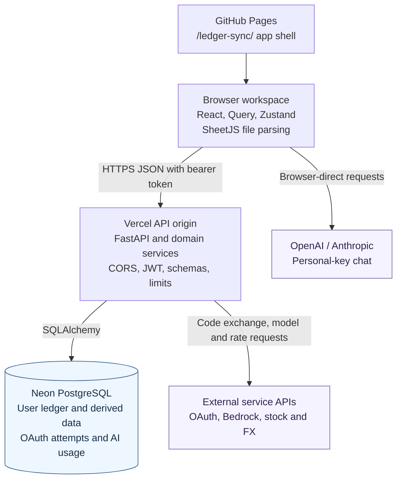
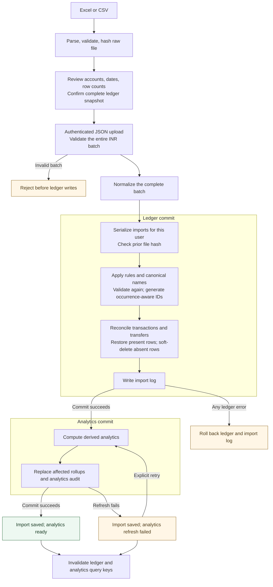
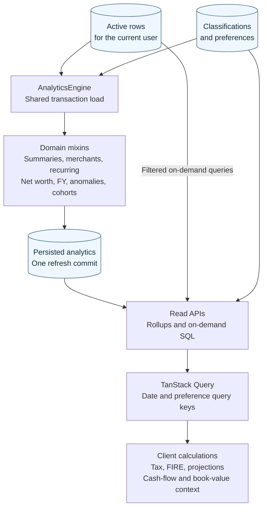
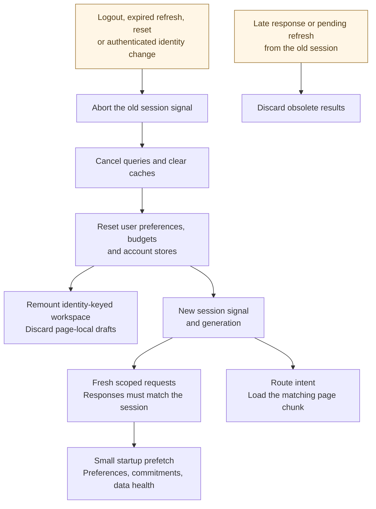
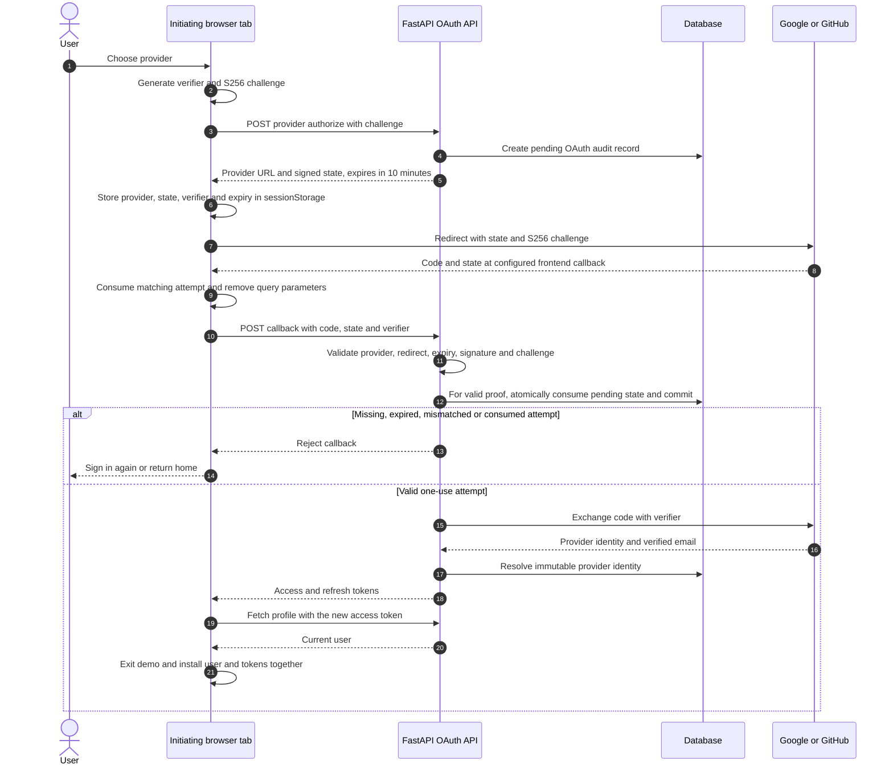
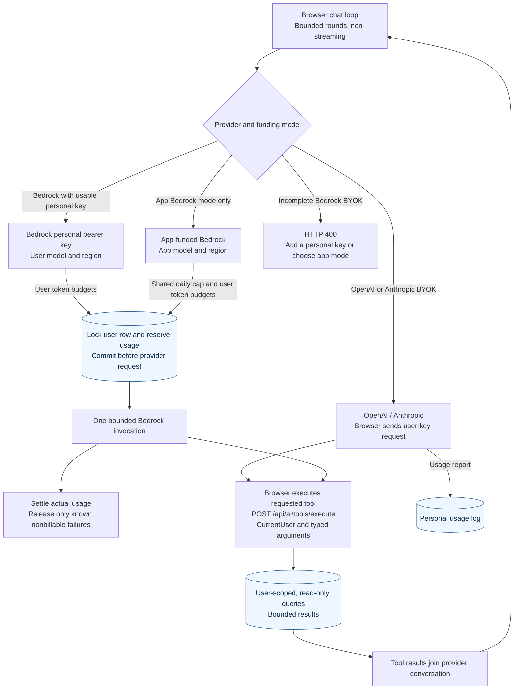
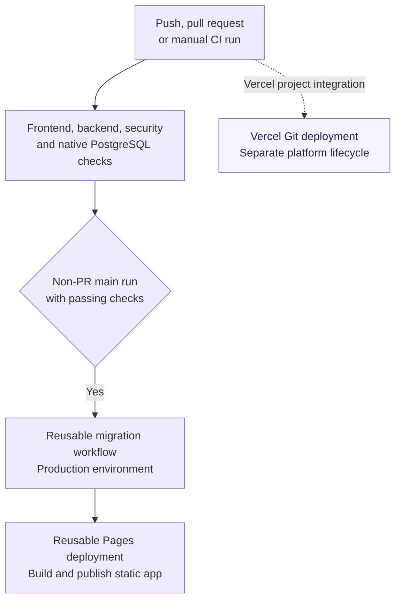

# System Architecture

Architecture reference for the current Ledger Sync source.

Source walkthrough updated on 2026-09-09. The local Graphify graph is a
navigation aid; the application entry points, routes, services, stores, models,
and workflows define the contracts below.

## System Overview

Ledger Sync is a static React workspace backed by a FastAPI JSON API and a
user-scoped relational ledger.



Local development uses the same frontend and backend with SQLite and a Vite
proxy. The browser and API can run on different origins: API requests use bearer
tokens and an explicit CORS allowlist, while OAuth initiation does not depend
on third-party cookies. The [static overview](images/system-overview.svg) is a
companion illustration; the diagrams here describe the current boundaries.

## Repository Layout

```text
ledger-sync/
  frontend/                   React and TypeScript SPA
  backend/                    Python and FastAPI service
  docs/                       Maintained references and dated records
  .github/workflows/          CI, deploy, migration, and keepalive workflows
  package.json                Root orchestration scripts
```

## Backend Architecture

<p align="center">
  
</p>

### API layer

Location: `backend/src/ledger_sync/api/`

Responsibilities:

- HTTP request and response contracts
- Authentication dependencies
- User-scoped query boundaries
- Rate limits
- External service proxies
- Error and status mapping

`main.py` creates the FastAPI app, shared `httpx` client, middleware, exception
handlers, health checks, and router registration.

The registered routers cover:

- Authentication and OAuth
- Upload and transactions
- Tags, rules, and saved views
- Analytics and calculations
- Preferences and classifications
- Reports
- Goals
- Currency, instrument, and stock rates
- AI chat, tools, and usage

See [API.md](API.md) for the complete inventory.

### Business logic

Location: `backend/src/ledger_sync/core/`

Key modules:

| Module | Responsibility |
| --- | --- |
| `sync_engine.py` | Coordinates row or CLI-file imports |
| `reconciler.py` | User-scoped upsert, restore, and soft-delete behavior |
| `reconciler_transfers.py` | Transfer-pair normalization and reconciliation |
| `calculator.py` | Pure on-demand financial metrics |
| `query_helpers.py` | Database-agnostic SQL and shared filters |
| `time_filter.py` | Relative ranges anchored on the IST ledger clock |
| `ledger_clock.py` | Single source of naive IST `now`, `today`, month, and financial-year boundaries |
| `expense_class.py` | Realised-capital-loss taxonomy that keeps trading losses out of consumption totals |
| `rules.py` | Categorization rule matching |
| `report_generator.py` | Monthly report construction |
| `encryption.py` | AES-256-GCM BYOK key encryption and legacy migration |
| `auth/` | JWT creation, decoding, and token-version verification |

Analytics implementation lives under `core/analytics/` as domain mixins:

```text
base.py
classification.py
summaries.py
trends.py
merchants.py
recurring.py
net_worth.py
fy_summaries.py
anomalies.py
cohort.py
engine.py
```

`merchant_extract.py` sits alongside them as a pure helper rather than a mixin.
It owns merchant label extraction: brands are matched with an ambiguity guard,
and a miss keeps the whole normalized note as a descriptor instead of the first
word, so nothing is dropped and unrelated purchases are not over-merged.

`core/analytics_engine.py` is a backwards-compatible facade that re-exports
the composed `AnalyticsEngine`. New analytics behavior belongs in the domain
package, not in the facade.

### Data access

Location: `backend/src/ledger_sync/db/`

- `base.py` owns the declarative base.
- `session.py` owns the engine and request-session lifecycle.
- `_models/` groups SQLAlchemy models by domain.
- `models.py` re-exports the public model surface.
- `migrations/versions/` contains the Alembic history.

The model metadata includes the ledger, derived analytics, preferences, goals,
OAuth audit records, and AI usage reservations. Hosted deployments use Neon
PostgreSQL; SQLite remains the default local and unit-test backend. Native
PostgreSQL verifies dialect-specific migrations and constraints.

Every user-owned query includes `user_id`. Current model foreign keys use
database cascades for account deletion, but authorization remains an explicit
query concern.

The current migration head is `identity_constraints_2026`, following
`ai_usage_reservations_2026`. The reservation revision extends existing AI
usage rows with funding, status, and reserved-token fields. The identity
revision closes uniqueness/constraint gaps, rejects conflicting identities or
invalid positive amounts before changing data, and removes obsolete global
uniqueness. It does not merge users or rewrite financial values. Goal editing
uses the existing goal model without a new goal migration.

Historical transfer consolidation preserves unmatched incoming legs and
ambiguous groups, collapsing only a matching pair. Unsupported downgrades
are rejected before any schema or version mutation, including consolidation
whose original legs and account links cannot be reconstructed. Historical
PostgreSQL setup also handles both existing enums and legacy VARCHAR columns.

### Schemas and services

Location:

```text
backend/src/ledger_sync/schemas/
backend/src/ledger_sync/services/
```

Pydantic models validate wire contracts. Services contain cross-router
workflows such as OAuth user creation, token refresh, account reset, and
account deletion.

### Ingestion

Location: `backend/src/ledger_sync/ingest/`

The web and CLI paths share normalization and hashing but enter differently:

- Web import parses files in the browser and calls `SyncEngine.import_rows`.
- CLI import reads a local file and calls `SyncEngine.import_file`.

The web upload router does not pass the source file through an Excel loader.

## Backend Request Lifecycle

For an authenticated financial request:

```text
request
  -> CORS and timing middleware
  -> security and cache headers
  -> IP and optional user rate limits
  -> JWT decode
  -> token_version comparison against users table
  -> CurrentUser dependency
  -> request-scoped SQLAlchemy session
  -> user-scoped router or domain logic
  -> commit only when the session has changes
  -> JSON response
```

An exception rolls back the request session. Database operational errors become
HTTP 503. Unexpected errors return a correlation ID without a traceback.

## Upload and Analytics Flow



The transaction hash includes user, date, amount, account, note, category,
subcategory, type, and a duplicate occurrence suffix when needed.

The reconciliation sweep is user-wide, including accounts or dates omitted
from the replacement snapshot. Both transaction and transfer reconciliation
run even when one set is empty. Transfer legs become canonical transfer rows;
they are not income or consumption. The review requires an explicit full-ledger
acknowledgment, including on a forced reupload.

All rows are normalized and validated before reconciliation. Decimal INR
amounts are the supported ingestion contract; display-currency conversion is a
separate concern. The raw-file hash detects repeated files, while row hashes
preserve legitimate duplicate occurrences and idempotence. PostgreSQL
serializes concurrent imports for a user with a user-row lock.

`SyncEngine` commits ledger changes and the import log together or rolls both
back. The upload API then runs analytics separately and reports its status.
A failed analytics refresh leaves the saved ledger intact. The frontend offers
an analytics-only retry instead of a second import. An upload timeout can occur
after persistence, so recovery first directs the user to import history.

The [static pipeline image](images/upload-pipeline.svg) is retained as a
companion overview.

### Analytics and calculation boundaries



The composed engine shares one active-transaction load across its refresh
stages, with additional domain queries where needed. It commits derived rows
and the analytics audit together. A refresh failure rolls back that work,
independently of the preceding import commit. Data Health exposes coverage and
rollup freshness.

Read endpoints use persisted aggregates or user-scoped SQL for the requested
period. Frontend utilities still own preference-sensitive tax, scenario, and
projection calculations. Imported cash flows and book-value holdings do not
establish a live market valuation or an actual investment return by themselves.
Tax rules are fiscal-year versioned: old-regime standard deduction is INR
50,000; new-regime deduction is INR 75,000 from FY 2024-25. The UI states the
income basis, deductions, rule year, and any latest-known-rules fallback.

## Frontend Architecture

Location: `frontend/src/`

```text
App.tsx
pages/
components/
hooks/
services/api/
store/
lib/
constants/
types/
```

### Routing and loading

`App.tsx` defines 29 routed page components:

- 3 public routes
- 26 protected workspace pages
- 4 eager page components
- 25 lazy page components

Eager components:

- Home
- Dashboard
- Demo Entry
- OAuth Callback

The remaining pages use `React.lazy`. After authentication initializes, route
intent through pointer, keyboard focus, or touch can prefetch the matching
internal page module. Startup no longer eagerly imports every page. Production
Workbox installation still precaches static chunks for offline use, including
in anonymous sessions; runtime lazy loading does not promise zero asset
downloads. Suspense waits 150 ms
before showing the page spinner to avoid a flash for fast chunk loads.

The protected route wraps `AppLayout`, which renders the responsive shell and
an `<Outlet>`. `/home` is a compatibility redirect to `/dashboard`.

See [PAGES.md](PAGES.md) for every route and data source.

### Page layer

Simple pages can remain a single file. Larger pages use:

```text
pages/<feature>/
  <Feature>Page.tsx
  use<Feature>.ts
  types.ts
  <feature>Utils.ts
  components/
```

Page orchestrators own composition. Data shaping belongs in hooks and pure
utilities. Repeated visual patterns belong in shared components.

### Component layer

| Directory | Responsibility |
| --- | --- |
| `components/layout/` | Sidebar, mobile navigation, and workspace header |
| `components/ui/` | Buttons, cards, inputs, tables, chart containers, and page primitives |
| `components/shared/` | Cross-feature states, authentication UI, command palette, and preferences |
| `components/analytics/` | Reusable financial visualizations |
| `components/transactions/` | Ledger filters, table, tags, pagination, and saved views |
| `components/upload/` | Drop zone, account classification, and upload result UI |
| `components/chat/` | AI panel, messages, and orchestration |

`PageContainer` and `PageHeader` define page-level structure. Shared tokens in
`index.css` control theme, density, borders, chart colors, focus states, and
responsive behavior.

### Server state

TanStack Query owns data fetched from the API.

Defaults:

- Infinite stale time
- One retry
- No refetch on window focus
- One-hour garbage-collection time

Mutations invalidate affected query keys. Upload invalidates ledger and
analytics data after the backend response. Browser HTTP caching is disabled for
API data, so TanStack Query is the only client cache.

### API client

`services/api/client.ts` creates the shared Axios instance.

It:

- Uses `API_BASE_URL` from the constants layer
- Attaches the current access token
- Serializes concurrent refresh attempts through one mutex
- Replays queued requests after refresh
- Rejects responses from an expired session and ends the session when refresh fails
- Intercepts demo-mode reads
- Blocks demo-mode mutations

Feature service modules expose typed API methods. Hooks under `hooks/api/`
compose those services with TanStack Query.

`services/api/auth.ts` uses a separate, credential-free OAuth client so sign-in
can run while demo mode is active and does not enter the authenticated refresh
queue. The new profile is fetched with the exchanged access token before the
new user and tokens are installed together.

### Session cleanup and startup



`lib/session.ts` centralizes cancellation, query-cache clearing, and user-store
resets. Each boundary also advances a generation. Axios captures the signal
synchronously, and queued user mutations retain that generation in their keys
and their original signal. Mutation hooks capture the signal during render
and carry it through `onMutate` context. Generation keys prevent a rerendered
observer from replacing queued work with another session's options.
Dispatch and publication both check the session;
a late result cannot repopulate a different user's cache or tokens. Token
refresh within the same session keeps its generation. Identity changes remount
the authenticated layout so local page state is also discarded. Theme and
motion remain device preferences. A transaction-only reset keeps settings
stores, while a full reset clears them.

Startup data prefetch is limited to preferences, active recurring commitments,
and Data Health, and is skipped for demo mode. Full-ledger reads remain an
explicit page need.

Settings batches ordinary preferences, salary structure, RSU grants, and
growth assumptions into one preferences request. Classifications and rules
have separate writes. Save waits for those writes before final rehydration;
partial failure retains the draft for retry. This is not one database
transaction across every Settings section.

### Persisted goals and legacy recovery

Goal creation, editing, progress, allocations, and deletion use the existing
goal model through `CurrentUser`-scoped APIs and `goal_service`. Query keys
include the account or demo identity. Demo edits remain in page memory.

Older global browser keys are never applied automatically or mutated.
Authenticated, non-demo recovery compares recognized fields only with
positive goal IDs fetched for the current account. Users select fields and
confirm ownership; a hidden-goal choice requires separate deletion
confirmation. Goals with IDs 1-4 receive a possible-demo warning because an
old global key cannot establish account ownership.

Recovery refetches the goal before an action, rejects changed server or
browser values, and guards writes against session changes. Failed writes
keep the draft and original browser values. Separate per-account, per-goal,
per-field acknowledgment markers record the reviewed value after a confirmed
choice or successful write. The same value is not reoffered; a changed browser
value can be reviewed again. These markers do not erase the original data.
The preflight comparison does not add atomic server version preconditions
to the existing PATCH/DELETE APIs.

### Client state

Zustand stores:

| Store | Responsibility |
| --- | --- |
| `authStore` | Token persistence and current auth state |
| `preferencesStore` | Normalized user preferences |
| `accountStore` | Account metadata |
| `investmentAccountStore` | Local investment-account set |
| `budgetStore` | Budget client state |
| `demoStore` | Demo mode activation |
| `themeStore` | Light or dark mode plus the resolved theme; new users start from the OS preference |
| `motionStore` | Device-local Full or Reduced motion preference, applied without remounting page state |

Stores should not duplicate API server state without a specific persistence or
cross-page reason.

### Demo mode

Demo entry seeds generated transactions and analytics into the query cache.
The API interceptor returns computed demo responses for supported GETs and
rejects server mutations. Goal creation, editing, progress, and deletion have
an explicit page-local demo implementation, discarded when the page remounts.
The mode does not send the generated ledger to the backend. OAuth initiation
can still contact the backend to leave demo mode and sign in.

### Responsive shell

Desktop uses a grouped sidebar and global workspace header. Phone layouts use
a fixed bottom bar plus the complete More page. Shared page and table
primitives switch wide tabular data into readable card or stacked layouts
where appropriate.

The layout reserves fixed space for navigation and safe areas so the chat
widget, demo banner, mobile bar, and page content do not overlap.

## Authentication Flow



`GET /api/auth/oauth/providers?flow_version=2` reports configured providers
with a version 2 contract. A fresh
`POST /api/auth/oauth/{provider}/authorize` creates each attempt. The signed
state binds the provider, S256 challenge, expiry, and configured redirect URI.
The verifier stays in the initiating tab until the callback request. No
cross-origin cookie is needed.

The backend records attempts in `audit_logs` and atomically changes a pending
record to consumed before exchanging the code. This works across Vercel
instances and prevents replay even after a failed provider exchange. The
frontend separately consumes its `sessionStorage` attempt before sending the
callback. An expired attempt, wrong provider, different tab, cancellation, or
failed exchange requires a new sign-in attempt; the callback page offers
explicit recovery.

Unversioned provider requests from older clients receive the existing config
shape with a navigation-only `/api/auth/oauth/v2/{provider}/restart` URL and a
non-authenticating marker. The old URL builder therefore reaches the bridge
instead of starting an unbound provider flow. The bridge ignores supplied
redirect/code/state values and redirects to the configured frontend callback
with a restart flag and cache-busting nonce. The current callback then creates
a fresh verifier and state.

Callbacks without a verifier receive HTTP 409 and a readable refresh/sign-in
message before required-field validation. HEAD clients can display that
message and return home. A stale PWA shell also receives that guidance and may
need a refresh after its app-shell update. No legacy state is accepted, and
the actual callback schema still requires the verifier.

Google and GitHub both support S256 PKCE. Provider authorization hosts and
frontend callback origin/base-path validation remain explicit, including
`/ledger-sync/` on GitHub Pages. Provider identity lookup uses the immutable
provider subject. Verified-email fallback may claim only a legacy user whose
provider and provider subject are both null; a bound or partially bound
identity cannot be rebound by email. A conditional update protects concurrent
legacy claims.

Official protocol references:

- [Google PKCE flow and S256 challenge](https://developers.google.com/identity/protocols/oauth2/native-app)
- [GitHub OAuth authorization and S256 requirement](https://docs.github.com/en/apps/oauth-apps/building-oauth-apps/authorizing-oauth-apps)

The [static auth illustration](images/auth-flow.svg) is retained for context;
the sequence above describes browser binding and one-use consumption.

JWTs contain the user ID, email, type, expiry, and token version. Protected
requests load the user and compare the token version. Logout and reset
increment the stored version and revoke every outstanding token pair.

The Axios refresh mutex prevents a burst of simultaneous 401 responses from
creating parallel refresh requests.

## AI Architecture

The assistant supports three provider adapters with one provider-neutral block
shape:

- OpenAI, browser-direct with the user's key
- Anthropic, browser-direct with the user's key
- Bedrock, backend proxy because AWS authentication and browser CORS require it

All adapters are non-streaming. One round returns complete JSON text or tool
requests. The tool loop:

```text
send messages
  -> receive text or tool_use blocks
  -> execute requested read-only tools in parallel
  -> append tool_result blocks
  -> send next round
  -> stop at end_turn or the configured round limit
```

`chatContext.ts` fetches preferences only. It provides currency, date,
fiscal-year context, and tool-use rules. Financial summaries are not copied
into the system prompt; the model calls one of 15 read-only, user-scoped tools
for data.

Browser-direct provider usage is logged through `/api/ai/usage/log`. Bedrock
usage is reserved and settled by the proxy to avoid double counting.

### Funding, quotas, and tool access



App-funded Bedrock fixes the model and region and applies the shared daily
limit. A usable personal Bedrock bearer key uses personal funding. Missing,
empty, placeholder, or unreadable Bedrock BYOK keys return HTTP 400 before
reservation or invocation. Shared funding requires an explicit `app_bedrock`
selection. OpenAI and Anthropic use the user's key directly from the browser.

For Bedrock, `ai_usage.py` locks the user row while checking limits and writing
a reservation, then commits before the network call. Outstanding reservations
count against token budgets and, for app funding, the shared cap. Each model
invocation, including another tool round, consumes a quota unit. Successful
calls settle usage once. Client creation, credential resolution, and personal
bearer setup failures release the reservation because inference has not
started. Known nonbillable provider rejections, including
`ModelNotReadyException`, also release it. Ambiguous failures during inference
retain the reservation within the applicable daily/monthly windows. Provider
invocation has bounded timeouts and no automatic billable retry.

Zero token budget blocks a proxied call; null removes that personal cap.
Pending reservations count toward the applicable daily/monthly windows.
Usage responses expose `reserved_tokens` and `pending_call_count` separately
from completed-call totals. Historical Bedrock records have legacy funding
and conservatively count toward their original day's shared allowance.

Browser-direct usage reports are accounting inputs, not an enforceable vendor
spending ceiling. Tool schemas come from the same typed registry that validates
execution arguments. Unknown tools, invalid arguments, and excessive result
limits are rejected before user-scoped reads. The tools do not mutate the
ledger, but their returned financial data becomes part of the selected external
provider's conversation.

Model/region-only saves omit `api_key` (or send null) and retain a usable stored
key only when the provider is unchanged. A concurrent key/provider replacement
returns HTTP 409; the UI reloads saved metadata while retaining the draft.
Changing provider requires a new key. `has_key` describes stored personal-key
availability, not verified live authentication or the current funding source.
App mode preserves that personal configuration for later use.

New encrypted API keys use an authenticated `ls-byok:v3:` envelope with
AES-256-GCM and HKDF-SHA256. Legacy v1 PBKDF2 and v2 HKDF ciphertexts are accepted
only after successful authentication and can be rewrapped on access. Apply the
reservation migration before new workers, and drain old workers before v3
writes because the old reader cannot decode that envelope. Retain previous
encryption material until rewrapping finishes. See
[DEPLOYMENT.md](DEPLOYMENT.md) for operational steps and rollback requirements.

## Security Architecture

- OAuth-only login
- Browser-bound, provider-specific, expiring and one-use OAuth state with S256 PKCE
- Verified provider email where required
- JWT access and refresh tokens with server-side version revocation
- Explicit user scoping in API and analytics queries
- Database `ON DELETE CASCADE` for current user foreign keys
- AES-256-GCM BYOK key encryption
- Dedicated HKDF-derived encryption key for current ciphertexts
- IP and authenticated-user rate limits
- Explicit CORS allowlist
- Security response headers and production HSTS
- No browser HTTP or service-worker cache for financial API responses
- No production source maps
- Whole-batch upload validation, bounded AI rounds, and runtime-validated tool arguments
- Database-backed Bedrock usage reservations across serverless instances
- Distributed SlowAPI storage required for global per-minute limits
- Generic server errors with correlation IDs

## Performance Design

Backend:

- Shared `httpx` client for OAuth and stock calls
- PostgreSQL pool size 5 with max overflow 3 by default
- Pool pre-ping and bounded database timeouts
- User-scoped composite transaction indexes
- One active-transaction load per full analytics refresh
- Persisted daily, monthly, category, cohort, net-worth, and fiscal-year data
- GZip for larger responses

Frontend:

- Route-level lazy loading
- Intent-based route chunk prefetch and small startup data prefetch
- Vendor chunk splitting
- Infinite-stale server cache with explicit invalidation
- Lightweight facet and date-range endpoints instead of full-ledger reads
- Responsive chart sizing
- PWA app-shell caching with API denial rules

## Deployment

| Layer | Hosted platform |
| --- | --- |
| Frontend | GitHub Pages |
| Backend | Vercel serverless, ASGI |
| Database | Neon PostgreSQL 17 |



The CI dependency chain gates migrations on all check jobs and Pages on
migration success. Native PostgreSQL runs from isolated test-cluster binaries
in CI. Vercel's Git deployment is outside this dependency chain; the workflow
does not establish that a backend release waits for migrations. Preserve
schema compatibility and follow [DEPLOYMENT.md](DEPLOYMENT.md) for rollout,
health, and recovery procedures.

## Verification

CI checks include:

- Frontend shared workflow for install, lint, build, and Vitest
- Backend Python 3.13 job for Ruff, format check, mypy, pytest, and an
  `alembic upgrade head` run against an empty database
- Shared security scan workflow
- Native PostgreSQL bootstrap, constraints, data preservation, and rollback guards

Test totals change with the source and are not an architecture contract.
SQLite tests do not establish PostgreSQL migration or locking behavior; those
checks require a native PostgreSQL test database. OAuth verification can use
synthetic identities and stubbed provider responses without a real login.

Native PostgreSQL 17.11 verification for this update covered fresh and populated
migrations, constraints, complete-plan downgrade guards, transaction-local
timeouts, and daily/monthly quota races across independent connections.
The final migration pass also covered unmatched transfer preservation,
irreversible consolidation rollback, and legacy VARCHAR/absent-enum setup.
Fixtures were synthetic and the owned local cluster was stopped afterward.
Vercel protection/promotion and distributed rate-limit storage remain external
deployment configuration.

See [TESTING.md](TESTING.md) for commands and scope. Deployment health and
database recovery checks are maintained in [DEPLOYMENT.md](DEPLOYMENT.md) and
[DATABASE.md](DATABASE.md).

## Related Reading

- [API](API.md)
- [Database](DATABASE.md)
- [Calculations](CALCULATIONS.md)
- [Development](DEVELOPMENT.md)
- [Page Catalog](PAGES.md)
