# Architecture and flow diagrams

These diagrams describe the source reviewed on 2026-09-16, including the
financial-estimate and profile changes in the working tree. They contain no
account records, credentials, or production query results.

The SVG previews render directly in repository documentation. Download an HTML
file and open it in a browser for Archify's search, pan/zoom, themes, and export
controls. GitHub's normal file page displays HTML source rather than running it.
The viewers are standalone; they do not require an app login or a running API.

| Diagram | Use it to understand | Interactive viewer | Editable source |
| --- | --- | --- | --- |
| [System architecture](#system-architecture) | Browser, API, storage, and external-service boundaries | [HTML](system-architecture.html) | [JSON](system-architecture.architecture.json) |
| [Statement import](#statement-import) | The two commits and recovery after an analytics failure | [HTML](statement-import.html) | [JSON](statement-import.sequence.json) |
| [Financial calculations](#financial-calculations) | Tax, earnings periods, current health, and bill selection | [HTML](financial-calculations.html) | [JSON](financial-calculations.dataflow.json) |
| [Release delivery](#release-delivery) | CI, migrations, Pages readiness, and Vercel's separate path | [HTML](release-delivery.html) | [JSON](release-delivery.workflow.json) |

## System architecture



GitHub Pages serves the app shell. Financial requests go from the browser to
the FastAPI origin, with explicit authentication and user-scoped queries.
Browser-direct BYOK chat and backend-proxied Bedrock requests have different
credential and quota boundaries. Local development uses SQLite and Vite's
`/api` proxy.

| Boundary | Source |
| --- | --- |
| App routes and local file parsing | [App.tsx](../../frontend/src/App.tsx), [fileParser.ts](../../frontend/src/lib/fileParser.ts) |
| API registration, middleware, and current-user dependency | [main.py](../../backend/src/ledger_sync/api/main.py), [deps.py](../../backend/src/ledger_sync/api/deps.py) |
| SQLAlchemy sessions and database configuration | [session.py](../../backend/src/ledger_sync/db/session.py) |
| Chat orchestration and server proxy | [useChat.ts](../../frontend/src/components/chat/useChat.ts), [ai_chat.py](../../backend/src/ledger_sync/api/ai_chat.py) |

Archify verified this diagram's 12 source references against base commit
`a3a0958edcda2c1e03b4e8d7e3cb30a6dcc55997`. The referenced architecture files are
unchanged by this work. The tables in this document link to the checkout being
read; the diagram uses local-only source metadata to avoid implying that
unpublished financial changes exist at that commit.

## Statement import



The browser parses the original file and asks the user to review a complete
ledger snapshot. It sends validated INR rows as JSON. `SyncEngine.import_rows`
normalizes and identifies occurrences, reconciles transactions and transfers,
and commits the ledger with its import log. Missing rows are soft-deleted
within the current user's ledger.

The router runs analytics after the ledger commit. If refresh fails, it returns
a successful import with `analytics_status: "failed"`; the ledger remains saved.
The recovery action retries `/api/analytics/v2/refresh`. It does not require
reimporting the source file. Invalid batches and ledger-transaction failures
return errors before the successful-import path shown above.

| Boundary | Source |
| --- | --- |
| Validated upload contract and response | [upload.py](../../backend/src/ledger_sync/api/upload.py), [upload schema](../../backend/src/ledger_sync/schemas/upload.py) |
| Atomic import and reconciliation | [sync_engine.py](../../backend/src/ledger_sync/core/sync_engine.py), [reconciler.py](../../backend/src/ledger_sync/core/reconciler.py), [reconciler_transfers.py](../../backend/src/ledger_sync/core/reconciler_transfers.py) |
| Analytics and session-aware frontend refresh | [analytics/engine.py](../../backend/src/ledger_sync/core/analytics/engine.py), [useUpload.ts](../../frontend/src/hooks/api/useUpload.ts) |

## Financial calculations



The three rows are separate calculation paths, not a sequence in which tax
feeds health or health feeds bills. Backend APIs own authorization and stored
data. Frontend finance helpers own preference-sensitive estimates and periods;
the green calculation boxes do not imply that every calculation runs on the
server.

- Tax views distinguish full-year liability, estimates on received income,
  payroll withholding, and actual payments. Unknown actual TDS remains blank.
  Gross RSU vesting value is taxable compensation; retained shares and cash
  take-home remain separate. The missing-unit assumption is 30% plus 4% cess
  on that tax, or 31.2%; entered units and locked prices take precedence.
- Income averages begin at the saved earning-start date, or supported employment
  evidence when no date is saved. Zero-income months after that boundary remain
  in the denominator. Current health uses at most 24 completed months;
  stability uses the latest 12 within that period. Current balances and lifetime
  balance proxies remain separate from recent cash flows.
- Automatic bills require obligation evidence, supported cadence, at least
  three occurrences, and sufficient confidence. Manual confirmations remain
  authoritative. Recurring and Bill Calendar select current obligations;
  ordinary habits and stale automatic detections do not become scheduled bills.

Chart zoom changes the visible plot, not financial totals or the earnings
boundary. Detailed money uses two decimal places; chart axes may use compact
units. Long date series include the year.

| Calculation | Source |
| --- | --- |
| Tax basis and FY grouping | [taxPlanning.ts](../../frontend/src/lib/finance/taxPlanning.ts), [taxHistory.ts](../../frontend/src/lib/finance/taxHistory.ts) |
| Payroll and withholding orchestration | [payrollPlanning.ts](../../frontend/src/lib/finance/payrollPlanning.ts), [tdsScheduleCalculator.ts](../../frontend/src/lib/tdsScheduleCalculator.ts), [useTaxPlanning.ts](../../frontend/src/pages/tax-planning/useTaxPlanning.ts) |
| Earnings periods and income statistics | [analysisPeriod.ts](../../frontend/src/lib/finance/analysisPeriod.ts), [incomeMetrics.ts](../../frontend/src/lib/finance/incomeMetrics.ts) |
| Current health and stability | [currentHealthAnalysis.ts](../../frontend/src/components/analytics/health/currentHealthAnalysis.ts), [healthScoreAnalysis.ts](../../frontend/src/components/analytics/health/healthScoreAnalysis.ts) |
| Detection and legacy interpretation | [recurring detector](../../backend/src/ledger_sync/core/analytics/recurring.py), [recurring API](../../backend/src/ledger_sync/api/analytics_v2_impl/recurring.py) |
| Accepted commitments and calendar dates | [recurringCalculations.ts](../../frontend/src/lib/recurringCalculations.ts), [billDays.ts](../../frontend/src/pages/bill-calendar/billDays.ts) |

See [Calculations](../CALCULATIONS.md) for formulas, fallbacks, and tests. A
historical health-score curve cannot be inferred from today's account balances
without the required historical balance observations.

## Release delivery



PRs run checks. A reviewed merge produces a commit on `main`, which runs the
four blocking jobs: frontend, backend, native PostgreSQL migrations, and
security scanning. Successful jobs allow the migration workflow, then the
Pages workflow.

Before publishing, Pages polls `/health` for the frontend package version and
`/health/db` for a connected database. A timeout leaves the previous Pages site
active. This is a version-and-health gate, not proof of the backend commit SHA.

Vercel's Git integration has its own deployment lifecycle. The repository's
Actions graph does not make Vercel wait for migrations; schema-compatible
rollouts and independent verification are still required.

| Delivery concern | Source |
| --- | --- |
| Blocking jobs and dependency graph | [ci.yml](../../.github/workflows/ci.yml) |
| Production migrations | [migrate.yml](../../.github/workflows/migrate.yml) |
| Build, backend readiness, and Pages publication | [deploy-frontend.yml](../../.github/workflows/deploy-frontend.yml) |
| Backend entry point and routing | [index.py](../../backend/api/index.py), [vercel.json](../../backend/vercel.json) |

## Regenerate and verify

Generated with [Archify](https://github.com/tt-a1i/archify), installed skill
version 2.17. The HTML identifies its renderer as `2.17.0-dev.1`. The editable
JSON files are the source of truth for diagram layout and wording.

From the repository root:

```bash
# Use ~/.agents/skills/archify, ARCHIFY_SKILL_DIR, or an explicit installation.
node docs/diagrams/build.mjs --skill /path/to/archify

# No skill installation needed: verify the checked-in artifacts and receipts.
node docs/diagrams/build.mjs --check

# Run separately in an environment that can launch Chrome.
node /path/to/archify/bin/archify.mjs visual-check docs/diagrams/system-architecture.html --json
```

Run `visual-check` for each delivered HTML after regeneration. It checks four
desktop sizes and captures both themes. Inspect those screenshots separately;
automated measurements do not prove visual polish.

The build helper validates every candidate, requires all nine showcase checks
with zero errors and warnings, and invokes Archify's atomic `deliver` command.
It never rewrites a trusted HTML artifact. It extracts a passive SVG preview
with the same geometry, embedded fonts, and resolved light palette for image
renderers. Each `*.delivery.json` records SHA-256 and byte counts for the JSON,
HTML, and SVG.

See [verification status](VERIFICATION.md) for the current browser and visual
coverage. Browser profiles, raw environment diagnostics, and review screenshots
are local sidecars and are excluded from source control.

Each standalone HTML embeds Archify's viewer and fonts, so it exceeds the
ordinary 500 KB file limit. The pre-commit exception names only these four
generated HTML files. The [Archify MIT license](ARCHIFY-LICENSE.txt) accompanies
the viewers; their embedded font styles retain the SIL Open Font License.

Related references: [Architecture](../architecture.md),
[Calculations](../CALCULATIONS.md), [Deployment](../DEPLOYMENT.md),
[Testing](../TESTING.md).
