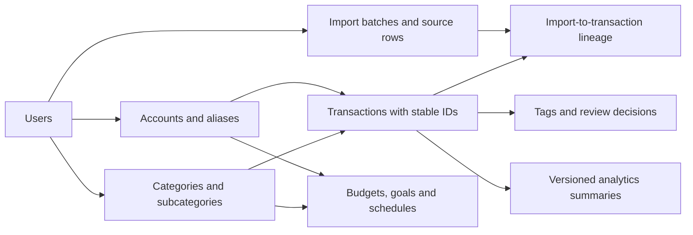

# Ledger Sync schema and algorithm review

Reviewed 16 September 2026.

**The highest-value changes are stronger identity and integrity guarantees, followed by more selective analytics refreshes. The existing relational design is a reasonable foundation.**

This review used the live schema returned by Neon through Composio, the local backend source at review time, synthetic inputs to the existing transaction hasher, and PostgreSQL/algorithm documentation. No production rows were queried or modified. The findings below describe the 16 September baseline; local implementation followed on 17 September.

**Implementation status, 17 September:** the working tree now includes versioned
source identities with stable public IDs, account/category dimensions, missing
uniqueness and ownership constraints, duplicate-index cleanup, transaction
invariants, scheduled-reference lifecycle handling, selective versioned
analytics, signed date pagination, bounded aggregate queries, and explicit
synchronous backend service boundaries. The migration chain is tested against
disposable SQLite and PostgreSQL 17.11 databases, including populated history.
See [the current database reference](../DATABASE.md) for the implemented
contracts. The production database has not been migrated or modified.

The live project [neon-cinereous-compass](https://console.neon.tech/app/projects/gentle-sunset-94386320), branch `main`, database `neondb`, contains Ledger Sync's tables and matches the supplied diagram. Its schema export reports PostgreSQL **17.11**, **26 application tables plus `alembic_version`**, **75 explicit `CREATE INDEX` statements**, and **5 named CHECK constraints**. The index count excludes indexes implicitly created by primary-key and unique constraints. No row-security policies or RLS enablement statements appeared in the export.

This is a structural and implementation review. It does not establish whether production contains duplicate budgets, invalid references, or slow queries. Table-level row counts, query plans, runtime roles, index usage, and latency were not measured.

**What is already good**

- Financial transaction amounts use `NUMERIC(15,2)`, with Decimal validation.
- The transaction table already has six partial composite indexes for active rows, all beginning with `user_id`.
- Imports already batch-fetch existing records and use occurrence-aware hashing to preserve legitimate identical transactions.
- PostgreSQL imports lock the user's row and commit ledger reconciliation and import history together. Adding a lock is not a new recommendation.
- Daily and monthly summaries already have user-scoped unique indexes. Several other aggregates do too.
- Recurring detection already uses median intervals, skipped-cycle handling, and median/MAD amount estimates.
- Anomaly detection already uses rolling median/MAD, an IQR fallback, and materiality filters. It preserves reviewed findings; recurring refreshes preserve user-confirmed decisions.
- The live schema contains the recent AI reservation columns/checks and OAuth identity uniqueness. These inspected objects do not suggest those migrations are missing.

**Recommended order**

| Priority | Improvement | Verified basis | Expected benefit |
| --- | --- | --- | --- |
| First | Make hash serialization unambiguous and versioned | Distinct synthetic field tuples currently produce identical hash inputs | More reliable reconciliation identity |
| First | Fix nullable budget uniqueness | `UNIQUE(user_id, category, subcategory)` uses default NULL semantics | At most one category-wide budget |
| First | Remove confirmed duplicate indexes | Four exact duplicate pairs in the live DDL | Less index maintenance and storage |
| Next | Add missing business keys and ownership-aware references | Several aggregate keys are not unique; child ownership is independently referenced | Database-enforced invariants |
| Next | Introduce stable account/category and transaction IDs | Names and mutable categories currently participate in identity | Renaming and recategorization without moving identities |
| Next | Refresh affected analytics with explicit versions | Full analytics loads all active transactions and rebuilds multiple domains | Less recomputation and clearer freshness |
| Later | Benchmark pagination and substring search changes | OFFSET pagination and leading-wildcard ILIKE searches exist | Better behavior as history grows |
| Later | Split selected preferences, clarify date semantics, consider RLS | A 54-column preferences table mixes concerns; dates and ownership rely on application conventions | Clearer boundaries and easier maintenance |

**1. Separate transaction identity from its fingerprint**

[`ingest/hash_id.py`](../../backend/src/ledger_sync/ingest/hash_id.py) hashes user, date, amount, account, note, category, subcategory, type, and occurrence. Two consequences are worth addressing.

First, the fields are concatenated using an unescaped `|`. A synthetic invocation of the actual hasher confirmed that these distinct tuples generate the same ID when the remaining fields are equal:

```text
note = "memo|food", category = "travel"
note = "memo",      category = "food|travel"
```

This is ambiguous serialization before hashing, not a cryptographic collision in SHA-256. Occurrence counters preserve multiplicity within a batch, but they do not make field boundaries unambiguous. No production corruption was demonstrated.

Use a versioned, unambiguous encoding, such as a canonical JSON array of normalized values or length-prefixed fields. Preserve Decimal amounts as explicitly normalized strings. Include the transfer destination as an explicit field: currently it reaches transfer identity indirectly through the generated category label. Keep the current INR-only accounting contract unless multi-currency ingestion is deliberately introduced.

Second, changing the category changes the primary key. This was also confirmed with synthetic inputs. The existing [`core/rules.py`](../../backend/src/ledger_sync/core/rules.py) compensates by rehashing rows and moving tag and anomaly references. Those existing protections should be preserved.

The longer-term model should have:

- An immutable internal transaction ID.
- Source identity, when available: source system, stable account ID, and bank-provided transaction reference.
- A separate fingerprint and fingerprint version for reconciliation.
- Preserved import lineage and explicit occurrence handling where the source lacks stable references.
- Mutable category, note, and display labels that do not alter the transaction ID.

Do not simply replace all existing hashes or remove category from the hash. Build a verified old-to-new mapping, preserve children, and prove repeated imports and genuine duplicates retain their semantics.

**2. Fix nullable uniqueness and add business keys**

The live budgets constraint is:

```sql
UNIQUE (user_id, category, subcategory)
```

Because `subcategory` is nullable, PostgreSQL permits multiple rows such as `(same_user, 'Food', NULL)`. This is a constraint gap; it is not evidence that duplicate budgets currently exist.

PostgreSQL 17 supports `UNIQUE NULLS NOT DISTINCT`. Since Ledger Sync also supports SQLite, a portable alternative is two partial unique indexes: one on `(user_id, category)` where subcategory is NULL, and one on `(user_id, category, subcategory)` where it is not NULL. Choose whether inactive budgets share the same uniqueness rule before implementing. Preflight existing duplicates and resolve them deliberately.

The live schema also lacks uniqueness for these intended keys:

| Table | Candidate business key |
| --- | --- |
| `import_logs` | `(user_id, file_hash)` under its current one-log-per-file behavior |
| `fy_summaries` | `(user_id, fiscal_year)` |
| `category_trends` | `(user_id, period_key, category, subcategory, transaction_type)`, with deliberate NULL handling |
| `merchant_intelligence` | `(user_id, canonical_merchant_key)` once canonical identity is defined |

The import's existing per-user lock already prevents ordinary same-user upload races through that path. A unique constraint adds enforcement for other writers and future changes. If import history becomes append-only, retain multiple attempt rows and place uniqueness on a separate import identity record.

For transaction checks, preserve current semantics: upload validation allows zero and rejects negative/non-finite amounts. An appropriate constraint must preserve that behavior, rather than imposing `amount > 0`. Review finite numeric values, source currency, and transfer endpoint shape before adding checks. Existing rows must pass validation first.

Sources: [PostgreSQL 17 constraints](https://www.postgresql.org/docs/17/ddl-constraints.html), [`planning.py`](../../backend/src/ledger_sync/db/_models/planning.py), [`upload.py`](../../backend/src/ledger_sync/schemas/upload.py).

**3. Remove duplicate indexes carefully**

The following pairs have identical table, method, key, and predicate definitions in the live export:

| Table and key | Existing index names |
| --- | --- |
| `anomalies(user_id)` | `ix_anomalies_user_id`, `ix_anomaly_user` |
| `audit_logs(created_at)` | `ix_audit_created`, `ix_audit_logs_created_at` |
| `category_trends(user_id)` | `ix_category_trend_user`, `ix_category_trends_user_id` |
| `recurring_transactions(user_id)` | `ix_recurring_transactions_user_id`, `ix_recurring_user` |

Keep one index in each pair and remove the duplicate declaration from ORM metadata as well as the database migration. Otherwise future bootstrap schemas may recreate it.

`net_worth_snapshots` additionally has both a unique constraint and a separate nonunique index on `(user_id, snapshot_date)`. That is another redundancy candidate; retain the uniqueness guarantee.

Do not broadly delete standalone indexes merely because a composite index starts with the same column. Check predicates, constraint dependencies, query usage, and index size. In particular, active-only transaction indexes do not cover reconciliation queries over soft-deleted history.

There is no measured percentage speedup attached to this recommendation.

**4. Make account/category references explicit**

The schema has account classifications, but no canonical accounts table. Transactions, transfers, schedules, recurring patterns, investments, and preferences repeat account names. Categories and subcategories are similarly repeated strings.

Introduce user-owned `accounts` and `categories` with stable IDs; keep names as editable labels. Represent a subcategory as a child category, or retain a separate subcategory table if it better matches existing APIs. Maintain source-specific account aliases so import spelling changes do not create new accounts.

A proposed core relationship map follows. Arrows show references, not an applied migration; user ownership accompanies each relationship.



Preserve original imported labels for traceability. Existing account-casing normalization is useful, but it cannot represent a real rename or an account alias relationship.

A longer diagram is not itself a database problem. For the visual schema, group tables into identity, ingestion, ledger, planning, analytics, and AI/operations. Hide repeated user-FK edges in overview diagrams and show them in detailed views.

**5. Enforce relationships within the same user**

`transaction_tags` and `anomalies` independently reference a user and transaction. Those foreign keys do not prove that the referenced transaction belongs to that same user.

Use composite references such as `(user_id, transaction_id)` to a corresponding unique parent key. This reinforces the existing user-scoped API checks; the schema gap alone does not demonstrate an exploitable API issue.

`scheduled_transactions.recurring_transaction_id` is an integer without a foreign key. Add a relationship only after defining lifecycle behavior. Recurring refreshes delete unconfirmed detections, so blindly adding cascading deletion could remove a user's schedule. Stable recurring identities and soft retirement, or an explicit unlinking policy, should come first.

The dump contains no RLS configuration. RLS is a possible later defense, using a runtime role that cannot bypass it and transaction-local user context compatible with PgBouncer. Keep application ownership filtering. Test default-deny behavior, context reset, migration roles, auth flows, and background analytics; the existence of a table owner in the dump does not reveal the deployed runtime role.

Source: [PostgreSQL row security](https://www.postgresql.org/docs/17/ddl-rowsecurity.html).

**6. Refresh affected analytics, with a freshness version**

[`analytics/engine.py`](../../backend/src/ledger_sync/core/analytics/engine.py) loads all active transactions for the user and runs the analytics stages. It sensibly reuses the initial load and commits the analytics transaction together. Nevertheless, daily/monthly calculations revisit the full history, some domains delete/rebuild rows, and monthly upserts perform per-period lookups.

A practical next design is:

1. Record a monotonically increasing ledger version and the changed transaction set.
2. Derive affected dates, categories, account pairs, merchants, and fiscal years from both old and new values, including soft deletions.
3. Recompute those groups from source rows. This is often easier to validate than maintaining every sum/min/max through arithmetic deltas.
4. Recompute dependent periods: changing an old month can alter a later month-on-month comparison, later cumulative balances, and rolling anomaly windows.
5. Persist `ledger_version`, `preferences_version`, `algorithm_version`, and refresh state.
6. Publish results only for a coherent version; serialize overlapping refreshes or reject stale publication.

Changing account exclusions, fiscal-year settings, or category classification may require a wider rebuild even when no transactions changed. Keep a full rebuild path and compare its results with incremental refreshes.

Moving to ordinary PostgreSQL materialized views would not automatically provide incremental maintenance. Existing rollup tables can support this design.

Also keep monetary aggregation in Decimal/NUMERIC end to end. [`analytics/trends.py`](../../backend/src/ledger_sync/core/analytics/trends.py) currently converts transaction amounts to float before rebuilding Decimal values. This is an avoidable precision boundary; no incorrect production total was measured.

Source: [PostgreSQL materialized views](https://www.postgresql.org/docs/17/rules-materializedviews.html).

**7. Algorithms worth considering**

| Problem | Recommended approach | Applicability and limits |
| --- | --- | --- |
| Identical-file and identical-row imports | Retain exact hashes, version their encoding, and preserve occurrence counts | Already largely implemented; do not replace with fuzzy deduplication |
| Noisy or overlapping bank exports | Exact source-reference match first, then candidate blocking and weighted matching | Useful when the product actually supports multiple statement sources |
| Pairing imperfect transfer legs | One-to-one bipartite matching within bounded candidate groups | Retain unmatched outcomes; fees, FX, splits, and ambiguity need explicit handling |
| Recomputing dashboards | Changed-group recomputation plus versioned dependencies | Highest-value performance candidate in this code |
| Recurrence | Retain the existing median/MAD detector; compare calendar-aware hypotheses on held-out history | Test month-end dates, weekends, skips, changing bill amounts, and habits versus commitments |
| Anomalies | Retain existing robust statistics; calibrate against review outcomes | A learned model should beat this baseline before replacing it |
| Large transaction listings | Deterministic ordering and keyset pagination | Stable ID as tie-breaker; design separate cursors for each supported sort |

A matching pipeline should first restrict candidates to the same user, plausible accounts, currency, amount, and a bounded date window. Adjacent date buckets must overlap enough to avoid dropping boundary matches. Exact reference matches receive priority; remaining scores can consider date distance, reference similarity, and normalized descriptions.

Use a one-to-one assignment algorithm only within those candidate groups, with explicit unmatched choices and minimum acceptance criteria. SciPy's `linear_sum_assignment` uses a modified Jonker–Volgenant method; the broader family is often described using the Hungarian assignment problem. A plain full assignment can force bad matches, so do not equate “optimal assignment” with “correct financial match.”

Blocking reduces the candidate space compared with all-pairs comparison, but its worst case can still be quadratic. Dense assignment cost grows quickly with group size. Measure candidate recall, final-match precision, false merges, duplicate retention, and review workload on labeled fixtures. Do not promise constant-time reconciliation or perfect fuzzy deduplication.

Sources: [Record Linkage Toolkit indexing](https://recordlinkage.readthedocs.io/en/latest/ref-index.html), [SciPy linear assignment](https://docs.scipy.org/doc/scipy/reference/generated/scipy.optimize.linear_sum_assignment.html).

**8. Additional improvements after the first phase**

- **Preferences:** A 54-column table is not automatically too wide. Split AI credentials/configuration from ordinary preferences for a clearer access boundary. Consider typed JSON/JSONB for structured settings, with schema versions and SQLite-compatible handling; normalize account/category references and any independently queried recurring entities. Add a GIN index only for actual JSON queries.
- **Dates:** The upload API accepts calendar dates, while `transactions.date` is a timestamp without time zone. Consider a `DATE` for the accounting date and timezone-aware timestamps for audit events. Preserve current IST ledger boundaries and interpret existing UTC audit values explicitly during conversion; do not blindly convert every timestamp.
- **Search:** Existing `%term%` ILIKE searches may benefit from `pg_trgm` GIN indexes at sufficient scale. Benchmark real search patterns, short queries, user filters, and write overhead first. Existing B-tree indexes remain useful for exact filters.
- **Pagination:** Current APIs use OFFSET and can order only by a nonunique field such as date. Add a stable tie-breaker first. Keyset pagination is a later API/UI change; cursor results across mutations may need a ledger version.
- **Financial exactness:** `monthly_investment_target` uses floating point although it represents money. Prefer NUMERIC for monetary settings. AI cost uses floating point as an estimate; only require exact billing semantics if that field becomes an authoritative charge.
- **Import lineage:** Transactions store `source_file`, but no import FK or mapping to individual source rows. A batch/source-row mapping would improve explanations of insert/update/delete decisions. Preserve the current explicit full-ledger replacement contract unless append/account-scoped import modes are deliberately added.
- **Double-entry postings:** Useful if the product expands to split transactions, loan principal/interest, fees, FX accounting, or authoritative balance reconciliation. It is a substantial product/data-model change. A per-entry balance invariant spans multiple rows and requires a controlled posting transaction or deferred constraint trigger, not a simple row CHECK. Multi-currency entries need explicit balancing/valuation rules.
- **Partitioning/sharding:** No measured scale or query evidence currently justifies either. Start with integrity, redundant-index cleanup, and observed workload costs.

Sources: [PostgreSQL multicolumn indexes](https://www.postgresql.org/docs/17/indexes-multicolumn.html), [partial indexes](https://www.postgresql.org/docs/17/indexes-partial.html), [pg_trgm](https://www.postgresql.org/docs/17/pgtrgm.html), [EXPLAIN](https://www.postgresql.org/docs/17/using-explain.html).

**Validation before implementation**

First inspect duplicate business keys, invalid ownership pairs, malformed transfer fields, and affected foreign-key dependencies with aggregate/read-only checks. Rehearse migrations on an isolated database. Preserve questionable rows for review; do not auto-merge financial records.

Verify the invariants using native PostgreSQL and SQLite: repeated imports are idempotent, legitimate identical transactions remain distinct, transfer legs pair without collapsing distinct destinations, category changes preserve annotations, invalid ownership references are rejected, NULL category budgets cannot duplicate, and incremental summaries equal a full rebuild after inserts, edits, deletions, and preference changes.

For performance claims, collect representative bounded SELECT plans, execution times, buffers, query counts, index sizes, and write overhead. `EXPLAIN ANALYZE` executes its query and should be used deliberately on a suitable isolated workload. Compare full import latency separately from database time and compute wake-up time.

Recommended first delivery: versioned hash encoding, nullable budget uniqueness, verified business-key constraints, and four duplicate-index removals. Follow with stable identities and versioned analytics after those semantics are specified.
